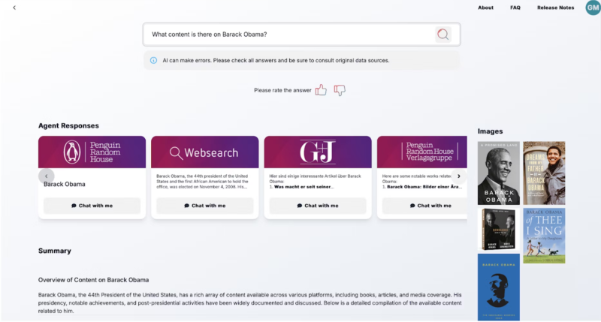
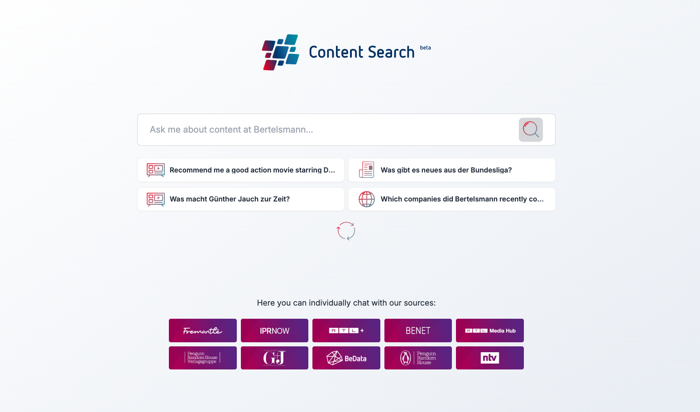
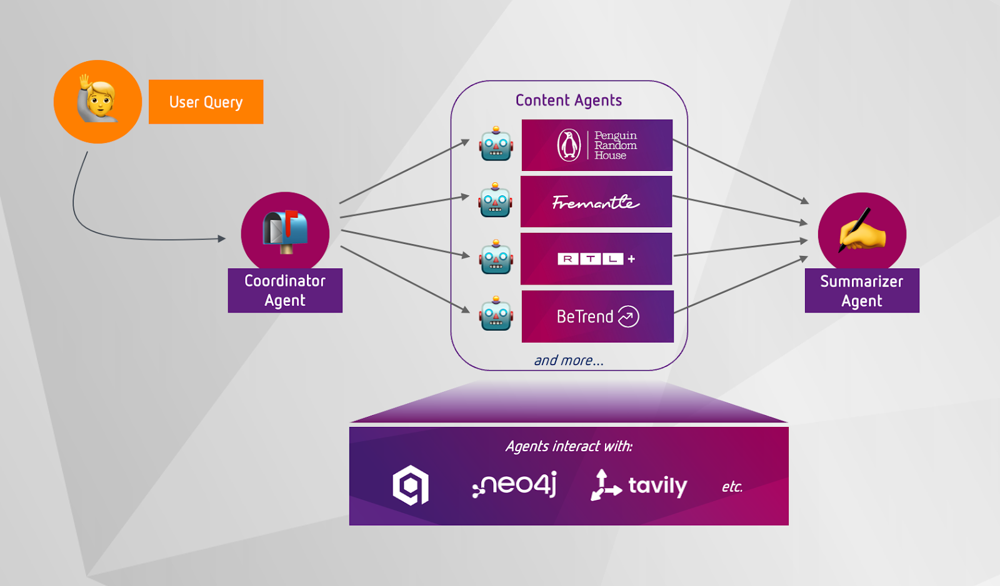
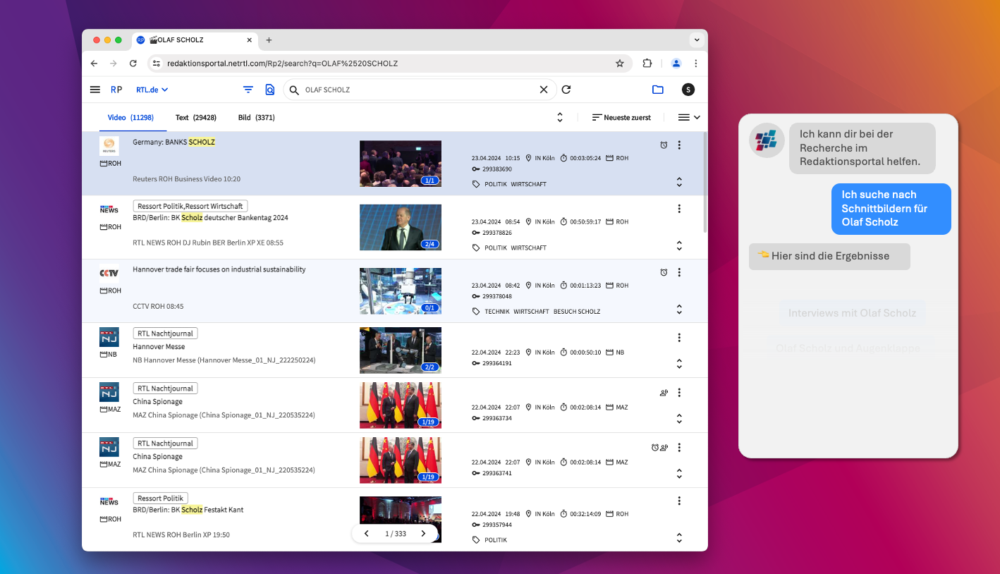

[Bertelsmann](https://www.bertelsmann.com/?ref=blog.langchain.com) is one of the world's largest media companies that has produced some of the most influential content of our time. From publishing Barack Obama's and Prince Harry's bestselling biographies and Pulitzer-winning novels, to producing Emmy- and Academy Award-winning productions like Poor Things and The Young Pope, the company's creative teams span dozens of brands and platforms to reach millions globally.

But with that scale also comes a challenge: When a creative or researcher at Bertelsmann asks a seemingly simple question like "What kind of content do we have about Barack Obama?" the answer could be scattered  across dozens of different systems, databases, and platforms.

The internal Bertelsmann Content Search changes that. Built by Bertelsmann's AI Hub team using LangGraph, this multi-agent system has gone from early prototype to full production deployment. It now powers content search and discovery across the company, empowering creativity across the entire organization.

## **The Challenge: Unified Search Across a Media Empire**

Bertelsmann's creative teams face a unique internal challenge: navigating a vast, decentralized content ecosystem. Across its divisions, the company produces and manages:

- Books and audiobooks
- TV shows, films, and documentaries
- News archives and journalistic content
- Third-party commentary and web trends

Each division at Bertelsmann operates within its own systems, databases, and content workflows. So, if a producer wants to understand what content exists around a trending topic, or if a marketing team needs to identify cross-platform opportunities, they need to know exactly where to look and need to have access to each relevant system.

This fragmentation leads to missed opportunities, research effort duplication, and creative teams spending more time searching for information than creating.

## **The Solution: Multi-Agent Content Discovery**

The Bertelsmann Content Search takes a fundamentally different approach. Instead of centralizing all data into a single system— a daunting task given Bertelsmann’s expansive portfolio— the team built a multi-agent system that orchestrates searches across existing platforms and data sources.

Here's how it works:

**Natural Language Interface**: Users can ask questions in natural language, such as: "What documentaries do we have about renewable energy?" or "Show me content related to emerging artists in electronic music."

**Intelligent Routing**: Behind the scenes, a router analyzes each query and determines which specialized agents should handle the search. One agent might query the documentary archives, another searches the catalog for related books, while a third checks internal news archives for journalistic coverage.

**Specialized Domain Agents**: Each agent is purpose-built for its specific domain – understanding the metadata, search patterns, and content types unique to that system.

**Unified Response Generation**: Individual agent responses are synthesized into a single, coherent answer.

**Flexible Agent Deployment**: With LangGraph’s flexible architecture, agents can be deployed directly within the systems that own the data. For example, an agent searching the proprietary news archive can be deployed as a standalone API that internal teams can integrate directly into their existing systems. This means divisions get enhanced agentic search capabilities within their own platforms, while the broader organization benefits from cross-platform search through the unified system.

## **Inside the Architecture**

At the core of Bertelsmann Content Search is a LangGraph-powered multi-agent architecture that coordinates complex, cross-domain content discovery in production. Here’s how it works:

### **Intelligent Query Routing via a Coordinator**

The system begins with a coordinator agent, which analyzes the user questions and sends them to the respective agents. This isn't simple keyword matching— the router understands context, intent, and domain relevance to ensure queries reach the most appropriate specialists.

### **Parallelized Domain-Specialized Agents**

These queries then get sent to a central and parallelized node, triggering relevant agents for each specific content domain. For example:

- **Publishing Agent**: Searches catalogs, understanding book metadata, author information, and publication timelines
- **Broadcasting Agent**: Queries archives with knowledge of show formats, air dates, and content classifications
- **News Agent**: Navigates journalistic archives with understanding of article metadata, publication dates, and content categorization.
- **Web Intelligence Agent**: Monitors external trends and commentary to provide context from beyond Bertelsmann's owned content.

LangGraph helped Bertelsmann to access these diverse data sources in a variety of ways. The agents interfaced with:

- Vector databases (e.g. Qdrant) for fast semantic search
- APIs for structured queries.
- Graph databases for relationship-based lookup
- Custom tools to simplify complex interactions and boost reliability

### **Response Synthesis**

The final  layer combines individual agent responses into coherent, actionable insights. The system understands relationships between different content types and can identify cross-platform opportunities. Users can also drill down into any content by chatting directly with an individual agent.

### **Supercharging Agent Use via Modular APIs**

One of LangGraph's most powerful features for Bertelsmann’s use case is how easily individual agents can be deployed as standalone APIs. This architectural flexibility allowed the team to serve the same agent that powers their cross-platform search directly to the division that owns the underlying data source. For example, teams can integrate their specialized news agent directly into their content management systems all while maintaining the agents' availability for the broader unified search platform.

As a result, the multi-agent system can kill two birds with one stone: Business units can pick up and use smart, agentic search for data sources that are deployed in Content Search. They can use these agents to help their own teams and place them right in people’s workflows, for example in the news archives UI.

## **Why LangGraph: First mover and still state of the art**

The Bertelsmann AI Hub team started to work with LangGraph the first week it was released— back in 2024, when "agents" were far from the buzzword they've become today. This early adoption proved crucial, and their multi-agent systems are deployed in production today.

"We started exploring a multi-agent approach towards empowering creative discovery in late 2023" says Moritz Glauner, Head of Data Science at Bertelsmann Data Services. "And what was initially earmarked as a pilot for exploring the potential of the still early agentic tech, evolved into fully-fledged internal product development given what turned out to be possible with LangGraph and agentic tech", adds Carsten Mönning, Bertelsmann AI Hub Lead. "Looking back, we started by exploring a lot of what were then research frameworks across the market,” points out Lion Schulz, Head of Machine Learning at the Bertelsmann AI Hub. "We then quickly realized that LangGraph was exactly what we were looking for, as it offered reliability and predictability for our production systems – so we committed to building our multi-agent system on it, and haven’t looked back."

In particular, the Bertelsmann team benefitted from LangGraph and its:

- **Modular Design**: The node-based architecture allowed the team to build specialized agents for each content domain while maintaining clean interfaces between components.
- **Production-Ready Infrastructure**: The maturity of the LangChain ecosystem provided the observability and debugging capabilities necessary for lifting the system from prototype to production and maintaining a complex multi-agent system at scale.
- **Scalable Orchestration**: As Bertelsmann's content universe expanded, the system could easily accommodate new agents and data sources without architectural changes.

## **Impact: Empowering Creativity at Scale**

Built on LangGraph, the Bertelsmann Content Search has transformed how creative teams find information across the organization:

**Faster content discovery**: What used to require **hours** of searching across multiple systems now takes **seconds**. Creative teams spend less time hunting for information and more time creating with it.

**Cross-platform insights**: The system reveals connections and opportunities that might be missed when searching individual systems in isolation. A documentary producer might discover related books that could inform their research, or a book editor might find inspiration in the news archives.

**Democratized access**: Teams no longer need to know which system contains what information—or have access to every database. The unified interface makes the entire Bertelsmann content universe accessible to authorized users.

**Enhanced collaboration**: By surfacing content across divisions, the system encourages collaboration and identifies opportunities for cross-brand initiatives.

The result is a more agile, informed creative organization that can respond quickly to trends and opportunities while making the most of Bertelsmann's vast content portfolio.

## **Looking Ahead: The Future of Agentic Content Systems**

The Bertelsmann Content Search represents more than just a successful deployment— it's a proof point for the future of AI in media and creative industries. By starting early with LangGraph and focusing on production reliability from day one, the team has built a system that continues to evolve with the organization's needs.

As multi-agent systems become more mainstream, the Bertelsmann Content Search stands as an example of what's possible when cutting-edge technology meets thoughtful engineering and real-world creative needs. Even beyond the Content Search, the Bertelsmann AI Hub Team now employs LangGraph in its agentic developments, for example supporting ideation or storyboarding.

### Tags

[Case Studies](https://blog.langchain.com/tag/case-studies/)

[**monday Service + LangSmith: Building a Code-First Evaluation Strategy from Day 1**](https://blog.langchain.com/customers-monday/)

[Case Studies](https://blog.langchain.com/tag/case-studies/) 8 min read

[**How Remote uses LangChain and LangGraph to onboard thousands of customers with AI**](https://blog.langchain.com/customers-remote/)

[Case Studies](https://blog.langchain.com/tag/case-studies/) 5 min read

[**Fastweb + Vodafone: Transforming Customer Experience with AI Agents using LangGraph and LangSmith**](https://blog.langchain.com/customers-vodafone-italy/)

[Case Studies](https://blog.langchain.com/tag/case-studies/) 7 min read

[**How Jimdo empower solopreneurs with AI-powered business assistance**](https://blog.langchain.com/customers-jimdo/)

[Case Studies](https://blog.langchain.com/tag/case-studies/) 4 min read

[**How ServiceNow uses LangSmith to get visibility into its customer success agents**](https://blog.langchain.com/customers-servicenow/)

[Case Studies](https://blog.langchain.com/tag/case-studies/) 4 min read

[**Monte Carlo: Building Data + AI Observability Agents with LangGraph and LangSmith**](https://blog.langchain.com/customers-monte-carlo/)

[Case Studies](https://blog.langchain.com/tag/case-studies/) 4 min read