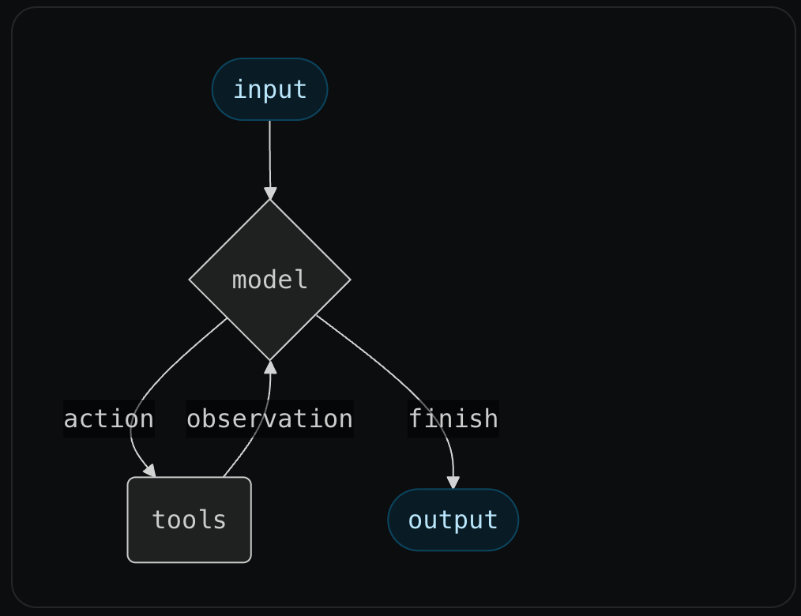
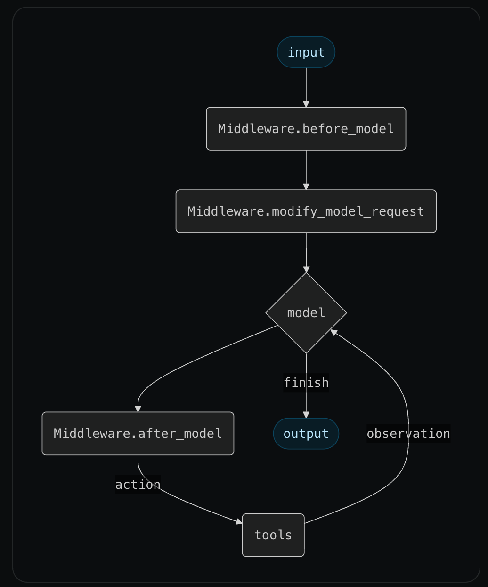

_LangChain has had agent abstractions for nearly three years. There are now probably 100s of agent frameworks with the same core abstraction. They all suffer from the same downsides that the original LangChain agents suffered from: they do not give the developer enough control over context engineering when needed, leading to developers graduating off of the abstraction for any non-trivial use case. In LangChain 1.0 we are introducing a new agent abstraction (_ [_`Middleware`_](https://docs.langchain.com/oss/python/langchain/middleware?ref=blog.langchain.com) _) which we think solves this._

The core agent components are quite simple:

- A model
- A prompt
- A list of tools

The core agent algorithm is equally simple. The user first invokes the agent with some input message, and the agent then runs in a loop, calling tools, adding AI and tool messages to its state, until it decides to not call any tools and ultimately finish.

We had a version of this agent in LangChain in November of 2022, and over the past 3 years 100s of frameworks have popped up with similar abstractions.

At the same time, while it is simple to get a basic agent abstraction up and running, it is hard to make this abstraction flexible enough to bring to production.

In this blog we will cover:

1. Why it is hard to get this abstraction to be reliable enough to bring to production
2. Our journey to make it more reliable over the past year or so
3. A new [`Middleware`](https://docs.langchain.com/oss/python/langchain/middleware?ref=blog.langchain.com) abstraction we are introducing in LangChain 1.0 which we think makes it the most flexible and composable agent abstraction out there

## Why it is hard to bring this abstraction to production

So why is it still so hard to build reliable agents with these frameworks? Why do many people, when they hit a certain level of complexity, go away from frameworks in favor of custom code?

The answer is [_context engineering_](https://blog.langchain.com/the-rise-of-context-engineering/). The context that goes into the model determines what comes out of it. In order to make the model (and therefore, the agent) more reliable, you want to have full control over what goes into the model. And while this simple agent state and simple agent loop are great for getting started, as you push the boundaries of your agent’s performance you will likely want to modify part of that.

There are a number of things you may want to have more control over as complexity increases:

1. You may want to adjust the “state” of the agent to contain more than just messages
2. You may want to have more control over what exactly goes into the model
3. You may want to have more control over the sequence of steps run

## Our journey to make it more reliable

Over the past two years we worked to make our agent abstraction better support context engineering. Some things we did (roughly in order):

- Allowed the user to specify runtime configuration, to pass in things like connection strings and read only user info
- Allowed the user to specify arbitrary state schemas, that either the user or the agent could update
- Allowed the user to specify a function to return a prompt, rather than a string, allowing for dynamic prompts
- Allowed the user to specify a function to return a list of messages, to have full control over the whole message list that was sent to the model
- Allowed the user to specify a “pre model hook”, to run a step BEFORE the model was called, that could update state or jump to a different node. This allows for things like summarization of long conversations.
- Allowed the user to specify a “post model hook”, to run a step AFTER the model was called, that could update state or jump to a different node. This allows for things like human-in-the-loop and guardrails.
- Allowed the user to specify a function that returned the model to use at each call, making it possible to do dynamic model switching and dynamic tool calling.

This allowed for high level of customization and control over the context engineering that gets done.

But it also resulted in a large number of parameters to the agent. Furthermore, these parameters often had dependencies on each other, which made it tough to coordinate. And it was tough to combine multiple versions of these parameters, or provide off-the-shelf variants to try.

## What we’re doing in LangChain 1.0

For LangChain 1.0 we are leaning to this idea of modifying this core agent loop by introducing a concept of [`Middleware`](https://docs.langchain.com/oss/python/langchain/middleware?ref=blog.langchain.com).

The core agent loop will still consist of a model node and a tool node. But Middleware can now specify:

- [`before_model`](https://docs.langchain.com/oss/python/langchain/middleware?ref=blog.langchain.com#before-model): will run before model calls, can update state or jump to other nodes.
- [`after_model`](https://docs.langchain.com/oss/python/langchain/middleware?ref=blog.langchain.com#after-model): will run after model calls, can update state or jump to other nodes.
- [`modify_model_request`](https://docs.langchain.com/oss/python/langchain/middleware?ref=blog.langchain.com#modify-model-request): will run before model calls, allows user to modify (only for that model request) the tools, prompt, message list, model, model settings, output format, and tool choice.

You can provide multiple middleware to an agent. They will run as middleware runs in web servers: sequentially on the way in to the model call (`before_model`, `modify_model_request`), and in reverse sequential order on the way back (`after_model`).

Middleware can also specify custom state schemas and tools as well.

We will provide off-the-shelf middleware for developers to get started with. We will also maintain a list of community middleware for easy access. For a while, developers have asked for collections of nodes to plug into LangGraph agents. This is exactly that.

Middleware will also help us unify our different agent abstractions. We currently have separate LangGraph agents for supervisor, swarm, bigtool, deepagents, reflection, and more. We’ve already verified that we will be able replicate these architectures using Middleware.

## Try it in LangChain 1.0 alpha

You can try out Middleware in the most recent LangChain 1.0 alpha releases (Python and JavaScript). This is the biggest new part of LangChain 1.0 so we would LOVE feedback on Middleware.

As part of this alpha release, we are also releasing three different middleware implementations (all of which we are using in internal agents already):

1. [Human-in-the-loop](https://docs.langchain.com/oss/python/langchain/middleware?ref=blog.langchain.com#human-in-the-loop): uses `Middleware.after_model` to provide an off-the-shelf way to add interrupts to get human-in-the-loop feedback on tool calls.
2. [Summarization](https://docs.langchain.com/oss/python/langchain/middleware?ref=blog.langchain.com#summarization): uses `Middleware.before_model` to summarize messages once they accumulate past a certain threshold
3. [Anthropic Prompt Caching](https://docs.langchain.com/oss/python/langchain/middleware?ref=blog.langchain.com#anthropic-prompt-caching): uses `Middleware.modify_model_request` to add special prompt caching tags to messages.

Try it in Python: `pip install --pre -U langchain`

Try it in JavaScript: `npm install langchain@next`