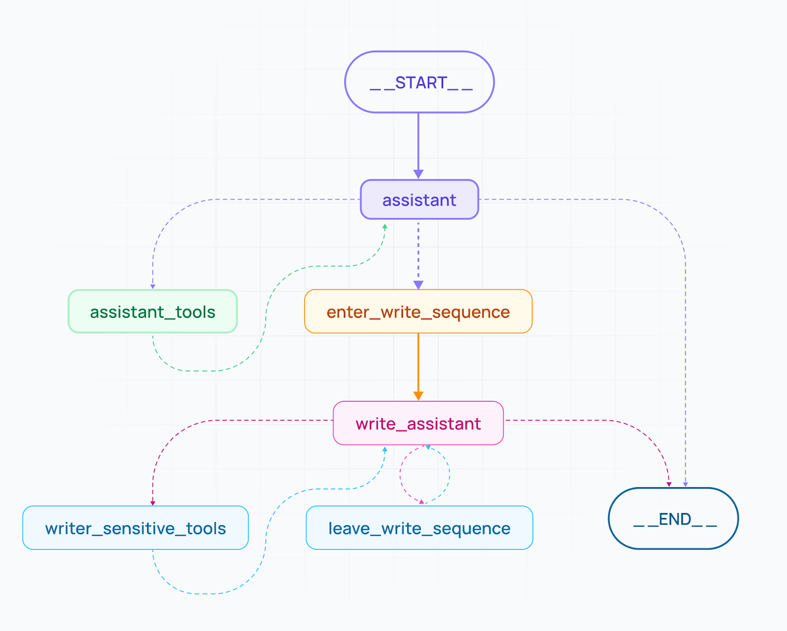
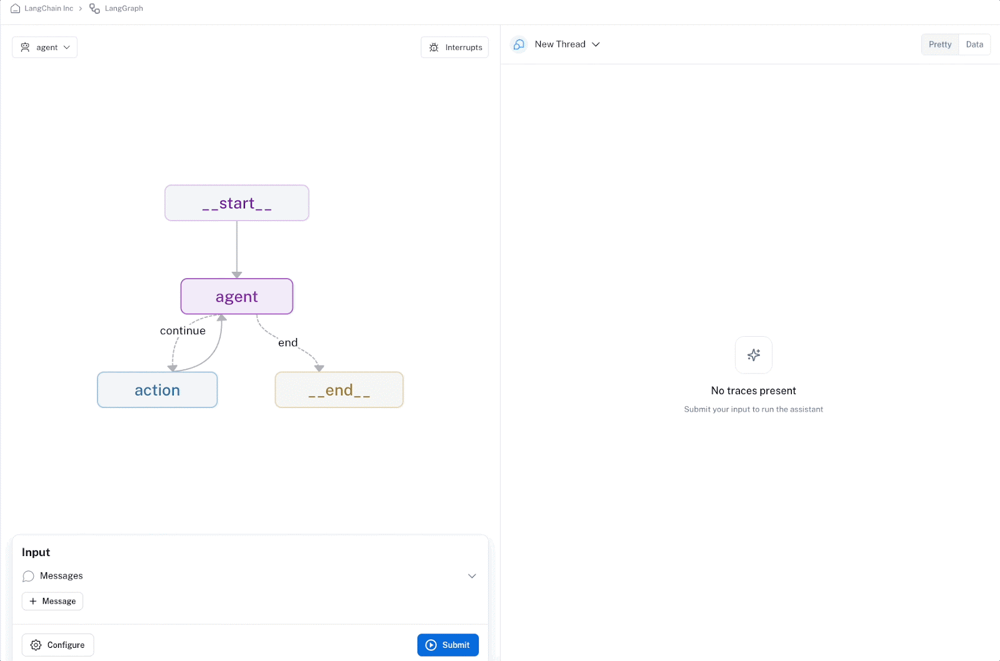
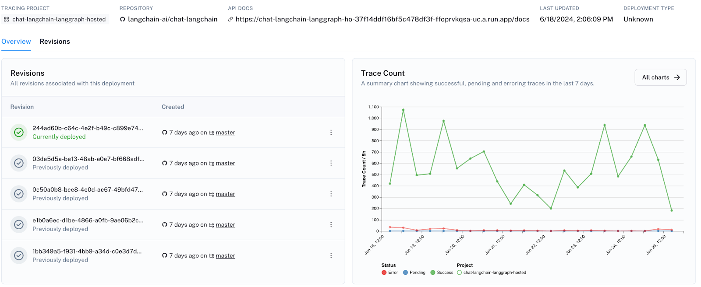
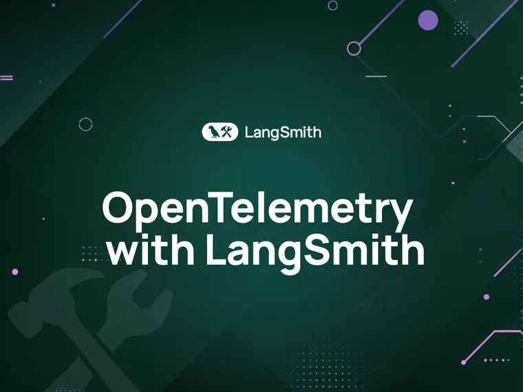

_Note: As of October 2025, LangGraph Platform has been re-named to "LangSmith Deployment"._

At LangChain, we aim to make it easy to build LLM applications – systems that connect LLMs to external sources of data and computation to _reason_ about the world. Letting an LLM decide the control flow of an application (i.e. what we call agents) is attractive, as they can unlock a variety of tasks that couldn’t previously be automated. In practice, however, it is incredibly difficult to build systems that reliably execute on these tasks.

To tackle this, a few months ago, we introduced [LangGraph](http://langchain.com/langgraph?ref=blog.langchain.com) — a framework for building agentic and multi-agent applications. Separate from the langchain package, LangGraph’s core design philosophy is to help developers add better precision and control into agentic workflows, suitable for the complexity of real-world systems.

Today, we’re introducing a **stable release of LangGraph v0.1**, reaffirming our commitment to helping users create more of these robust agentic systems, and we’re grateful for leading companies such as Klarna, Replit, Ally, Elastic, NCL, and many more who are already relying on LangGraph to take their companies’ AI initiatives to the next level.

We’re also thrilled to announce **LangGraph Cloud**. LangGraph Cloud, currently in closed beta, is infrastructure for deploying your LangGraph agents in a scalable, fault tolerant way. It also provides an integrated developer experience for you to gain more visibility and confidence as you prototype, debug, and monitor your agentic workflows.

Read on to learn more and see how to try it out. If you're more of a visual learner, you can check out our video walkthrough [here](https://www.youtube.com/watch?v=l4sMKF1dTDM&ref=blog.langchain.com).

## **LangGraph v0.1: Balancing agent control with agency**

Most agentic frameworks can handle simple, predefined tasks but struggle with complex workflows that require any company or domain-specific context. This was true of the legacy LangChain AgentExecutor as well, but what we learned through iteration and experience is that the higher level abstraction hides too many details from the developer, ultimately resulting in a system lacking the control needed to accomplish tasks reliably.

[LangGraph](https://langchain-ai.github.io/langgraph/?ref=blog.langchain.com), by contrast, has a flexible API that lets you design custom cognitive architectures. This means you get low-level control over the flow of code, prompts, and LLM calls that take in user input to perform an action or generate a response. With conditional branching and looping, LangGraph lets users build single-agent or multi-agent setups with hierarchical or sequential decision patterns. At companies like Norwegian Cruise Line, having this level of agent control has been critical.

> _"LangGraph has been instrumental for our AI development. Its robust framework for building stateful, multi-actor applications with LLMs has transformed how we evaluate and optimize the performance of our AI guest-facing solutions. LangGraph enables granular control over the agent's thought process, which has empowered us to make data-driven and deliberate decisions to meet the diverse needs of our guests." **\- Andres Torres (Sr. Solutions Architect @** **Norwegian Cruise Line)**_

LangGraph also makes it easy to add moderation and quality checks that ensure agents meet certain conditions before continuing their tasks. This keeps the agent progressing properly and reduces the chance it gets stuck on an incorrect path, from which it’d be unlikely to recover.

For companies like Replit, LangGraph’s fine-grained control has strengthened their ability to ship reliable agents.

> _"It's easy to build the prototype of a coding agent, but deceptively hard to improve its reliability. Replit wants to give a coding agent to millions of users — reliability is our top priority, and will remain so for a long time. LangGraph is giving us the control and ergonomics we need to build and ship powerful coding agents." - **Michele Catasta (VP of AI @ Replit)**_

For the most complex or sensitive tasks, human collaboration is still needed to supplement agentic automation. LangGraph makes human-agent collaboration possible through its built in persistence layer. Specifically, with LangGraph, you can:

- Design the agent to explicitly wait for human approval before executing a task and resuming its workflow.
- Edit the agent’s actions before they are executed.
- Inspect, rewire, edit, and resume execution of the agent (in what we describe as “time travel” features).

For teams such as Elastic, this flexibility in design has been game-changing. They note:

> _"LangChain is streets ahead with what they've put forward with LangGraph. LangGraph sets the foundation for how we can build and scale AI workloads — from conversational agents, complex task automation, to custom LLM-backed experiences that 'just work'. The next chapter in building complex production-ready features with LLMs is agentic, and with LangGraph and LangSmith, LangChain delivers an out-of-the-box solution to iterate quickly, debug immediately, and scale effortlessly." **– Garrett Spong (Principal SWE @ Elastic)**_

Lastly, LangGraph natively supports streaming of intermediate steps and token-by-token streaming, enabling more dynamic and responsive experiences for users working with long-running, agentic tasks.

## **LangGraph Cloud: Scalable agent deployment with integrated monitoring**

To complement the LangGraph framework, we also have a new runtime, [LangGraph Cloud](https://langchain-ai.github.io/langgraph/cloud/?ref=blog.langchain.com), now available in beta, which provides infrastructure purpose-built for deploying agents at scale.

As your agentic use case gains traction, uneven task distribution among agents can overload the system, risking slowdowns and downtime. LangGraph Cloud does the heavy lifting to help you achieve fault-tolerant scalability. It gracefully manages horizontally-scaling task queues, servers, and a robust Postgres checkpointer to handle many concurrent users and efficiently store large states and threads.

LangGraph Cloud is designed to support real-world interaction patterns. In addition to streaming and human-in-the-loop (which are covered in LangGraph), LangGraph Cloud also adds:

- **Double-texting** to handle new user inputs on currently-running threads of the graph. It supports four different strategies for handling additional context: reject, queue, interrupt, and rollback.
- **Asynchronous background jobs** for long-running tasks **.** You can check for completion via polling or a webhook.
- **Cron jobs** for running common tasks on a schedule

LangGraph Cloud also brings a more integrated experience for collaborating on, deploying, and monitoring your agentic app. It comes with [LangGraph Studio](https://langchain-ai.github.io/langgraph/cloud/how-tos/test_deployment/?ref=blog.langchain.com) – a playground-like space for visualizing agent trajectories to help debug failure modes and add breakpoints for interruption, state editing, resumption, and time travel. LangGraph Studio lets you share your LangGraph agent with internal stakeholders for feedback and rapid iteration.

Additionally, LangGraph Cloud simplifies deployment. Select a LangGraph repo from GitHub, and with just one-click, deploy your agentic application — no infra expertise required. And since LangGraph Cloud is integrated within LangSmith, you can gain deeper visibility into your app and track and monitor usage, errors, performance, and costs in production too.

We're excited to roll out LangGraph Cloud, with support from partners like Ally Financial who have already been making strides with LangGraph.

> _“As Ally advances its exploration of Generative AI, our tech labs is excited by LangGraph, the new library from LangChain, which is central to our experiments with multi-actor agentic workflows. We are committed to deepening our partnership with LangChain._” \- **Sathish Muthukrishnan (Chief Information, Data and Digital Officer @ Ally Financial _)_**

## **Try it for yourself**

To get started with LangGraph, simply go to the [GitHub project](https://github.com/langchain-ai/langgraph?ref=blog.langchain.com) and follow the install instructions.

To get access to LangGraph Cloud, sign up for the [LangGraph Cloud waitlist](http://langchain.com/langgraph-cloud-beta?ref=blog.langchain.com). You’ll need to first have a LangSmith account (which you can [try out](https://smith.langchain.com/?ref=blog.langchain.com) for free) to use LangGraph Cloud features.

* * *

We believe we have a unique approach to building agents – one that lets you put your company specific workflow at the center and gives you the control needed to ship to production. Our hope is that with the launch of these tools, we’re a step closer to bridging the gap between user expectations and agent capabilities.

If you have feedback, we’d love to hear from you at hello@langchain.dev!

**_Learn more from these additional resources:_**

- [LangGraph docs](https://langchain-ai.github.io/langgraph/?ref=blog.langchain.com)
- [LangGraph Cloud docs](https://langchain-ai.github.io/langgraph/cloud/?ref=blog.langchain.com)
- [LangGraph webpage](http://langchain.com/langgraph?ref=blog.langchain.com) (with FAQs)

### Tags

[By LangChain](https://blog.langchain.com/tag/by-langchain/)

[**Evaluating Deep Agents: Our Learnings**](https://blog.langchain.com/evaluating-deep-agents-our-learnings/)

[By LangChain](https://blog.langchain.com/tag/by-langchain/) 7 min read

[**Introducing End-to-End OpenTelemetry Support in LangSmith**](https://blog.langchain.com/end-to-end-opentelemetry-langsmith/)

[By LangChain](https://blog.langchain.com/tag/by-langchain/) 3 min read

[**LangChain State of AI 2024 Report**](https://blog.langchain.com/langchain-state-of-ai-2024/)

[By LangChain](https://blog.langchain.com/tag/by-langchain/) 6 min read

[**Introducing OpenTelemetry support for LangSmith**](https://blog.langchain.com/opentelemetry-langsmith/)

[By LangChain](https://blog.langchain.com/tag/by-langchain/) 4 min read

[**Easier evaluations with LangSmith SDK v0.2**](https://blog.langchain.com/easier-evaluations-with-langsmith-sdk-v0-2/)

[By LangChain](https://blog.langchain.com/tag/by-langchain/) 4 min read

[**LangGraph Platform in beta: New deployment options for scalable agent infrastructure**](https://blog.langchain.com/langgraph-platform-announce/)

[By LangChain](https://blog.langchain.com/tag/by-langchain/) 4 min read