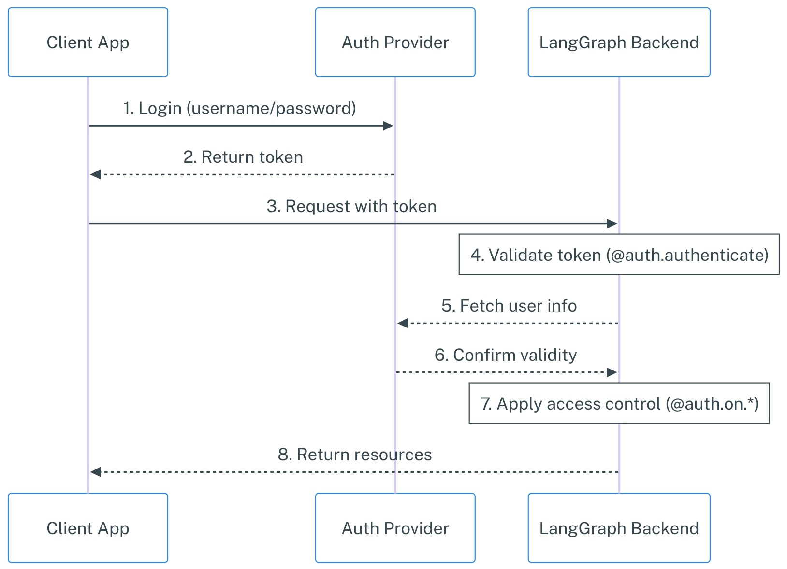
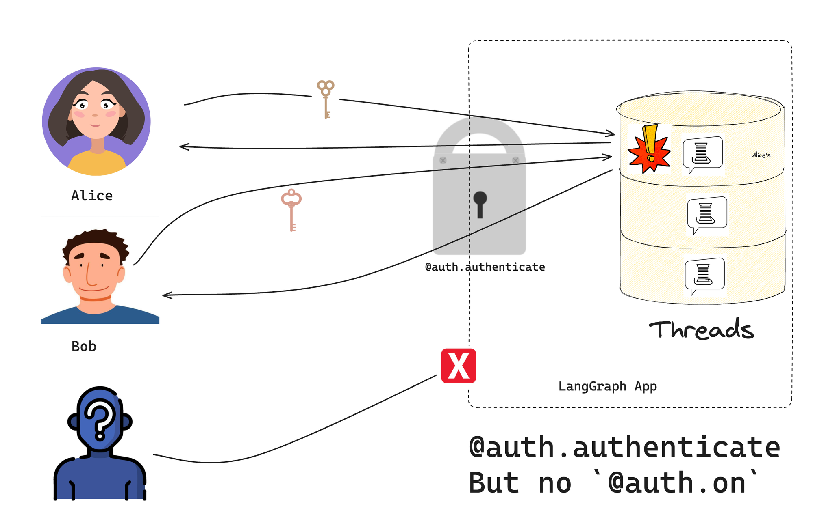
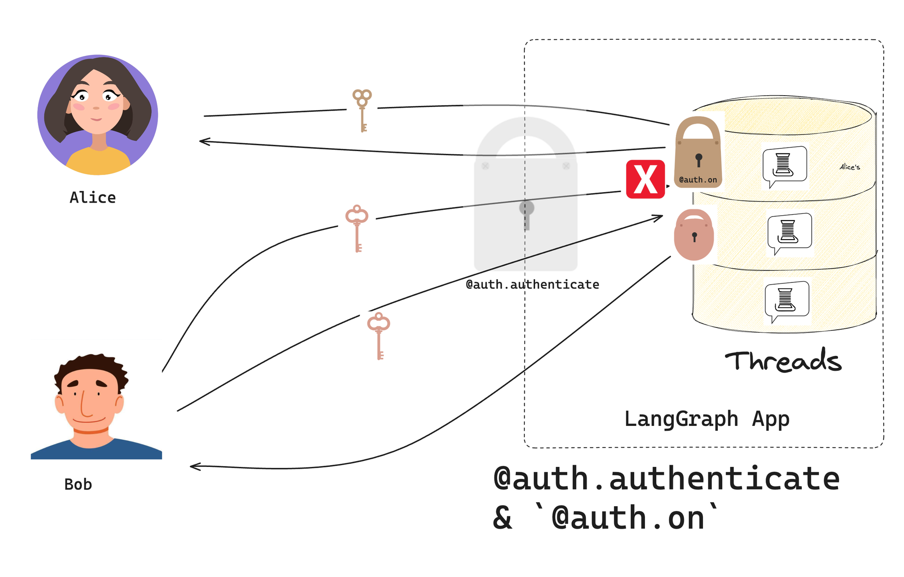

_Note: As of October 2025, LangGraph Platform has been re-named to "LangSmith Deployment"._

Today we're introducing custom authentication and resource-level access control for Python deployments in LangGraph Cloud and self-hosted environments. This feature lets you integrate your own auth providers and implement granular access patterns directly in your LangGraph applications.

## Quick Links

- [Video Tutorial: Adding Custom Authentication to LangGraph](https://youtu.be/g7s_6t5Jm4I?ref=blog.langchain.com)
- Authentication tutorial series:
1. [Basic Authentication](https://langchain-ai.github.io/langgraph/tutorials/auth/getting_started/?ref=blog.langchain.com) \- Learn to add user authentication to a `langgraph` app
2. [Resource Authorization](https://langchain-ai.github.io/langgraph/tutorials/auth/resource_auth/?ref=blog.langchain.com) \- Add authorization & resource filtering to make conversations private
3. [Production Auth](https://langchain-ai.github.io/langgraph/tutorials/auth/add_auth_server/?ref=blog.langchain.com) \- Connect your application with OAuth2 providers like Supabase
- [Conceptual Guide: Authentication & Access Control](https://langchain-ai.github.io/langgraph/concepts/auth/?ref=blog.langchain.com)
- [Quick guide](https://langchain-ai.github.io/langgraph/how-tos/auth/custom_auth/?ref=blog.langchain.com) on how to implement custom auth
- [`Auth`](https://langchain-ai.github.io/langgraph/cloud/reference/sdk/python_sdk_ref/?ref=blog.langchain.com#langgraph_sdk.auth.Auth) reference docs

## Why Custom Authentication?

While LangGraph Cloud provides built-in API key authentication, production deployments often need deeper integration with existing auth systems. Teams frequently need to:

- Validate credentials using their own auth provider
- Scope conversations to specific users
- Add OAuth support for end-user authentication
- Implement role-based access control (RBAC)

Custom authentication provides low-level primitives that integrate with any auth system while maintaining LangGraph's simplicity. A typical flow would look something like the following:



Your [`@auth.authenticate`](https://langchain-ai.github.io/langgraph/cloud/reference/sdk/python_sdk_ref/?ref=blog.langchain.com#langgraph_sdk.auth.Auth.authenticate) handler in LangGraph handles steps 4-6, while your [`@auth.on`](https://langchain-ai.github.io/langgraph/cloud/reference/sdk/python_sdk_ref/?ref=blog.langchain.com#langgraph_sdk.auth.Auth.on) handlers implement step 7. Keep reading to learn more!

## Adding to your app

The system centers around the [`Auth`](https://langchain-ai.github.io/langgraph/cloud/reference/sdk/python_sdk_ref/?ref=blog.langchain.com#langgraph_sdk.auth.Auth) object, which provides two key capabilities:

1. **Authentication**: Validate credentials and identify users. The authentication handler (marked by `@auth.authenticate` ) receives each request and returns a [`MinimalUserDict`](https://langchain-ai.github.io/langgraph/cloud/reference/sdk/python_sdk_ref/?ref=blog.langchain.com#langgraph_sdk.auth.types.MinimalUserDict) containing the user's identity:

```python
from langgraph_sdk import Auth

auth = Auth()

@auth.authenticate
async def get_current_user(authorization: str | None) -> Auth.types.MinimalUserDict:
    """Validate JWT tokens and extract user information."""
    assert authorization
    scheme, token = authorization.split()
    assert scheme.lower() == "bearer"

    # Validate with your auth provider
    user = await validate_token(token)
    return {
        "identity": user["id"],
        "email": user["email"],
        "is_authenticated": True
    }
```

With authentication alone, non-credentialed requests are rejected. However, authenticated users are still able to access all resources since we haven't introduced any resource ownership. That's the role of the authorization handlers below.



2. **Authorization**: Control access to specific resources. Authorization handlers receive an [`AuthContext`](https://langchain-ai.github.io/langgraph/cloud/reference/sdk/python_sdk_ref/?ref=blog.langchain.com#langgraph_sdk.auth.types.AuthContext) containing user information (from your `@auth.authenticate` function above) and can add metadata to the resource indicating ownership and/or return filters that control resource access:

```python
@auth.on
async def add_owner(ctx: Auth.types.AuthContext, value: dict):
    """Make resources private to their creator."""
    filters = {"owner": ctx.user.identity}
    metadata = value.setdefault("metadata", {})
    metadata.update(filters)
    return filters
```

Now that an authorization handler has been implemented, resources' metadata are stamped with an "`owner`" ID to restrict access only to threads the user has created.



Authorization event handlers have three main jobs:

1. Add metadata to resources being created.
2. Return filters so users can only access matching resources
3. Reject requests from users who lack permissions to this resource or action.

To use custom auth in your deployment, add an auth configuration to your `langgraph.json`, pointing to the `auth` variable name and path in your app deployment.

```json
{
  "auth": {
    "path": "src/security/auth.py:auth"
  }
}
```

## Resource-Level Control

The authorization system provides fine-grained control over `threads`, `assistants`, and `crons` (support for authorization on `store` actions to be released soon). Instead of a single global handler, you can implement custom logic for different operations:

```python
@auth.on.threads.create
async def on_thread_create(ctx: Auth.types.AuthContext, value: Auth.types.on.threads.create.value):
    """Custom logic for thread creation"""
    if not has_permission(ctx.user, "threads:create"):
        raise Auth.exceptions.HTTPException(status_code=403)
    return {"owner": ctx.user.identity}

@auth.on.assistants
async def on_assistants(ctx: Auth.types.AuthContext, value: Auth.types.on.assistants.value):
    """Restrict access to assistants resource"""
    if not is_admin(ctx.user):
        raise Auth.exceptions.HTTPException(status_code=403)
```

LangGraph will use the most specific handler that matches the resource and action being accessed, falling back to broader handlers when needed. For a given event, at most one handler is called.

## Current Support

Custom authentication is currently available for Python deployments only. Support for JavaScript deployments is coming soon.

## Next Steps

The fastest way to get started is by checking out the [quick how-to guide](https://langchain-ai.github.io/langgraph/how-tos/auth/custom_auth/?ref=blog.langchain.com) on implementing custom auth. We also have the following resources:

- Video Tutorial: Adding Custom Authentication to LangGraph
- Authentication tutorial series:
1. [Basic Authentication](https://langchain-ai.github.io/langgraph/tutorials/auth/getting_started/?ref=blog.langchain.com) \- learn to add user authentication to a langgraph app
2. [Resource Authorization](https://langchain-ai.github.io/langgraph/tutorials/auth/resource_auth/?ref=blog.langchain.com) \- add authorization & resource filtering to make conversations private
3. [Production Auth](https://langchain-ai.github.io/langgraph/tutorials/auth/add_auth_server/?ref=blog.langchain.com) \- integrate with an identity server to finish the implementation

To learn even more, check out the [conceptual guide on custom authentication & access control](https://langchain-ai.github.io/langgraph/concepts/auth/?ref=blog.langchain.com), and the [reference docs](https://langchain-ai.github.io/langgraph/cloud/reference/sdk/python_sdk_ref/?ref=blog.langchain.com#langgraph_sdk.auth.Auth) on the auth object.

And check out the [full-stack template](https://github.com/langchain-ai/custom-auth?ref=blog.langchain.com) ( [demo](https://custom-auth.vercel.app/?ref=blog.langchain.com)) that connects your LangGraph chatbot with a react frontend.

Try it out and share your feedback on [GitHub](https://github.com/langchain-ai/langgraph/discussions?ref=blog.langchain.com). This is another step toward supporting more sophisticated deployment patterns - we're excited to see what you build!