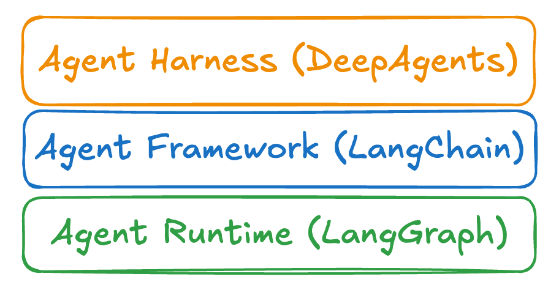
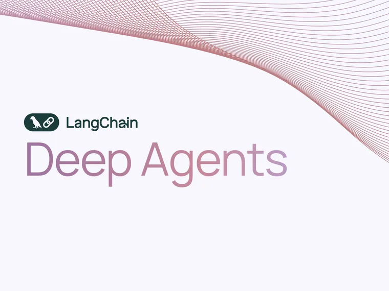

There are few different open source packages we maintain: [LangChain](https://docs.langchain.com/oss/python/langchain/quickstart?ref=blog.langchain.com) and [LangGraph](https://docs.langchain.com/oss/python/langgraph/overview?ref=blog.langchain.com) being the biggest ones, but [DeepAgents](https://docs.langchain.com/oss/python/deepagents/overview?ref=blog.langchain.com) being an increasingly popular one. I’ve started using different terms to describe them: LangChain is an agent framework, LangGraph is an agent runtime, DeepAgents is an [agent harness](https://www.vtrivedy.com/posts/claude-code-sdk-haas-harness-as-a-service?ref=blog.langchain.com). Other folks are using these terms as well - but I don’t think there is a clear definition of framework vs runtime vs harness. This is my attempt to do try to define things. I will readily admit that there is still murkiness and overlap so I would love any feedback!

## Agent Frameworks (LangChain)

Most packages out there that help build with LLMs I would classify as agent frameworks. The main value add they provide is abstractions. These abstractions represent a mental model of the world. These abstractions should ideally make it easier to get started. They also provide a standard way to build applications which makes it easy for developers to onboard and jump between projects. Complaints against abstractions are that if done poorly they can obfuscate the inner workings of things and not provide the flexibility needed for advanced use cases.

We think of [LangChain](https://docs.langchain.com/oss/python/langchain/overview?ref=blog.langchain.com) as an agent framework. As part of the 1.0 we spent a lot of time thinking about the abstractions - for structured content blocks, for the agent loop, for middleware (which we think adds flexibility to the standard agent loop). Other examples of what I would consider agent frameworks are Vercel’s AI SDK, CrewAI, OpenAI Agents SDK, Google ADK, LlamaIndex, and lot more.

## Agent Runtimes (LangGraph)

When you need to run agents in production, you will want some sort of runtime for agents. This runtime should provide more infrastructure level considerations. The main one that comes to mind is [durable execution](https://docs.langchain.com/oss/python/langgraph/durable-execution?ref=blog.langchain.com), but I would also put considerations like support for streaming, [human-in-the-loop support](https://docs.langchain.com/oss/python/langgraph/interrupts?ref=blog.langchain.com), thread level persistence and [cross-thread persistence](https://docs.langchain.com/oss/python/langgraph/add-memory?ref=blog.langchain.com) here.

When we build [LangGraph](https://docs.langchain.com/oss/python/langgraph/overview?ref=blog.langchain.com), we wanted to build in a production ready agent runtime from scratch. You can read more about our thought process behind building LangGraph [here](https://blog.langchain.com/building-langgraph/). The other projects we think are closest to this are Temporal, Inngest, and other durable execution engines.

Agent runtimes are generally lower level than agent frameworks and can power agent frameworks. For example, LangChain 1.0 is built on top of LangGraph to take advantage of the agent runtime it provides.

## Agent Harnesses (DeepAgents)

[DeepAgents](https://docs.langchain.com/oss/python/deepagents/overview?ref=blog.langchain.com) is the newest project we’re working on. It is higher level than agent frameworks - it builds on top of LangChain. It adds in default prompts, opinionated handling for tool calls, tools for planning, has access to a filesystem, and more. It’s more than a framework - it comes with batteries included.

Another way that we’ve used to describe DeepAgents is as a “general purpose version of Claude Code”. To be fair, Claude Code is also trying to be an agent harness - they’ve released things like Claude Agent SDK as a step in that direction. Besides Claude Agent SDK, I don’t think there are many other general purpose agent harnesses out there today. One could argue, however, that ALL the coding CLI's are in a way agent harnesses, and may be general purpose.

## When to use each one

Let’s summarize the differences and talk about when to each one:

Now, I will readily admit that the lines are blurry. LangGraph is probably best described as both a runtime and a framework, for example. “Agent Harness” is a term I’m just starting to see be used more ( [I didn’t come up with it](https://www.vtrivedy.com/posts/claude-code-sdk-haas-harness-as-a-service?ref=blog.langchain.com)). I don’t think there is yet a super clear definition of any of these.

Part of the fun of developing in an early space is coming up with the mental models for how to talk about things. We know LangChain is different from LangGraph, and DeepAgents is different from both of them. We think describing them as a framework, runtime, and harness respectively is a helpful distinction - but as always, we would love your feedback!

### Tags

[Harrison's Hot Takes](https://blog.langchain.com/tag/in-the-loop/)

[**On Agent Frameworks and Agent Observability**](https://blog.langchain.com/on-agent-frameworks-and-agent-observability/)

[Harrison's Hot Takes](https://blog.langchain.com/tag/in-the-loop/) 4 min read

[**From Traces to Insights: Understanding Agent Behavior at Scale**](https://blog.langchain.com/from-traces-to-insights-understanding-agent-behavior-at-scale/)

[Harrison's Hot Takes](https://blog.langchain.com/tag/in-the-loop/) 5 min read

[**In software, the code documents the app. In AI, the traces do.**](https://blog.langchain.com/in-software-the-code-documents-the-app-in-ai-the-traces-do/)

[Harrison's Hot Takes](https://blog.langchain.com/tag/in-the-loop/) 5 min read

[**Reflections on Three Years of Building LangChain**](https://blog.langchain.com/three-years-langchain/)

[Harrison's Hot Takes](https://blog.langchain.com/tag/in-the-loop/) 6 min read

[**Not Another Workflow Builder**](https://blog.langchain.com/not-another-workflow-builder/)

[Harrison's Hot Takes](https://blog.langchain.com/tag/in-the-loop/) 4 min read

[**Deep Agents**](https://blog.langchain.com/deep-agents/)

[Harrison's Hot Takes](https://blog.langchain.com/tag/in-the-loop/) 3 min read