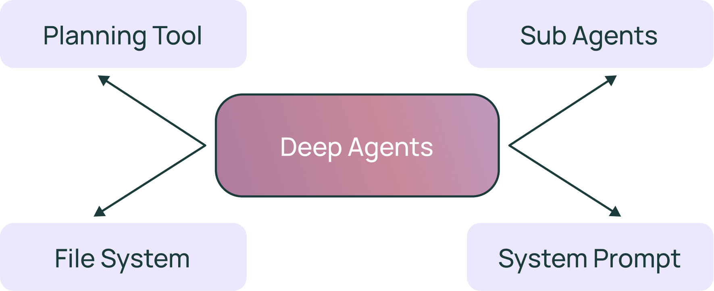
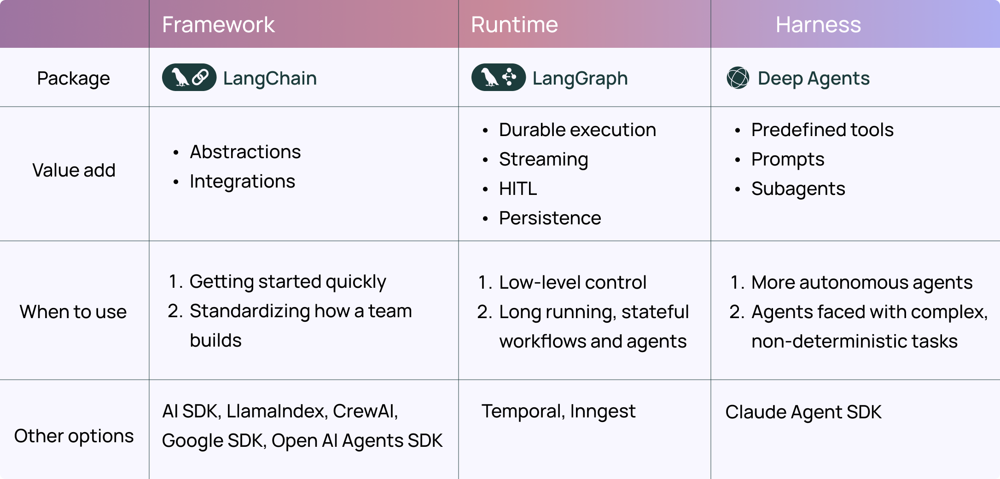
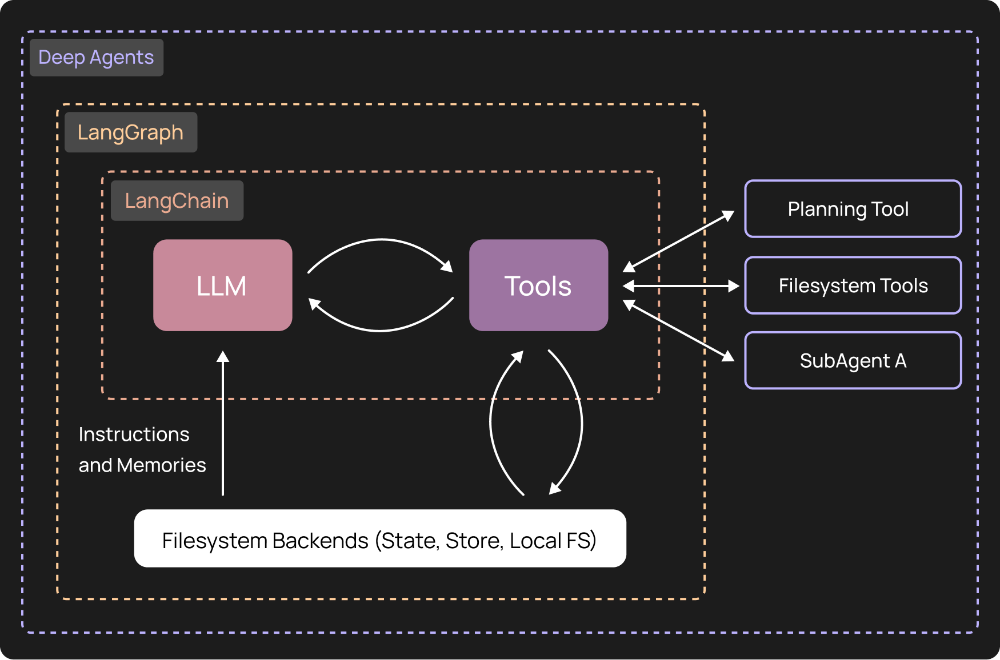

Two months ago [we wrote about Deep Agents](https://blog.langchain.com/deep-agents/) \- a term we coined for agents that are able to do complex, open ended tasks over longer time horizons. We hypothesized that there were four key elements to those agents: a planning tool, access to a filesystem, subagents, and detailed prompts.

We launched [`deepagents`](https://github.com/hwchase17/deepagents?ref=blog.langchain.com) as an Python package that had a base of all these elements, so that you would only have to bring your custom tools and a custom prompt and you could build a Deep Agent easily.

We've seen strong interest and adoption, and today we're excited to double down with a 0.2 release. In this blog we want to talk about whats new in 0.2 release compared to the launch, as well as when to use [`deepagents`](https://docs.langchain.com/oss/python/deepagents/overview?ref=blog.langchain.com) (vs [`langchain`](https://docs.langchain.com/oss/python/langchain/overview?ref=blog.langchain.com) or [`langgraph`](https://docs.langchain.com/oss/python/langgraph/overview?ref=blog.langchain.com))

## **Pluggable Backends**

The main new addition in 0.2 release comes in the form of pluggable backends. Previously, the "filesystem" that `deepagents` had access to was a "virtual filesystem". It would use LangGraph state to store files.

In 0.2, we have a new `Backend` abstraction, which allows you to plug in anything as the "filesystem". Built in implementations include:

- LangGraph State
- LangGraph Store (cross thread persistence)
- The actual local filesystem

We've also introduced the idea of a "composite backend". This allows you to have a base backend (eg local filesystem) but then map on top of it other backends at certain subdirectories. An example use case of this is to empower long term memory. You could have a local filesystem as a base backend, but then map all file operations in `/memories/` directory to an s3 backed "virtual filesystem", allowing your agent to add things there and have them persist beyond your computer.

You can write your own backend to create a "virtual filesystem" over any database or any data store you want.

You can also subclass an existing backend and add in guardrails around which files can be written to, format checking for these files, etc.

## Other things in 0.2

We also added a number of other improvements making their way to `deepagents` in the 0.2 release:

- [Large tool result eviction](https://docs.langchain.com/oss/python/deepagents/harness?ref=blog.langchain.com#large-tool-result-eviction): automatically dump large tool results to the filesystem when they exceed a certain token limit.
- [Conversation history summarization](https://docs.langchain.com/oss/python/deepagents/harness?ref=blog.langchain.com#conversation-history-summarization): automatically compress old conversation history when token usage becomes large.
- [Dangling tool call repair](https://docs.langchain.com/oss/python/deepagents/harness?ref=blog.langchain.com#dangling-tool-call-repair): fix message history when tool calls are interrupted or cancelled before execution.

## When to use deepagents vs LangChain, LangGraph

This is now our third open source library we are investing in, but we believe that all three serve different purposes. In order to distinguish these purposes, we will likely refer `deepagents` as an "agent harness", `langchain` as an "agent framework", and `langgraph` as an agent runtime.

LangGraph is great if you want to build things that are combinations of workflows and agents.

LangChain is great if you want to use the core agent loop without anything built in, and built all prompts/tools from scratch.

DeepAgents is great for building more autonomous, long running agents where you want to take advantage of built in things like planning tools, filesystem, etc.

They built on top of each other - `deepagents` is built on top of `langchain`'s agent abstraction, which is turn is built on top of `langgraph`'s agent runtime.

