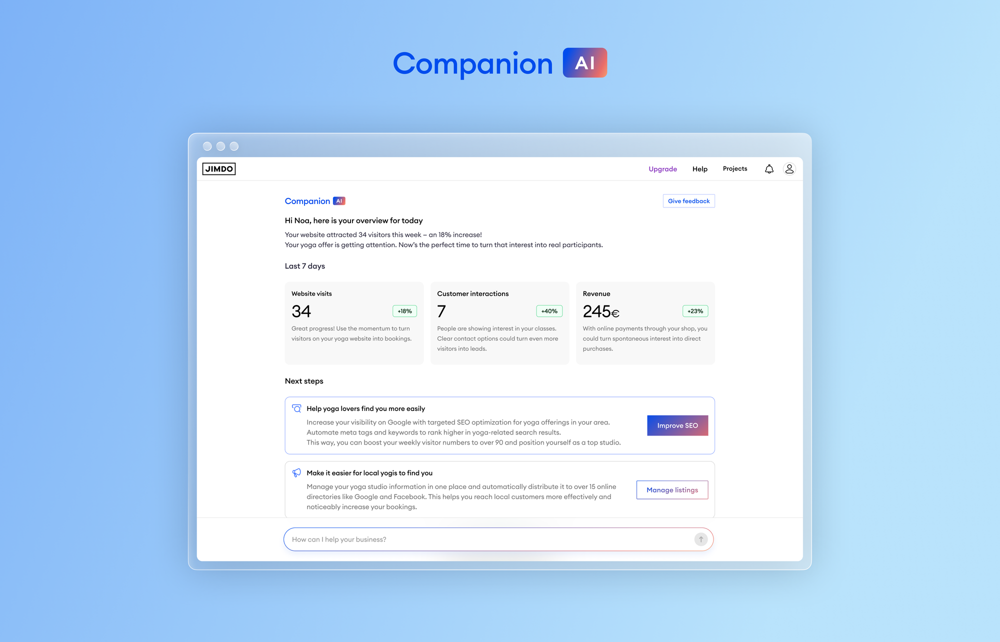

## **About Jimdo**

For 18 years, Jimdo, one of Europe's leading website builders, has been building tools for self-employed entrepreneurs across 190 countries, with over 35 million websites created on their platform. Based in Germany, Jimdo serves yoga studios, photography businesses, bakeries, consulting practices, and thousands of other solopreneurs. Their core offering has expanded beyond website hosting to include features that help solopreneurs with bookings, analytics, transactions, and marketing campaigns.

**The challenge: Lack of domain expertise across critical** **business functions**

Solopreneurs often need to handle marketing, sales, finance, operations, and strategy without the dedicated teams that larger companies rely on. Jimdo observed that many of their customers were able to build solid websites, but some faced issues with driving more traffic and conversion to their sites and spent valuable time guessing at what might move the needle.

Jimdo needed to build an AI-powered business advisor that could analyze each customer’s unique situation and provide personalized, actionable guidance — essentially giving solopreneurs the same strategic insights that enterprise companies get from their analytics and consulting teams to help the users grow their own business.

**Solution: Building Jimdo Companion with the LangChain ecosystem**

To deliver on this vision, Jimdo's AI engineering team turned to the LangChain ecosystem, using LangChain.js and LangGraph.js for orchestration, with LangSmith providing comprehensive observability and evaluation capabilities, building their own AI Platform, a shared core that every product team contributes to. On this foundation, Jimdo’s Companion has two main AI agent systems:

**Companion Assistant: AI that speaks your language -** Jimdo also released Companion Assistant, a ChatGPT-like interface embedded throughout their product suite. A key innovation is its agent analyzes the customers business, their created content, extracting their tone of voice so results speak their language. At launch, Companion Assistant helps customers deeply understand and complete tasks for their business including integrating with specialized agents for SEO optimization, listings management, bookings, smart forms, and the website editor - providing contextual help wherever users need it.

**Companion Dashboard: An agentic business advisor -** Jimdo Companion is the first thing customers see when they log in - a comprehensive synthesis of where their business currently stands. The system queries 10+ data sources to deliver real-time performance summaries and context-aware next steps tailored to each business's specific challenges. Unlike generic tools, Companion differentiates Jimdo from competitors by delivering analytical insights based on actual product behavior and business data.

Jimdo Companion Dashboard

### [**LangGraph.js**](http://langgraph.js/?ref=blog.langchain.com) **and LangChain.js for workflow orchestration**

LangChain.js provided the interoperability layer that made Jimdo's multi-faceted AI platform possible, enabling seamless integration of multiple data sources and AI capabilities. The framework's TypeScript support fit naturally with Jimdo's existing tech stack, while offering the flexibility to work with different LLM providers and switch between models without rewriting code.

The real power of Jimdo Companion lies in its ability to dynamically analyze a business and determine the highest-impact next actions. This required sophisticated workflow orchestration that LangGraph.js enabled through ReAct agents (reasoning + acting) and graph-based architectures:

- **Context-aware decision trees**: When traffic drops, Companion activates local SEO analysis workflows. When conversion rates lag, it triggers conversion optimization assessments. A wedding photographer with pricing questions follows a completely different evaluation flow than a bakery struggling with local visibility.
- **Parallel execution paths**: The system simultaneously evaluates multiple business dimensions - traffic sources, conversion funnels, competitive positioning, pricing strategy - reducing response latency while providing comprehensive insights across 10+ data sources.
- **State management**: LangGraph.js's state management capabilities allow Companion to maintain context across multiple interactions, remembering previous conversations and tracking which actions users have seen.

The modular approach encouraged by LangGraph.js enabled the Jimdo team to build smaller, focused subgraphs that could be combined into larger, more sophisticated workflows - creating a scalable architecture for their growing suite of AI capabilities.

### **LangSmith for monitoring and quality assurance**

With thousands of customers relying on Companion for business-critical decisions, maintaining accuracy and reliability was non-negotiable. Jimdo uses LangSmith as their key monitoring feature, tracking:

- **Quality scores**: Latency and quality of outputs based on LLM-as-judge setups
- **Graph quality output**: Performance metrics for LangGraph workflows
- **Tool quality output**: Accuracy and effectiveness of tool calls
- **User satisfaction**: The next frontier in their evaluation strategy

LangSmith's comprehensive tracing allows the team to understand exactly how the system arrives at specific guidance, enabling continuous refinement of prompts and workflows. The intuitive structuring of trace data makes debugging significantly easier, leading to quicker development cycles and faster bug fixes.

## **Impact: Measurable success for self-employed entrepreneurs**

The results speak to the transformative power of personalized, AI-driven business guidance:

### **50% More First Customer Contacts**

Jimdo users with access to Companion receive their first customer contact or order within 30 days at a 50% higher rate than users without the AI assistant. By identifying and addressing the specific blockers each business faces - whether traffic, conversion, or positioning - Companion accelerates the path to that critical first success.

### **40% Increase in Customer Activity**

Across the board, Companion users see 40% more inquiries and orders compared to users without access. This isn't just about more traffic; it's about smarter positioning, clearer value propositions, better-optimized conversion paths, and pricing that reflects true market value.

## **What's next**

Jimdo Companion already delivers measurable impact through personalized business assistance - the next evolution shifts to execution: Every product experience, progressively automating the journey from "what to do next" to "it’s already done." This evolution moves beyond a set of agents to a comprehensive ecosystem where specialized agents autonomously handle configuration, background optimization, and multi-step workflows across Jimdo and external tools, empowering customers to confidently partner with the AI and maintain ultimate control.

Using LangSmith's evaluation framework, these agents will continuously improve through millions of interactions, while enhanced LangGraph orchestration will handle increasingly sophisticated multi-agent coordination.

The goal: transform every login into concrete business value with dramatically less effort, positioning Jimdo not as a website builder with AI features, but as an AI-powered business platform for solopreneurs.

### Tags

[Case Studies](https://blog.langchain.com/tag/case-studies/)

[**monday Service + LangSmith: Building a Code-First Evaluation Strategy from Day 1**](https://blog.langchain.com/customers-monday/)

[Case Studies](https://blog.langchain.com/tag/case-studies/) 8 min read

[**How Remote uses LangChain and LangGraph to onboard thousands of customers with AI**](https://blog.langchain.com/customers-remote/)

[Case Studies](https://blog.langchain.com/tag/case-studies/) 5 min read

[**Fastweb + Vodafone: Transforming Customer Experience with AI Agents using LangGraph and LangSmith**](https://blog.langchain.com/customers-vodafone-italy/)

[Case Studies](https://blog.langchain.com/tag/case-studies/) 7 min read

[**How ServiceNow uses LangSmith to get visibility into its customer success agents**](https://blog.langchain.com/customers-servicenow/)

[Case Studies](https://blog.langchain.com/tag/case-studies/) 4 min read

[**Monte Carlo: Building Data + AI Observability Agents with LangGraph and LangSmith**](https://blog.langchain.com/customers-monte-carlo/)

[Case Studies](https://blog.langchain.com/tag/case-studies/) 4 min read

[**How Bertelsmann Built a Multi-Agent System to Empower Creatives**](https://blog.langchain.com/customer-bertelsmann/)

[Case Studies](https://blog.langchain.com/tag/case-studies/) 6 min read