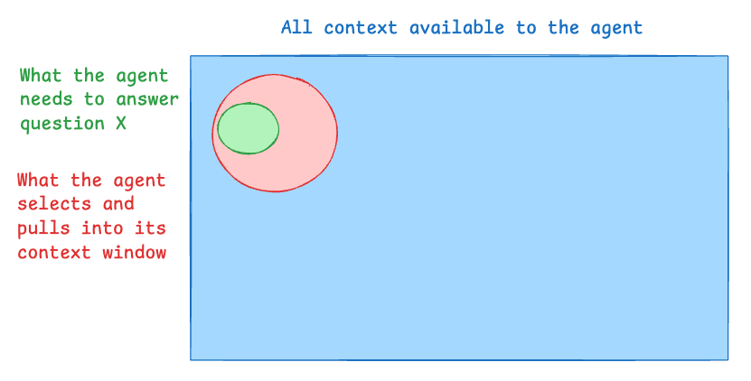
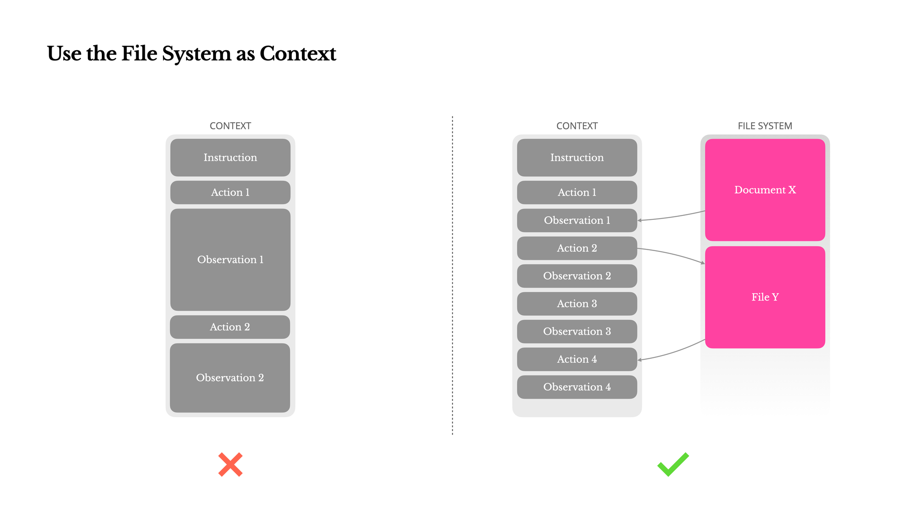

By Nick Huang

A key feature of [deep agents](https://blog.langchain.com/deep-agents/) is their access to a set of filesystem tools. Deep agents can use these tools to read, write, edit, list, and search for files in their filesystem.

In this post, we’ll walk through why we think filesystems are important for agents. In order to understand how filesystems are helpful, we should start by thinking through where agents can fall short today. They either fail because (a) the model is not good enough, or (b) they don’t have access to the right context. Context engineering is the [“delicate art and science of filling the context window with just the right information for the next step”](https://x.com/karpathy/status/1937902205765607626?ref=blog.langchain.com). Understanding context engineering - and how it can fail - is crucial for building reliable agents.

### A view of context engineering

One way to view the job of a modern day agent engineer is through the lens of [context engineering](https://blog.langchain.com/the-rise-of-context-engineering/). Agents generally **have access to** a lot of context (all support docs, all code files, etc). In order to answer an incoming question, the agent **needs** some important context (which contains the context needed to answer the question). While aiming to answer said question, the agent **retrieves** some body of context (to pull into it’s context window).

When viewed from this lens, there are many ways that context engineering can “fail” for agents:

- If the context that the agent needs is not in the total context, the agent cannot succeed. Example: a customer support agent needs access to a certain documentation page to answer a question, but that page hasn’t been indexed.
- If the context that the agent retrieves doesn’t encapsulate the context that the agent needs, then the agent will not be able to answer correctly. Example: a customer support agent needs access to a certain documentation page to answer a question, that page exists and is indexed, but is not retrieved by the agent.
- If the context that the agent retrieves is far larger than the context that the agent needs, then the agent is being wasteful (with time, tokens, or both). Example: a customer support agent needs a single specific page, and the agent retrieves 100 pages.

Our job as agent engineers is to **fit red to green (to make sure that the context the agent retrieves is as small of a superset of the needed information as possible)**

A few specific challenges arise when seeking to isolate the appropriate context

1. **Too many tokens** (retrieved context >> necessary context)

Some tools, like web search, can return a lot of tokens. A few web searches can quickly build up to tens of thousands of tokens in your conversation history. You might eventually run into a pesky 400 bad request error, but well before that, your LLM bill balloons and performance degrades.
2. **Needs large amounts of context** (necessary context > supported context window)

Sometimes an agent may actually need a lot of information in order to answer a question. This information usually cannot be returned in a single search query, which is why many have leaned into the idea of “agentic search” - letting an agent call a search tool repeatedly. The issue with this is that the amount of context quickly grows to a point where it can’t all fit into its context window.
3. **Finding niche information** (retrieved context ≠ necessary context)

Agents may need to reference niche information buried in hundreds or thousands of files in order to handle an input. How can the agent reliably find that information? If it cannot - then the retrieved context will not be what is needed to answer the question. Are there alternatives (or complements) to semantic search?
4. **Learning over time** (total context ≠ necessary context)

Sometimes the agent may just not have access to the necessary context for answering a question (either in the tools or instructions it has). The end user may often provide clues (implicitly or explicitly) in their interactions with the agent what that context may be. Is there a way for the agent to add that to its context for future iterations?

These are all common hurdles, and most of us have faced different flavors of these before!

### How can a filesystem make an agent better?

In the simplest terms: a filesystem provides **a single interface through which an agent can flexibly store, retrieve, and update an infinite amount of context.**

Let’s see how this can help in each of the scenarios listed above.

**Too many tokens** (retrieved context >> necessary context)

Instead of using the conversation history to hold all tool call results and notes, an agent can write these to the filesystem, and then selectively look up **_relevant information_** when necessary. Manus was one of the first to [publicly talk about this approach](https://manus.im/blog/Context-Engineering-for-AI-Agents-Lessons-from-Building-Manus?ref=blog.langchain.com) \- the below diagram is from their blog post.

Let’s take that first example with the web search tool. I run a web search, and I get back 10k tokens of raw content from the tool. Most of that content is probably not necessary all the time. If I put that in my messages history, all 10k tokens are going to sit there for the entire conversation, driving up my Anthropic bill. But if I offload that large tool result to the filesystem, the agent can then intelligently grep search for certain key words, and then read only necessary context into my conversation.

In this example, the agent is effectively using the filesystem as a **scratch pad for large context.**

**Needs large amounts of context (necessary context < supported context window)**

Sometimes agents require a lot of context to answer the question. Filesystems provide a nice abstraction for letting LLMs dynamically store and pull in more information as needed. Examples of this include:

- For long horizon answers, agents need to make a plan and then follow it. By writing that plan to the filesystem, the agent can then pull this information back into the context window later on, to remind the agent what it’s suppose to be doing (eg [“manipulate attention through recitation”](https://manus.im/blog/Context-Engineering-for-AI-Agents-Lessons-from-Building-Manus?ref=blog.langchain.com))
- To pour through all this context, the agent may spin up subagents. As these subagents do work and learn things, rather than just replying to the main agent with their learnings, they can write their knowledge to the filesystem instead (eg [minimize the game of telephone](https://www.anthropic.com/engineering/multi-agent-research-system?ref=blog.langchain.com))
- Some agents require a lot of instructions on how to do things. Rather than just stuff all these instructions into the system prompt (and bloat context) you can store them as files and let the agent dynamically read them as needed (eg [Anthropic skills](https://www.anthropic.com/engineering/equipping-agents-for-the-real-world-with-agent-skills?ref=blog.langchain.com)).

**Finding niche information** (retrieved context ≠ necessary context)

Semantic search was one of the most popular approaches to retrieving context early on in the LLM wave. It can be effective in some use cases, but depending on the type of document (e.g. technical API reference, code files), semantic may be very poorly placed due to a lack of semantic information in the text.

Filesystems provide an alternative to allow agents to intelligently search for context with ls, glob, and grep tools. If you’ve used Claude Code recently, you’ll know that it heavily relies on glob and grep search to find the right context it needs. There are a few keys to why this technique is successful.

- models today are [specifically trained](https://platform.claude.com/docs/en/agents-and-tools/tool-use/bash-tool?ref=blog.langchain.com) to understand traversing filesystems
- the information is often already structured logically (directories)
- glob and grep allow the agent to not only isolate specific files but also specific lines and specific characters
- The [`read_file`](https://platform.claude.com/docs/en/agents-and-tools/tool-use/text-editor-tool?ref=blog.langchain.com) tool allows the agent to specify which lines to read in from a file

For these reasons, there are situations where using filesystems (and the search capabilities you gain by using a filesystem) can create better results.

Note that semantic search can still be useful! And can be used in conjunction with filesystem search. Cursor recently [wrote a blog](https://cursor.com/blog/semsearch?ref=blog.langchain.com) highlighting the benefits of using both together.

**Learning over time** (total context ≠ necessary context)

A big reason agents mess up is they are missing relevant context. A great way to improve agents is usually to make sure they have access to the right context. Sometimes this can look like adding more datasources or updating the system prompt.

A common practice for updating the system prompt is:

1. See an example where the agent was lacking appropriate instructions
2. Get the relevant instructions from a subject matter expect
3. Update the prompt with those instructions

Often times, the end user is actually the best subject matter expert. Through conversation with the agent, they may provide important clues (implicitly or explicitly) as to what the right relevant instructions are. So with that in mind - is there a way to automate the third step above (updating the prompt with those instructions)?

We think an agent’s instructions (or skills) are no different than any other context they might want to work with. A filesystem can serve as the place for agents to store and update their own instructions!

Immediately after user feedback is given, an agent can write to its own files and remember an important piece of information. This is great for quick, one-off facts, especially things that might be custom to a user like their name, email, or other preferences.

This hasn’t been fully solved and is still an emerging pattern, but it’s an exciting new way that LLMs can grow their own skillsets and instructions over time, making sure that for future iterations they have access to the necessary context.

### See how a deep agent can make use of its filesystem

We have an open source repo called Deep Agents ( [Python](https://github.com/langchain-ai/deepagents?ref=blog.langchain.com), [TypeScript](https://github.com/langchain-ai/deepagentsjs?ref=blog.langchain.com)) that lets you quickly build an agent that has access to a filesystem. A lot of these context engineering tricks that use the filesystem are baked in! There are almost certainly more patterns that will emerge - try Deep Agents out and let us know what you think!