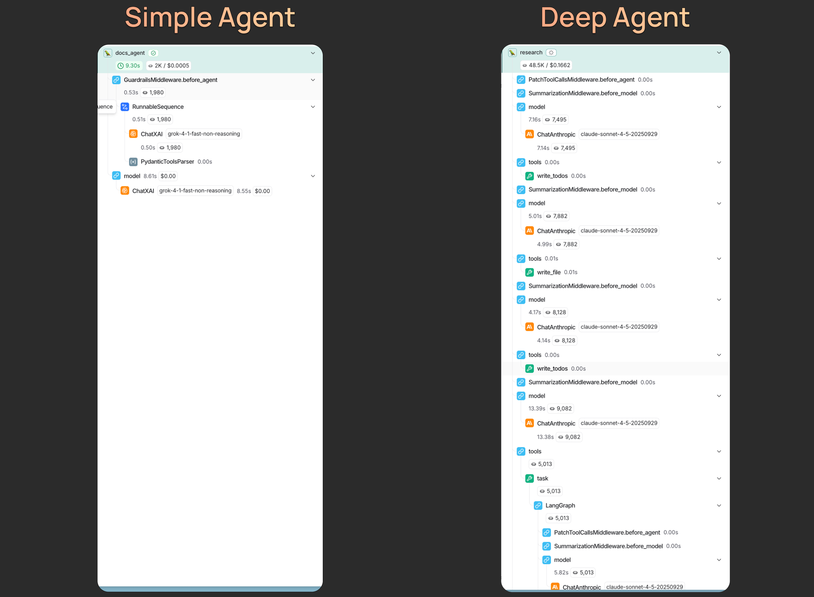
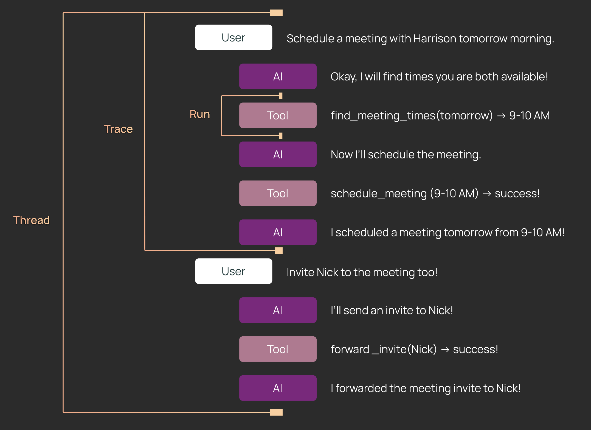
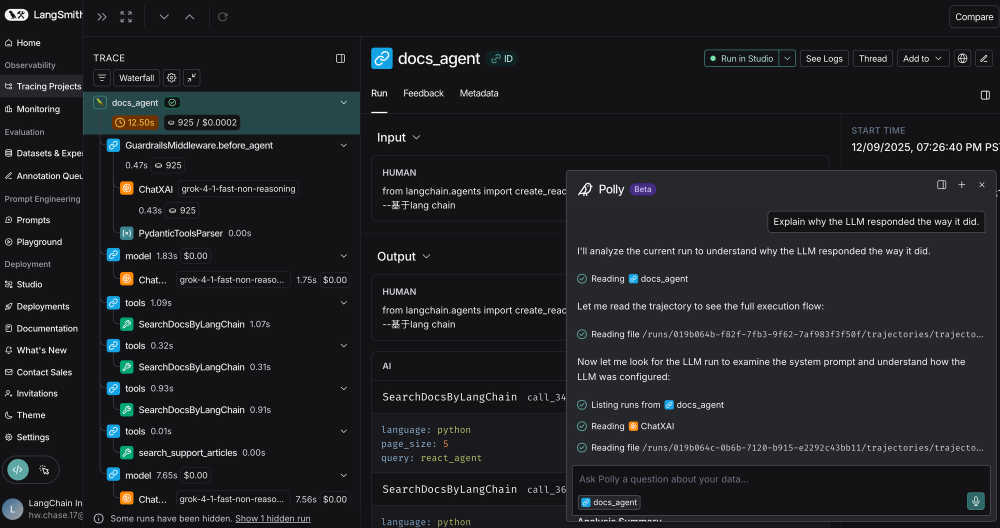
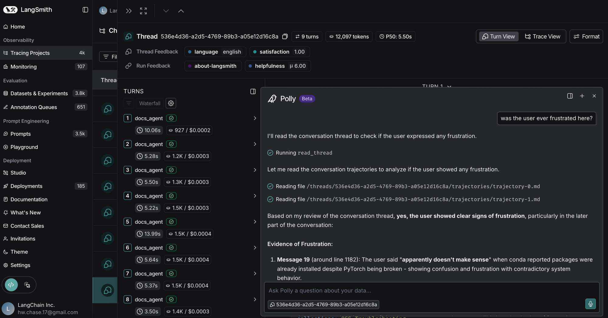
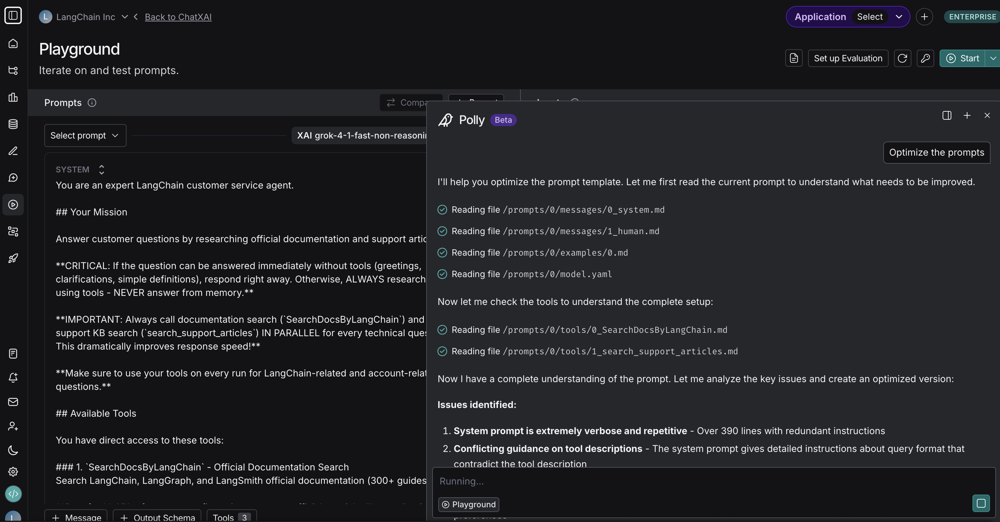

Debugging is the process of finding and fixing errors. This is a critical step in software engineering, and even more critical in [agent engineering](https://blog.langchain.com/agent-engineering-a-new-discipline/). One of the key capabilities of [LangSmith](https://docs.langchain.com/langsmith/home?ref=blog.langchain.com) is tooling to debug LLM applications.

Today we are doubling down on solving that problem for the new wave of [“deep agents”](https://blog.langchain.com/doubling-down-on-deepagents/) we see being developed.

In this blog we:

- Explain why debugging deep agents is different than debugging simpler LLM applications
- Introduce [Polly](https://blog.langchain.com/introducing-polly-your-ai-agent-engineer/) (an AI assistant for agent engineering) to help in LangSmith for debugging deep agents
- Launch l [angsmith-fetch](https://blog.langchain.com/introducing-langsmith-fetch/), a CLI for equipping coding agents like Claude Code or DeepAgents CLI with debugging capabilities

## How Deep Agents are different than simpler LLM applications

Unlike simple LLM calls or short workflows, deep agents run for minutes, span dozens or hundreds of steps, and often involve multiple back-and-forth interactions with users.



As a result, the traces produced by a single deep agent execution can contain an ton of information, far more than a human can easily scan or reason about. When something goes wrong, it may not be obvious which decision, prompt instruction, or tool call caused the behavior you’re seeing.

This is where tracing with LangSmith — and using AI to analyze those traces — becomes important. So, what specifically makes deep agents more complex?

- **Longer prompts:** The prompts for deep agents often span hundreds if not thousands of lines — usually containing a general persona, instructions on calling tools, important guidelines, and few-shot examples. When behavior degrades, it’s difficult to know which part of the prompt is responsible.
- **Longer traces:** Deep agents can run for dozens if not hundreds of steps (taking minutes to complete). When presented with such a large trace, there is simply more content for a human to parse through to find meaningful sections.
- **Multiple turns:** Deep agents enable human-in-the-loop workflows by default. A meaningful example conversation with a deep agent often involves several back and forth interactions. In order to understand what the agent did and see its full trajectory, you need to look across multiple interactions.

## Tracing captures relevant information

In order to debug an agent, you need to have visibility into what is happening inside. This is where tracing comes in.

We use the umbrella term **tracing** to describe logging your agent execution data to LangSmith. The data format consists of **runs, traces, and threads.**



- **Runs:** A step that your agent takes. Examples include LLM model calls and tool calls. Runs are nested in a tree structure.
- **Traces:** A single execution of your agent. A trace is made up of a tree of Runs.
- **Threads:** A collection of Traces. A thread is a full conversation between a User and an application.

Tracing is super easy to set up - you can set it up in a few minutes by following this [guide](https://www.youtube.com/watch?v=fA9b4D8IsPQ&ref=blog.langchain.com).

Once your application data is in LangSmith, you can leverage AI to analyze full agent trajectories to figure out what is going on, and then suggest updates to the prompt. There are two main ways to do this.

## Polly - an AI assistant for agent engineering

Polly is a [new in-app feature](https://blog.langchain.com/p/162fa797-0446-4a2b-86b5-49fdc007bfc3/?member_status=free) that allows you to chat with an agent to analyze your thread and trace data. See our [video overview here](https://youtu.be/4Ox2gdZnM6c?ref=blog.langchain.com).

Here are a few ways to chat with Polly!

**In the Trace view**



You can use Polly to debug, analyze, and understand what happened in the Trace. Instead of manually scanning dozens or hundreds of steps, you can ask Polly questions like:

- “Did the agent do anything that could be more efficient”
- “Did the agent make any mistakes”

This is particularly helpful for deep agents, which tend to have longer traces where failure modes can be distributed across many steps.

**In the Thread view**



This is similar to a single Trace, but here, Polly can access information from an entire thread. Threads span several conversational turns, and can oftentimes also span several hours or days. It’s hard for a person to stay aware of all of that context.

**In the Prompt Playground**



One of the most important parts of a Deep Agent is the system prompt. Polly is tuned to be an excellent prompt engineer! Just describe the behavior you want in natural language and Polly will update your prompt accordingly. Polly can also help you define structured output or mock tools on your model call as well.

## LangSmith Fetch CLI - a tool to make your coding agent an expert agent engineer

If you prefer to work in your IDE or code agents (e.g., DeepAgents, Claude Code, etc), we have a CLI [`LangSmith Fetch`](https://github.com/langchain-ai/langsmith-fetch?ref=blog.langchain.com) that connects to LangSmith traces or threads easily. Whether you're debugging an agent, analyzing conversation flows, or building datasets from production traces, this [CLI](https://blog.langchain.com/p/647419d5-fa7e-493f-a997-d81fd0009f7a/?member_status=free) provides fast, flexible access to your LangSmith traces and threads.

It bridges the gap between the LangSmith UI and your local workflow, letting you fetch traces or threads by ID when you know exactly what you want, or by time when you need to grab whatever just happened. With support for multiple output formats (human-readable panels, pretty JSON, or compact raw JSON), the tool adapts to your use case—whether you're inspecting data in the terminal, piping to `jq`, or feeding results to an LLM for analysis.

It enables two key workflows. First, the "I just ran something" workflow to grab recent threads: you execute your agent, then immediately run `langsmith-fetch threads ./my_data` to grab the most recent traces in the project without hunting for IDs in the UI. Add temporal filters like `--last-n-minutes 30` to narrow your search, or use `--project-uuid` to target a specific project.

```markdown
# Just ran your agent? Grab the most recent trace immediately
langsmith-fetch traces --project-uuid <your-uuid> --format json

# Or grab the last 5 traces
langsmith-fetch traces --project-uuid <your-uuid> --limit 5
```

Second, the bulk export workflow: when you need datasets for evaluation or analysis, commands like `langsmith-fetch threads ./my-data --limit 50` fetch multiple threads and save each as a separate JSON file, perfect for batch processing or building test sets.

```markdown
# Or grab the last 5 traces from a specific project
langsmith-fetch traces --project-uuid <your-uuid> --limit 5
```

Of course, you can also supply a desired thread or trace ID. The output formats adapt to your needs: `--format pretty` for terminal viewing with Rich panels, `--format json` for readable structured data, or `--format raw` for piping to other tools.

## LangSmith makes it easy to debug and improve your deep agents

Deep Agents are powerful but longer running and more complex than simple LLM workflows. To understand and improve them, you need visibility into what your deep agents are actually doing.

With LangSmith, you can trace your deep agents and see what's going on — then, chat with [Polly](https://blog.langchain.com/p/162fa797-0446-4a2b-86b5-49fdc007bfc3/?member_status=free) to analyze your deep agent’s behavior and use AI to help you improve your prompts. If you'd rather analyze it with Claude Code or another coding agent - you can use [LangSmith Fetch](https://blog.langchain.com/p/647419d5-fa7e-493f-a997-d81fd0009f7a/?member_status=free) to equip your coding agents with all the debugging tools necessary.

Set up tracing in just a few minutes, and try chatting with Polly today on LangSmith to debug and improve your deep agents!