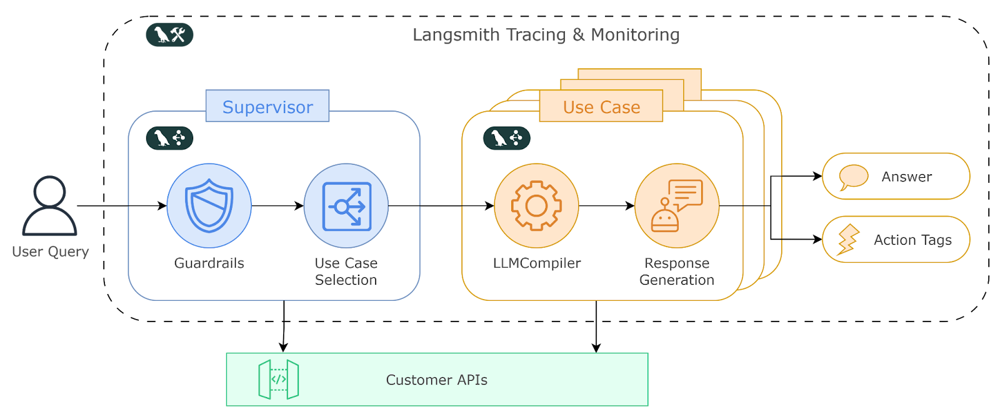
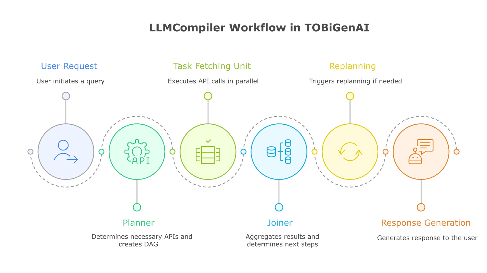
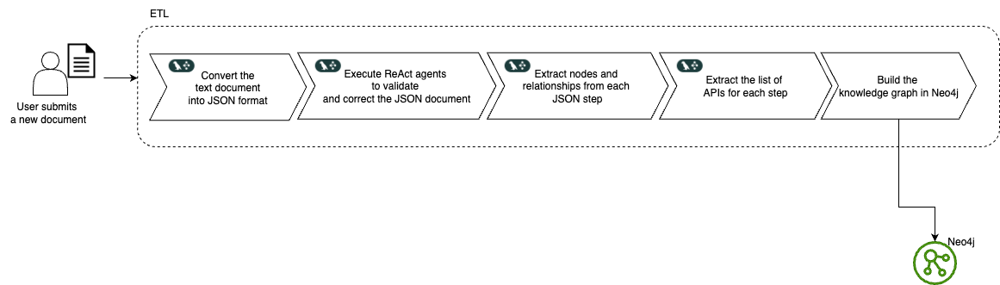
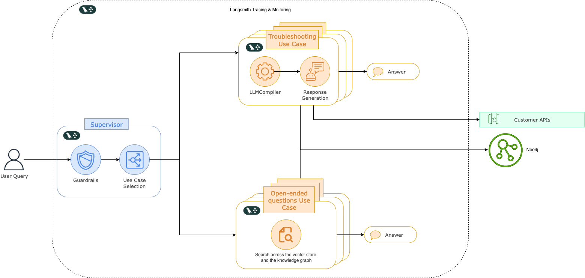
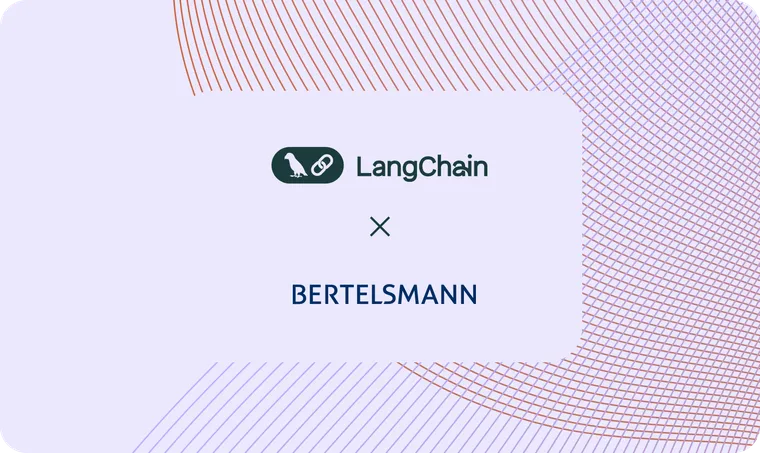

Fastweb + Vodafone, part of the Swisscom Group, is one of Europe's leading telecommunications providers serving millions of customers across Italy. Recognizing that traditional customer service approaches could be improved to meet their growing demands, Fastweb + Vodafone embarked on an AI transformation to revolutionize how it delivers customer support.

Customer service in telecommunications operates at a massive scale with complex, interconnected challenges. Customers require immediate assistance with billing inquiries, service activations, roaming questions, and technical support, often expecting resolution within a single interaction. Traditional TOBi struggles with nuanced requests that require contextual understanding, multiple system access, and end-to-end resolution.

For Fastweb + Vodafone's call center consultants, the challenge was equally complex. Agents needed to access customer data quickly, understand service history, and determine appropriate resolutions while maintaining high service standards. The manual process of consulting multiple systems and knowledge bases, while effective, could benefit from intelligent support to further enhance the speed and consistency of the customer experience. Fastweb + Vodafone thus needed an AI solution that could handle both customer-facing interactions and empower call center agents to deliver exceptional service consistently.

## **Building intelligent customer interactions with LangChain and LangGraph**

Fastweb + Vodafone chose LangChain and LangGraph as the foundation for their AI transformation because their customer service process naturally mapped to a graph-based decision-making flow. Their implementation centers around two flagship projects: **Super TOBi and Super Agent**.

### **Super TOBi: AI-powered customer service at enterprise scale**

Super TOBi builds upon Fastweb + Vodafone's existing ChatBot (TOBi), transforming it into an agentic system that can handle complex customer interactions across multiple channels. The system follows a structured approach that mirrors how experienced customer service representatives handle inquiries.

The system’s architecture is organized around two main agents, both implemented as LangGraph graphs: the **Supervisor** and the **Use Cases**.

The Supervisor acts as the central entry point for all user queries. Its first responsibility is to apply guardrails, filtering, and shaping inputs to ensure they are valid and safe. Beyond this, it manages special scenarios such as the end of a conversation, operator handovers, simple interactions (like greetings), and others. Once the input has been processed, the Supervisor either routes the query directly to the most appropriate Use Case or, in cases of uncertainty, **asks clarification questions** to identify the right path forward. In this way, it orchestrates the entire dialogue flow, ensuring each query is handled consistently and efficiently.

The **Use Cases** represent specialized agents, each designed to resolve a particular category of customer need. They operate with access to a well-defined subset of customer APIs and follow the **LLM Compiler pattern**. This approach allows them to reason about which APIs should be invoked, to coordinate multiple steps where required, and to generate final responses that are tailored to the customer’s context. Importantly, some Use Cases are not limited to natural language responses: they can also emit **structured action** tags. These tags enable the system to execute transactional flows directly within the conversation. For example, an action tag might initiate an offer activation, disable an ongoing service, or trigger a payment method update.

When such action tags are returned, the **ChatBot** automatically executes them in the conversation interface. This integration creates a seamless blend of dialogue and action, allowing customers to move effortlessly from asking a question to completing a transaction, all within the same conversational experience.

Fastweb + Vodafone's implementation of the LLM Compiler pattern within LangGraph enables the system to generate comprehensive plans for each customer request, seamlessly executing API calls, data retrieval, and multi-step problem resolution.

Currently serving nearly **9.5 million customers** through the Customer Companion App and voice channels, Super TOBi handles use cases including cost control, active offers, roaming, sales, and billing with impressive business metrics: **90% correctness rate, 82% resolution rate, and a Customer Effort Score (CES) of 5.2 out of 7**, translating into faster response times, fewer human-operator transfers, and higher customer satisfaction.

### **Super Agent: Empowering call center excellence with LangGraph**

Super Agent is Fastweb + Vodafone’s internally facing AI project that augments every consultant with instant diagnostics, compliant guidance, and source-backed explanations. Unlike the consumer bot Super TOBi, Super Agent never speaks directly to customers; instead, it equips the human consultant with the exact next step. Thanks to this approach, the use of generative AI has driven **One-Call Resolution (OCR) rates above 86%**.

The solution blends LangChain’s composable tools with LangGraph’s controllable orchestration and stores all operational knowledge as a living graph inside Neo4j.

#### **From business template to graph in one automated ETL flow**

Business specialists write troubleshooting and informational procedures using structured templates with defined steps, conditions, and actions. Once submitted, an automated ETL pipeline—powered by LangGraph and task-specific LLM Agents (including ReAct Agents)—parses the document into JSON, extracts verification APIs, performs consistency checks, and refines step definitions.

The content is decomposed into nodes and relationships and stored in Neo4j as part of a knowledge graph: Steps link to Conditions, Actions, and related API nodes. A CI/CD pipeline then automates build, validation, and deployment, promoting the updated graph to production within hours and without downtime.

#### **Intent router and execution flows**

Incoming requests from consultants, whether troubleshooting support requests on user issues or general knowledge base questions, are first processed by a LangGraph Supervisor who determines whether the request matches a **graph-based procedure** or an **open-ended question**. In the case of a troubleshooting request, the corresponding procedure authored by the business and stored in Neo4j as a knowledge graph is identified. CRM data is automatically injected at this stage to reliably identify the user, ensuring each request is linked to the correct user and responses are tailored to the appropriate customer context.

#### **Graph-based procedure execution**

For structured troubleshooting and fault-isolation scenarios, the Supervisor activates a procedural sub-graph executor. Using LangChain and LangGraph, the system retrieves the first _Step_ node of the procedure from Neo4j along with its associated _Condition_, _Action_, and _API_ nodes. For each step, the required APIs are executed to validate the step’s conditions. If a condition is satisfied, the procedure concludes: the user’s issue is identified, and a response is generated by combining the corresponding Action with the contextual information gathered from the APIs. If none of the conditions are met, the process moves to the next Step node in the procedure and repeats iteratively until the problem and its solution are found.

#### **Graph RAG for open-ended questions**

Generic or unstructured questions about the company knowledge base are routed to a hybrid Retrieval-Augmented Generation (RAG) chain that combines a **vector store** with the **Neo4j knowledge graph**. The vector store finds a broad set of potentially relevant passages, and the knowledge graph then anchors the answer with the right context, adding source citations and making sure it follows company policy.

### **Technology highlights**

• Supervisor pattern keeps intent routing deterministic while allowing specialised sub-graphs to evolve independently.

• Customized LLMCompiler design adds telecom-specific LangGraph nodes for API orchestration, rule checking, and exception handling.

• Neo4j houses every artefact—procedural steps, validation rules, APIs, documents, solutions—making relationships first-class citizens and enabling lightning-fast graph traversals.

• LangSmith streams chain traces, latency metrics, and evaluation scores to Fastweb + Vodafone’s internal dashboards for continuous optimisation.

• Governance by design: every recommendation is validated against Rule nodes that encode Fastweb + Vodafone policy.

• Deployment agility:  the architectural design enables seamless integration of new capabilities without re-engineering, dramatically reducing time to market.

## **Continuous improvement through LangSmith monitoring**

Fastweb + Vodafone implemented LangSmith from day one of development, recognizing the critical importance of monitoring and evaluation in production AI systems.

> “You can’t run agentic systems in production without deep observability. LangSmith gave us end-to-end visibility into how our LangGraph workflows reason, route, and act, turning what would otherwise be a black box into an operational system we can continuously improve.” — Pietro Capra, Chat Engineering Chapter Lead, Fastweb + Vodafone

The team has developed sophisticated evaluation processes that run daily, automatically classifying chatbot responses and providing structured feedback for continuous improvement:

**Daily Evaluation Process:**

- Collect traces in LangSmith datasets from daily interactions
- Perform automated evaluation using LangSmith Evaluators SDK during overnight processing
- Analyze user queries, chatbot responses, context, and grading guidelines
- Generate structured output including scores (1-5), explanations, and violated guidelines

This automated evaluation system enables business stakeholders to review daily performance metrics, provide strategic input, and communicate with the technical team to make prompt adjustments to maintain the 90% correctness rate target. The combination of automated monitoring and human oversight ensures Super TOBi consistently delivers value to customers while identifying areas for improvement.

> _As Lucia Barbieri, Fastweb + Vodafone AI Customer Channels Lead, explains, “Automated evaluation has been crucial to scaling effectively, enabling us to quickly identify improvement areas and enhance experience, driving continuous growth and refinement.”_

## **What's next**

Fastweb + Vodafone continues expanding both Super TOBi and Super Agent capabilities while maintaining its core value proposition: delivering exceptional customer experiences through intelligent automation. Looking ahead, Fastweb + Vodafone plans to leverage its early success with LangGraph and LangSmith to explore building additional AI applications across its telecommunications operations.

With their foundation built on LangGraph's flexible architecture and LangSmith's monitoring capabilities, Fastweb + Vodafone is well-positioned to continue innovating in the telecommunications AI space while maintaining the reliability and performance their customers expect.

### Tags

[Case Studies](https://blog.langchain.com/tag/case-studies/)

[**monday Service + LangSmith: Building a Code-First Evaluation Strategy from Day 1**](https://blog.langchain.com/customers-monday/)

[Case Studies](https://blog.langchain.com/tag/case-studies/) 8 min read

[**How Remote uses LangChain and LangGraph to onboard thousands of customers with AI**](https://blog.langchain.com/customers-remote/)

[Case Studies](https://blog.langchain.com/tag/case-studies/) 5 min read

[**How Jimdo empower solopreneurs with AI-powered business assistance**](https://blog.langchain.com/customers-jimdo/)

[Case Studies](https://blog.langchain.com/tag/case-studies/) 4 min read

[**How ServiceNow uses LangSmith to get visibility into its customer success agents**](https://blog.langchain.com/customers-servicenow/)

[Case Studies](https://blog.langchain.com/tag/case-studies/) 4 min read

[**Monte Carlo: Building Data + AI Observability Agents with LangGraph and LangSmith**](https://blog.langchain.com/customers-monte-carlo/)

[Case Studies](https://blog.langchain.com/tag/case-studies/) 4 min read

[**How Bertelsmann Built a Multi-Agent System to Empower Creatives**](https://blog.langchain.com/customer-bertelsmann/)

[Case Studies](https://blog.langchain.com/tag/case-studies/) 6 min read