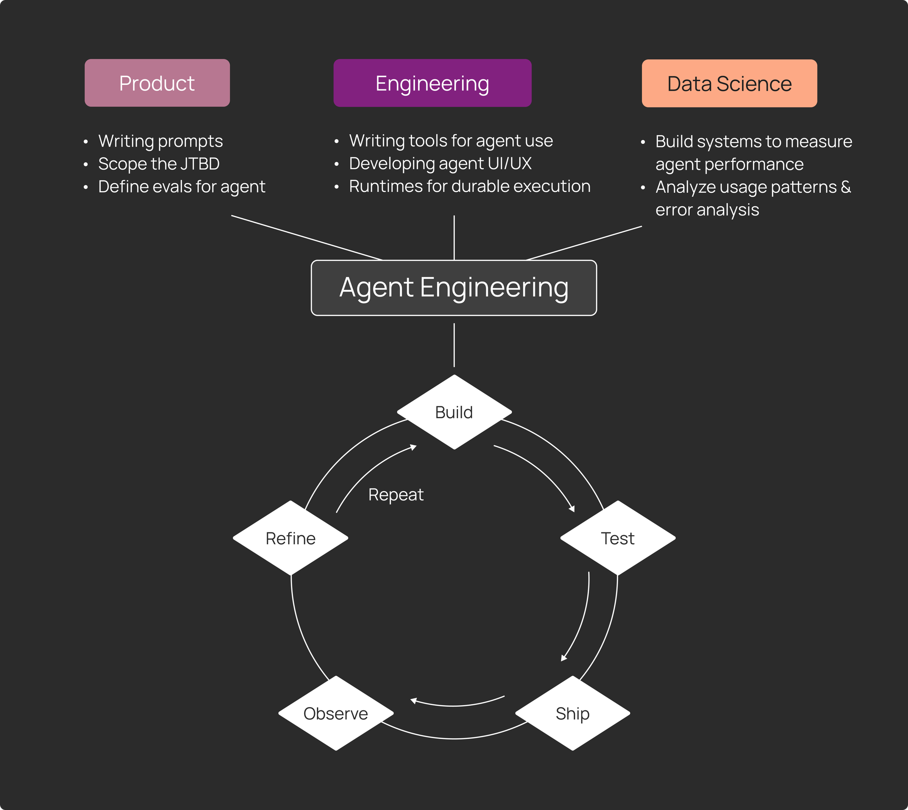

If you’ve built an agent, you know that the delta between “it works on my machine” and “it works in production” can be huge. Traditional software assumes you mostly know the inputs and can define the outputs. Agents give you neither: users can say literally anything, and the space of possible behaviors is wide open. That’s why they’re powerful — and why they can also go a little sideways in ways you didn’t see coming.

Over the past 3 years, we’ve watched thousands of teams struggle with this reality. The ones who’ve succeeded in shipping something reliable to production — companies like Clay, Vanta, LinkedIn, and Cloudflare — aren’t following the traditional software playbook. They’re pioneering something new: **agent engineering.**

### What is agent engineering?

Agent engineering is the iterative process of refining non-deterministic LLM systems into reliable production experiences. It is a cyclical process: **build, test, ship, observe, refine, repeat.**

The key here is that shipping isn't the end goal. It’s just the way you keep moving to get new insights and improve your agent. To make improvements that matter, you need to understand what’s happening in production. The faster you move through this cycle, the more reliable your agent becomes.

We see agent engineering as a new discipline that combines 3 skillsets working together:

- **Product thinking**defines the scope and shapes agent behavior. This involves:
  - Writing prompts that drive agent behavior (often hundreds or thousands of lines). Good communication and writing skills are key here.
  - Deeply understanding the "job to be done" that the agent replicates
  - Defining evaluations that test whether the agent performs as intended by the “job to be done”
- **Engineering**builds the infrastructure that makes agents production-ready. This involves:
  - Writing tools for agents to use
  - Developing UI/UX for agent interactions (with streaming, interrupt handling, etc.)
  - Creating robust runtimes that handle durable execution, human-in-the-loop pauses, and memory management.
- **Data science**measures and improves agent performance over time. This involves:
  - Building systems (evals, A/B testing, monitoring etc.) to measure agent performance and reliability
  - Analyzing usage patterns and error analysis (since agents have a broader scope of how users use them than traditional software)

### Where agent engineering shows up

Agent engineering isn’t a new job title. Instead, it’s a set of responsibilities that existing teams take on when they’re building systems that reason, adapt, and behave unpredictably. The organizations shipping reliable agents today are extending the skills of engineering, product, and data teams to meet the demands of non-deterministic systems.

Here’s where the practice typically shows up:

- **Software engineers and ML engineers** writing prompts and building tools for agents to use, tracing why an agent made specific tool calls, and refining the underlying models
- **Platform engineers** building agent infrastructure that handles durable execution and human-in-the-loop workflows
- **Product managers** writing prompts, defining agent scope, and ensuring the agent solves the right problem
- **Data scientists** measuring agent reliability and identifying opportunities for improvement

These teams embrace rapid iteration, and you'll often see software engineers tracing errors and handing off to PMs to tweak prompts based on those insights, or PMs identifying scope issues that require new tools from engineers. Each recognizes that the real work of hardening an agent happens through this cycle of observing production behavior and systematically refining based on what they learn.

### Why agent engineering, and why now?

Two fundamental shifts have made agent engineering necessary.

First, LLMs are powerful enough to handle complex, multi-step workflows. We’ve been seeing it with agents taking on whole jobs, not just tasks. Clay uses agents to handle everything from prospect research to personalized outreach and CRM updates. LinkedIn uses agents to scan massive talent pools for recruiting, ranking candidates and surfacing the strongest matches instantly. We’re starting to cross the threshold where agents are delivering meaningful business value in production.

Second, that power comes with real unpredictability. Simple LLM apps, though non-deterministic, tend to have more contained behavior. Agents are different. They reason across multiple steps, call tools, and adapt based on context. The same things that make agents useful also make them behave differently than traditional software. This usually means that:

- **Every input is an edge case.** There's no such thing as a "normal" input when users can ask anything in natural language. When you type in “make it pop” or “do what you did last time but differently”, the agent (just like a human) can interpret the prompts in different ways.
- **You can’t debug the old way.** Because so much logic lives inside the model, you have to inspect each decision and tool call. Small prompt or config tweaks can create huge shifts in behavior.
- **“Working” isn’t binary.** An agent can have 99.99% uptime while still being off the rails and broken. There aren’t always simple yes/no answers to the questions that matter, like: is the agent making the right calls? Using tools the right way? Following the intent behind your instructions?

When you put this all together — agents running real, high impact workflows yet behaving in ways that traditional software can’t solve — there’s an opportunity and the need for a new discipline. Agent engineering lets you harness the power of LLMs while building systems you can actually trust in production.

### What does agent engineering look like in practice?

Agent engineering operates on a different principle than traditional software development. To achieve a reliable agent system, shipping is how you learn, not what you do after learning.

We’ve seen successful eng teams follow a cadence for agent development that looks something like this:

- **Build your agent’s foundation.** Start with designing your agent's foundation, whether it's a simple LLM call with tools or a complex multi-agent system. Your architecture depends on how much workflow (deterministic step-by-step processes) versus agency (LLM-driven decisions) you need.
- **Test based on scenario you can imagine**. Test your agent against example scenarios to catch obvious issues with prompts, tool definitions, and workflows. Unlike traditional software where you can map out user flows, you can't anticipate every way users will interact with natural language input. Shift your mindset from "test exhaustively, then ship" to "test reasonably, ship to learn what actually matters.”
- **Ship to see real-world behavior.** Once you ship, you’ll immediately start seeing inputs you hadn’t considered and every production trace shows what your agent actually needs to handle.
- **Observe.** Trace every every interaction to see the full conversation, every tool called, and the exact context that informed each decision the agent made. Run evals over your production data to measure agent quality, whether you care about accuracy, latency, user satisfaction, or other criteria.
- **Refine**. Once you’ve identified patterns in what's failing, refine by editing prompts and modifying tool definitions. It’s all continuous, as you can add problematic cases back to your set of example scenarios for regression testing.
- **Repeat**. Ship your improvements and watch what’s changing in production. Each cycle teaches you something new about how users are interacting with your agent and what reliability actually means in your context.

### A new standard for engineering

The teams shipping reliable agents today share one thing: they've stopped trying to perfect agents before launch and started treating production as their primary teacher. In other words, tracing every decision, evaluating at scale, and shipping improvements in days instead of quarters.

Agent engineering is emerging because the opportunity demands it. Agents can now handle workflows that previously required human judgment, but only if you can make them reliable enough to trust. There is no shortcut, just the systematic work of iteration. The question isn't whether agent engineering will become standard practice. It's how quickly your team can adopt it to unlock what agents can do.