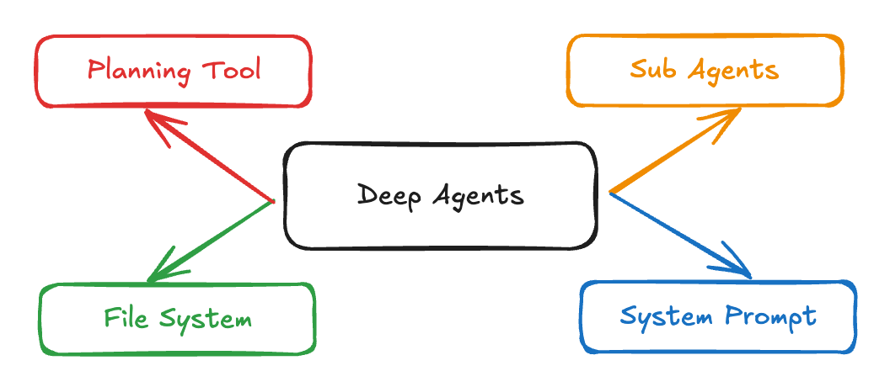
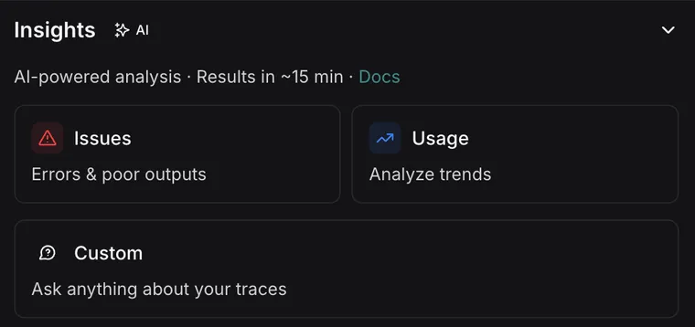
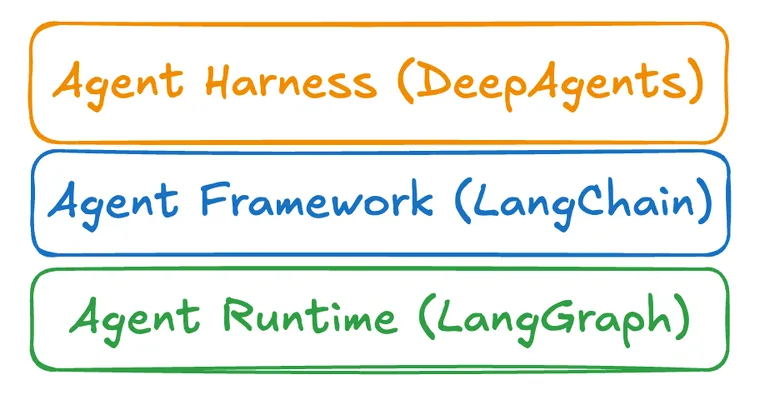
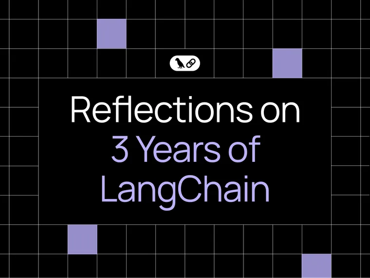
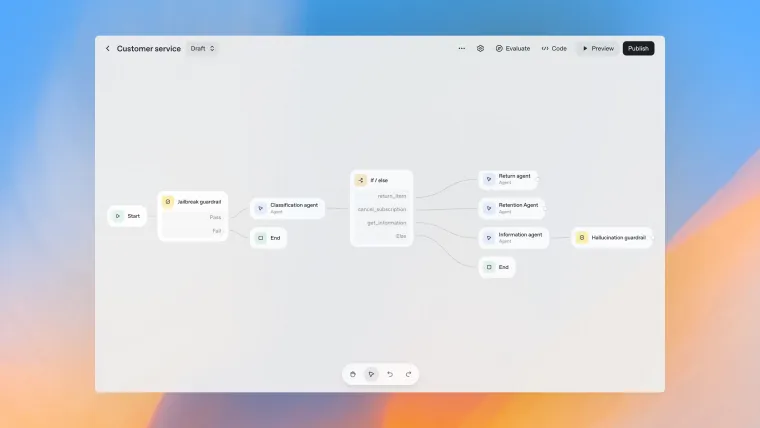

Using an LLM to call tools in a loop is the simplest form of an agent. This architecture, however, can yield agents that are “shallow” and fail to plan and act over longer, more complex tasks. Applications like “ [Deep Research](https://openai.com/index/introducing-deep-research/?ref=blog.langchain.com)”, “ [Manus](https://manus.im/?ref=blog.langchain.com)”, and “ [Claude Code](https://www.anthropic.com/claude-code?ref=blog.langchain.com)” have gotten around this limitation by implementing a combination of four things: a planning tool, sub agents, access to a file system, and a detailed prompt.

Acknowledgements: this exploration was primarily inspired by Claude Code and reports of people using it for [more than just coding](https://x.com/alexalbert__/status/1948765443776544885?ref=blog.langchain.com). What about Claude Code made it general purpose, and could we abstract out and generalize those characteristics?

## Deep agents in the wild

The dominant agent architecture to emerge is also the simplest: running in a loop, calling tools.

Doing this naively, however, leads to agents that are a bit shallow. “Shallow” here refers to the agents inability to plan over longer time horizons and do more complex tasks.

Research and coding have emerged as two areas where agents have been created that buck this trend. All of the major model providers have an agent for Deep Research and for “async” coding tasks. Many startups and customers are creating versions of these for their specific vertical.

I refer to these agents as “deep agents” - for their ability to dive deep on topics. They are generally capable of planning more complex tasks, and then executing over longer time horizons on those goals.

What makes these agents good at going deep?

The core algorithm is actually the same - it’s an LLM running in a loop calling tools. The difference compared to the naive agent that is easy to build is:

- A detailed system prompt
- Planning tool
- Sub agents
- File system

## Characteristics of deep agents

**Detailed system prompt**

Claude Code’s [recreated system prompts](https://github.com/kn1026/cc/blob/main/claudecode.md?ref=blog.langchain.com) are long. They contain detailed instructions on how to use tools. They contain examples (few shot prompts) on how to behave in certain situations.

Claude Code is not an anomaly - most of the best coding or deep research agents have pretty complex system prompts. Without these system prompts, the agents would not be nearly as deep. Prompting matters still!

**Planning tool**

Claude Code uses a [Todo list tool](https://claudelog.com/faqs/what-is-todo-list-in-claude-code/?ref=blog.langchain.com). Funnily enough - this doesn’t do anything! It’s basically a no-op. It’s just context engineering strategy to keep the agent on track.

Deep agents are better at executing on complex tasks over longer time horizons. Planning (even if done via a no-op tool call) is a big component of that.

**Sub agents**

Claude Code can spawn [sub agents](https://docs.anthropic.com/en/docs/claude-code/sub-agents?ref=blog.langchain.com). This allows it to split up tasks. You can also create custom sub agents to have more control. This allows for ["context management and prompt shortcuts"](https://x.com/dexhorthy/status/1950288431122436597?ref=blog.langchain.com).

Deep agents go deeper on topics. This is largely accomplished by spinning up sub agents that specifically focused on individual tasks, and allowing those sub agents to go deep there.

**File System**

Claude Code (obviously) has access to the file system and can modify files on there, not just to complete its task but also to jot down notes. It also acts as a shared workspace for all agents (and sub agents) to collaborate on.

Manus is another example of a deep agent that makes [significant use](https://manus.im/blog/Context-Engineering-for-AI-Agents-Lessons-from-Building-Manus?ref=blog.langchain.com) of a file system for “memory”.

Deep agents run for long periods of time and accumulate a lot of context that they need to manage. Having a file system handy to store (and then later read from) is helpful for doing so.

## Build your deep agent

In order to make it easier for everyone to build a deep agent for their specific vertical, I hacked on an open source package ( [`deepagents`](https://github.com/hwchase17/deepagents?ref=blog.langchain.com)) over the weekend. You can easily install it with `pip install deepagents` and then read instructions for how to use it [here](https://github.com/hwchase17/deepagents?ref=blog.langchain.com).

This package attempts to create a general purpose deep agent that can be customized to create your own custom version.

It comes with built-in components mapping to the above characteristics:

- A system prompt inspired by Claude Code, but modified to be more general
- A no-op Todo list planning tool (same as Claude Code)
- Ability to spawn sub-agents, and specify your own
- A mocked out “virtual file system” that uses the agents state (a preexisting LangGraph concept)

You can easily create your own deep agent by passing in a custom prompt (will be inserted into the larger system prompt as custom instructions), custom tools, and custom subagents. We put together a simple example of a ["deep research" agent](https://github.com/langchain-ai/open_deep_research?ref=blog.langchain.com) built on top of `deepagents`.

[**TRY OUT `deepagents` HERE**](https://github.com/hwchase17/deepagents?ref=blog.langchain.com)

### Tags

[Harrison's Hot Takes](https://blog.langchain.com/tag/in-the-loop/)

[**On Agent Frameworks and Agent Observability**](https://blog.langchain.com/on-agent-frameworks-and-agent-observability/)

[Harrison's Hot Takes](https://blog.langchain.com/tag/in-the-loop/) 4 min read

[**From Traces to Insights: Understanding Agent Behavior at Scale**](https://blog.langchain.com/from-traces-to-insights-understanding-agent-behavior-at-scale/)

[Harrison's Hot Takes](https://blog.langchain.com/tag/in-the-loop/) 5 min read

[**In software, the code documents the app. In AI, the traces do.**](https://blog.langchain.com/in-software-the-code-documents-the-app-in-ai-the-traces-do/)

[Harrison's Hot Takes](https://blog.langchain.com/tag/in-the-loop/) 5 min read

[**Agent Frameworks, Runtimes, and Harnesses- oh my!**](https://blog.langchain.com/agent-frameworks-runtimes-and-harnesses-oh-my/)

[Harrison's Hot Takes](https://blog.langchain.com/tag/in-the-loop/) 3 min read

[**Reflections on Three Years of Building LangChain**](https://blog.langchain.com/three-years-langchain/)

[Harrison's Hot Takes](https://blog.langchain.com/tag/in-the-loop/) 6 min read

[**Not Another Workflow Builder**](https://blog.langchain.com/not-another-workflow-builder/)

[Harrison's Hot Takes](https://blog.langchain.com/tag/in-the-loop/) 4 min read