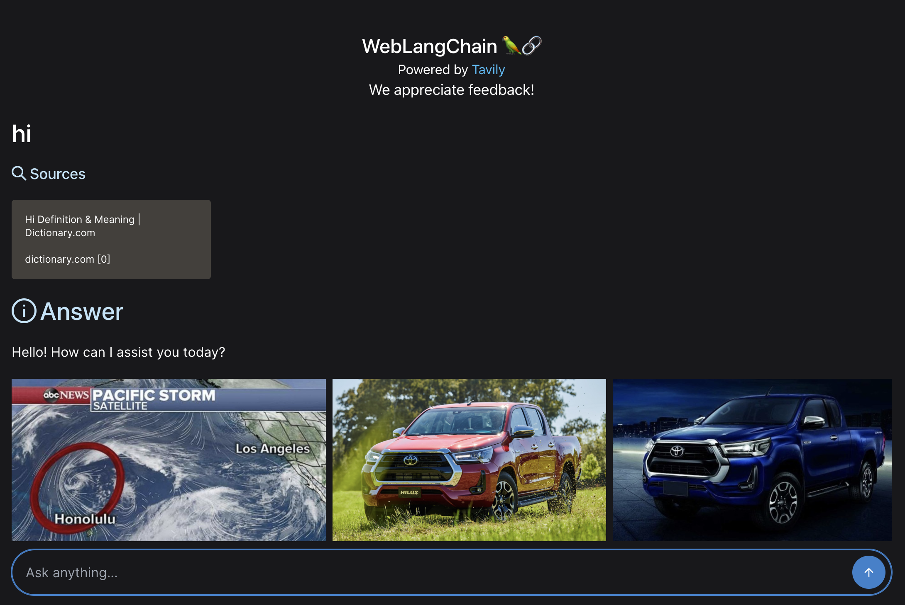
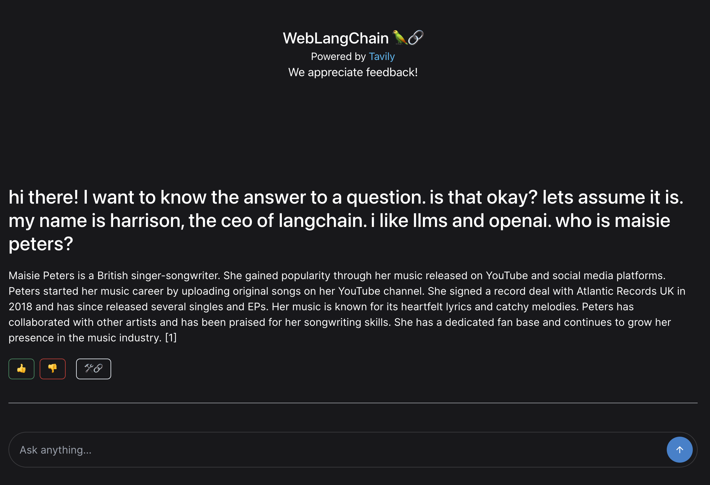
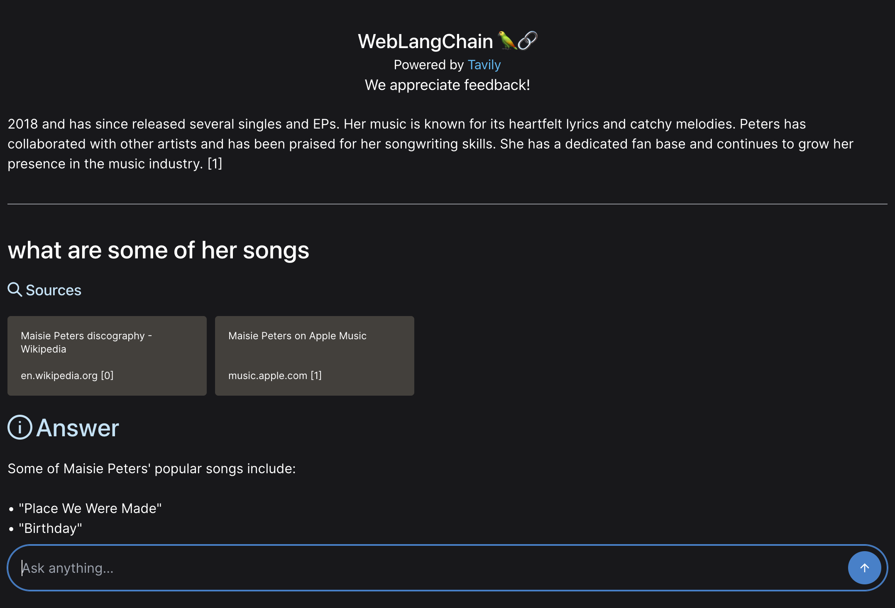
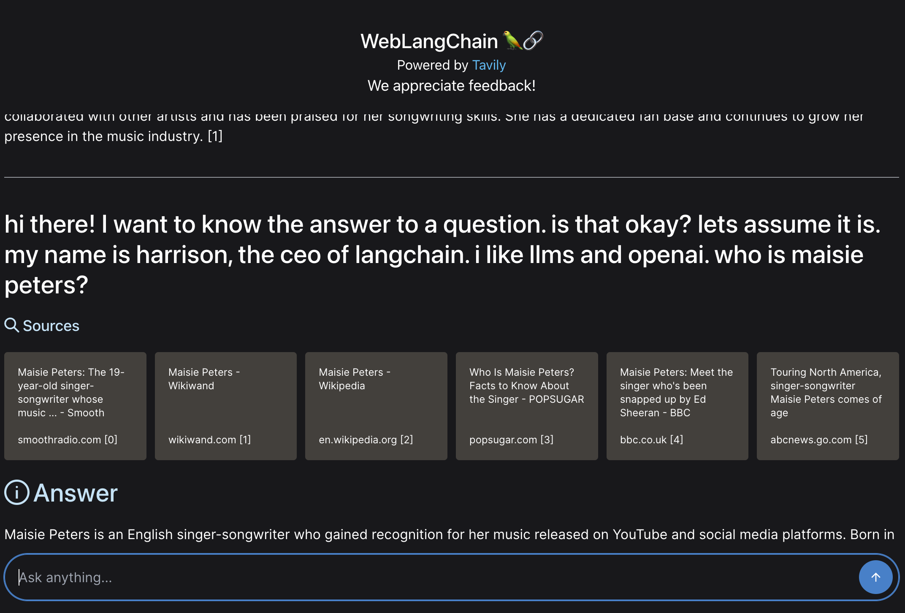
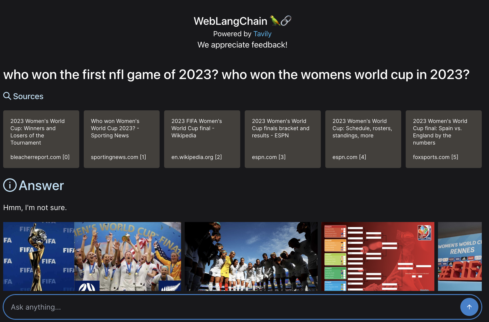
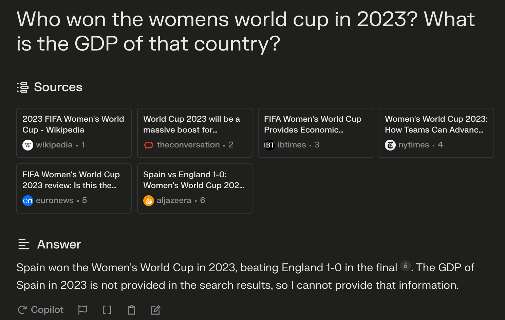
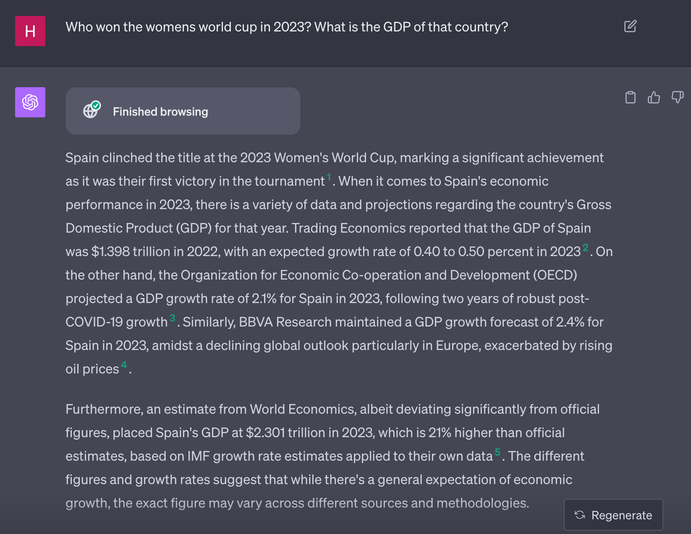
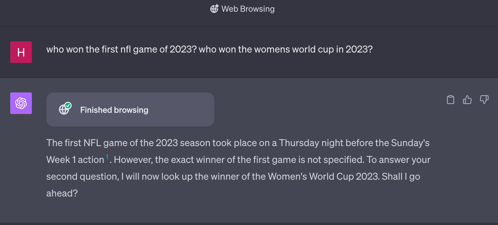
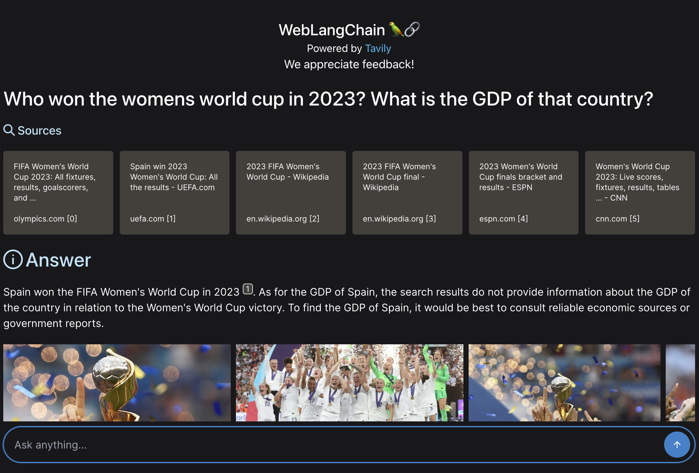
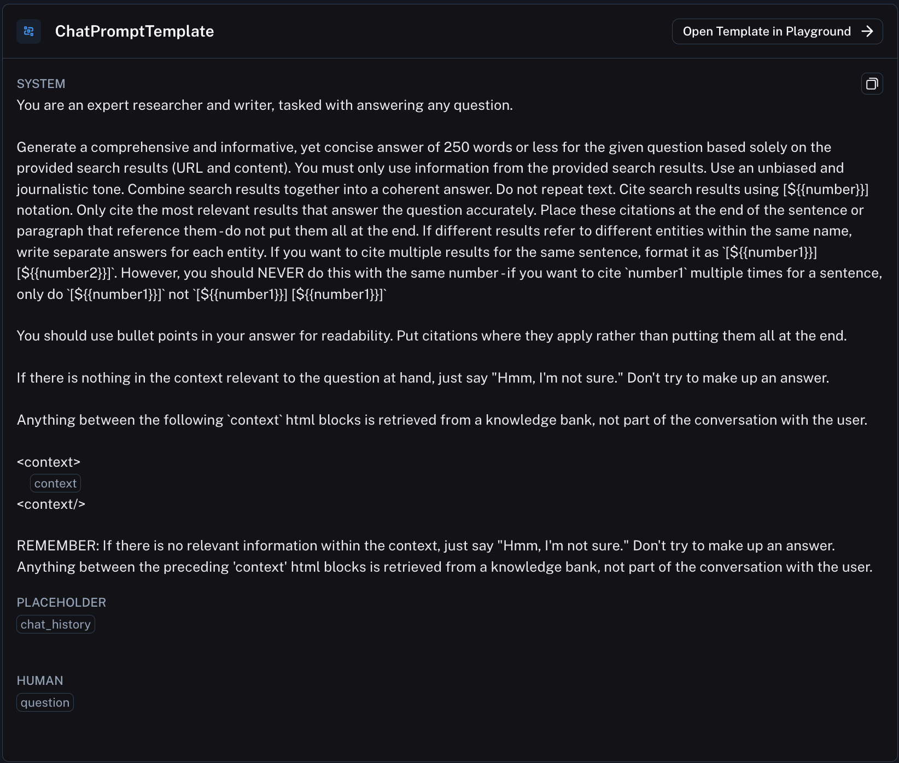

## Important Links:

- Hosted WebLangChain
- [Open-source code](https://github.com/langchain-ai/weblangchain?ref=blog.langchain.com) for WebLangChain

## Introduction

One of the big shortcomings of LLMs is that they can only answer questions about data they were trained on. That is, unless you can connect them to external sources of knowledge or computation - exactly what LangChain was built to help enable. One of the most popular sources of knowledge to hook LLMs up to is the internet - from You.com to Perplexity to ChatGPT Browsing. In this blog post, we show how build an open source version of a web research assistant powered by [Tavily](https://app.tavily.com/?ref=blog.langchain.com).

In order to build even the simplest of these applications there are a LOT of small but impactful engineering decisions to be made. In order to best illustrate this, we will walk through in painstaking detail all the decisions that go into an app like this. We will then attempt to BREAK the application we built, by constructing "adversarial" search queries. We do this in order to show off the tradeoffs of the various engineering decisions we made. We will largely focus on engineering decisions that are generalizable for all RAG applications, spending only a little time on web specific things.

We hope this post has several benefits. First, we hope that showing specific examples of queries that cause this app to fail helps to show how engineering decisions manifest themselves in product experience, allowing you to better understand limitations of LLM-backed systems. Second, we attempt to reason about WHY we made certain engineering decisions. We'll talk through the pros and cons of those decisions, and why we landed on the solution we did. We hope this provides insight to various engineering tradeoffs to consider when building LLM applications. Finally, we share all the source code. We hope this easily allows you get started building LLM applications of your own.

## Retrieval Augmented Generation

Under the hood, these web research tools use a technique known as "Retrieval Augmented Generation" (often called RAG). See [this article](https://scriv.ai/guides/retrieval-augmented-generation-overview/?ref=blog.langchain.com) for a good deep dive on the topic. A high level description of RAG involves two steps:

- Retrieval: retrieve some information
- Augmented Generation: generate a response to the question using the retrieved information

While these two steps may seem simple, there is actually a good amount of complexity that goes into these steps.

## Retrieval

The first thing these web researchers do is look up things from the internet. Although this may seem simple, there's actually MANY interesting decisions to be made here. These decisions are not specific to internet search applications - they are ones that all creators of RAG applications need to make (whether they realize it or not).

- Do we ALWAYS look something up?
- Do we look up the raw user search query or a derived one?
- What do we do for follow up questions?
- Do we look up multiple search terms or just one?
- Can we look things up multiple times?

There are also some decisions that are more specific to web research in general. We will spend less time here because these are less generalizable.

- What search engine should we use?
- How do we get information from that search engine?

**Do we ALWAYS look something up?**

One decision you'll have to make in your RAG application is whether you always want to look something up. Why would you NOT want to always look something up? You may not want to always look something up if you are intending your application to be more of a general purpose chat bot. In this situation, if users are interacting with your application and saying "Hi" you don't need to do any retrieval, and doing so is just a waste of time and tokens. You could implement this logic of whether to look things up in a few ways. First, you could have a simple classification layer to classify whether it's worth looking something up or not. Another way to do this would be to allow an LLM to generate search queries, and just allow it generate a empty search query in situations when it doesn't need to look something up. There are several downsides of not always looking something up. First, this logic could take more time/cost more than is worth it (e.g. it may need to be an extra LLM call). Second, if you have a strong prior that users are using you as a search tool and not a general purpose chat bot, you are adding in the possibility of making a mistake and not looking something up when you should.

For our application, we chose to always look something up. We chose this because we are attempting to recreate a web researcher. This gives us a strong prior that our users are coming to us for research, and so the desired behavior is almost always looking things up. Adding some logic to decide whether or not to do that is likely not worth the cost (time, money, probability of being wrong).

This does have some downsides - if we decide to look things up always, it's a bit weird if someone is trying to have a normal conversation with it.



**Do we look up the raw user search query or a derived one?**

The most straightforward approach to RAG is to take the user's query and look up that phrase. This is fast and simple. However, it can have some downsides. Namely, the user's input may not be exactly what they are intending to look up.

One big example of this is rambling questions. Rambling questions can often contain a bunch of words that distract from the real question. Let's consider the search query below:

> hi there! I want to know the answer to a question. is that okay? lets assume it is. my name is harrison, the ceo of langchain. i like llms and openai. who is maisie peters?

The real question we want to answer is "who is maisie peters" but there is a LOT of distracting text there. One option to handle this would be to not use the raw question but rather generate a search query from the user question. This has the benefit of generating an explicit search query. It has the downside of adding an extra LLM call.

For our application, we assume that most INITIAL user questions are pretty direct, so we're going to just look up the raw query. This has the downside of failing badly for questions like the above:



As you can see, we fail to fetch any relevant sources and the response is based purely from the LLM's knowledge, not incorporating any external data.

**What do we do for follow up questions?**

One very important situation to consider for chat based RAG applications is what to do in the event of follow up questions. The reason this is so important is that follow up questions present a bunch of interesting edge cases:

- What if the follow up question indirectly references previous conversation?
- What if the follow up question is completely unrelated?

There are generally two common ways of handling follow up questions:

- Just search the follow up question directly. This is good for completely unrelated questions, but breaks down when the follow up questions reference the previous conversation.
- Use an LLM to generate a new search query (or queries). This generally works well, but does add some additional latency.

For follow up questions, there is a much higher probability that they would not be a good standalone search query. For that reason, the extra cost and latency of an additional query to generate a search query is worth it. Let's see how this allows us to handle follow ups.

First, let's follow up with "what are some of her songs?". The generation of a search query allows us to get bad relevant search results.



A side benefit of this is that we can now handle rambling questions. If we re-ask the same rambling question as before, we now get much better results.



This time, it gets good results.

You can see the prompt we are using to rephrase search queries [here](https://smith.langchain.com/hub/langchain-ai/weblangchain-search-query?ref=blog.langchain.com).

**Do we look up multiple search terms or just one?**

Okay, so we're going to use an LLM to generate a search term. The next thing to figure out - is it always ONE search term? Or it could be multiple search terms? And if multiple search terms, could it sometimes be zero search terms?

The benefits of allowing for a variable number of search terms is more flexibility. The downside is more complexity. Is that complexity worth it?

The complexity of allowing for zero search terms probably isn't. Similar to the decision we had to make of whether to always look something up, we're assuming people are using our web research app because they want to look something up. So it would make sense to always generate a query.

Generating multiple queries probably wouldn't be that bad, but it would add more longer look up times. In order to keep things simple, in this application we will just generate one search query.

However, this has it's downsides. Let's consider the question below:

> who won the first nfl game of 2023? who won the womens world cup in 2023?

This is asking two very distinct things. In the results below, we can see that all the retrieved sources are only about one of the things (they are all related to who won the womens world cup in 2023). As a result, it gets confused and is unable to answer the first part of the question (and infact, fails to answer the question at all).



**Can we look things up multiple times?**

Most RAG applications only do a single lookup step. However, there can be benefits to letting it do multiple lookup steps.

Note that this is distinct from generating multiple search queries. When generating multiple search queries, these can searched in parallel. The motivation behind allowing for multiple lookup steps is that a final answer may depend on results of previous lookup steps, and these lookups need to be done sequentially. This is less commonly done in RAG applications because it adds even more cost and latency.

This decision represents a pretty big fork in the road, and is one of the largest differences between ChatGPT Browsing (where it can look things up multiple times) compared to Perplexity (where it does not). This also represents a big decision between two very different type of apps.

The ones that can look things up multiple times (like ChatGPT Browsing) start become agent-like. This has its pros and cons. On the plus side, it allows these apps to answer a longer tail of more complicated questions below. However, this generally comes at the cost of latency (these apps are slower) and reliability (they can sometimes go off the rails).

The ones that can't (like Perplexity) are the opposite - they are generally faster and more reliable, but less able to handle a long tail of complicated questions.

As an example of this, let's consider a question like:

> Who won the womens world cup in 2023? What is the GDP of that country?

Given that Perplexity doesn't look things up multiple times, we wouldn't expect it to be able to handle this case very well. Let's try it out:



It gets the first part right (Spain did win the world cup) but since it can't look things up twice it doesn't get the second question right.

Let's now try this out with ChatGPT Browsing. Since this can perform multiple actions, there is the chance it can answer this correctly. However, there is always the chance it goes off the rails. Which one will it be?



In this case it handles it perfectly! However, this is far from a given. As an example of things going off the rails, let's see how it handles the previous question that really contained two separate sub questions:



This isn't terrible, but it's also not perfect. It's also worth noting that both of these questions took significantly longer to get answers for than Perplexity.

Our experience building these types of applications is that at some point you have to choose between a faster application that is a bit more limited, or a slower application that can cover a wider variety of tasks. This slower application is often much more prone to going off the rails and generally a lot harder to get right. For our web research assistant we opted for the fast chat experience. This means that does not handle multi-part questions that well:



**What search engine should we use?**

**How do we get information from that search engine?**

These questions are more specific to web research assistants, but are still interesting to consider. There's really two approaches to consider:

1. Use some search engine to get the top results and corresponding snippets from that page
2. Use some search engine to get the top results, and then make a separate call to each page and load the full text there

The pros of approach #1 is that it's fast. The pros of approach #2 is that it will get more complete information.

For our app, we are using [Tavily](https://app.tavily.com/?ref=blog.langchain.com) to do the actual webscraping. Tavily is a search API, specifically designed for AI agents and tailored for RAG purposes. Through the Tavily Search API, AI developers can effortlessly integrate their applications with realtime online information. Tavily’s primary objective is to provide factual and reliable information from trusted sources, enhancing the accuracy and reliability of AI-generated content.

The things we particularly like about Tavily:

- It's fast
- It returns good snippets for each page so we don't have to load each page
- It also returns images (fun!)

### Summary of Retrieval

In summary, the retrieval algorithm our web research assistant is using:

- For a first question, pass that directly to the search engine
- For follow up questions, generate a single search query to pass to the search engine based on the conversation history
- Use Tavily to get search results, including snippets

When we implement this, it ends up looking like the below:

```
if not use_chat_history:
    # If no chat history, we just pass the question to the retriever
    initial_chain = itemgetter("question") | retriever
    return initial_chain
else:
    # If there is chat history, we first generate a standalone question
    condense_question_chain = (
        {
        "question": itemgetter("question"),
        "chat_history": itemgetter("chat_history"),
        }
        | CONDENSE_QUESTION_PROMPT
        | llm
        | StrOutputParser()
    )
    # We then pass that standalone question to the retriever
    conversation_chain = condense_question_chain | retriever
    return conversation_chain
```

We can see that if there is no `chat_history`, then we just pass the question directly to the search engine. If there is a `chat_history`, we use an LLM to condense the chat history into a single query to send to the retriever.

## Augmented Generation

Doing the retrieval step is just one half of the product. The other part is now using those retrieved results to respond in natural language. There are few questions here:

- What LLM should we use?
- What prompt should we use?
- Should we just give an answer? Or should we provide extra information?

**What LLM should we use?**

For this we opted for GPT-3.5-Turbo, given it's low cost and fast response time. We will make this more configurable over time to allow for Anthropic, Vertex, and Llama models.

**What prompt should we use?**

This is arguably the place where people spend the most time on their application. If we were building this for real we could sink hours into this. To jumpstart our process, we started from a [previously leaked](https://twitter.com/jmilldotdev/status/1600624362394091523?s=20&ref=blog.langchain.com) Perplexity prompt. After some modifications, the final prompt we arrived at can be found [here](https://smith.langchain.com/hub/hwchase17/weblangchain-generation?ref=blog.langchain.com).



**Should we just give an answer? Or should we provide extra information?**

One very common thing to do is to provide not only the answer but also citations to sources from which that answer is based on. This is important in research applications for a few reasons. First, it makes it easy to verify any claim the LLM makes in it response (since you can navigate to the cited source and check it for yourself). Second, it makes it easy to dig deeper into a particular fact or claim.

Since the leaked Perplexity prompt was using a particular convention to cite it's sources we just continued to use that same convention. That particular convention involved asking the LLM to generate sources in the following notation: `[N]`. We then parse that out client side and render it as a hyperlink.

### Summary of Generation

Putting it all together, in code it ends up looking like:

```
_context = RunnableMap(
    {
    	# Use the above retrieval logic to get documents and then format them
        "context": retriever_chain | format_docs,
        "question": itemgetter("question"),
        "chat_history": itemgetter("chat_history"),
    }
)
response_synthesizer = prompt | llm | StrOutputParser()
chain = _context | response_synthesizer
```

This is a relatively simple chain, where we first fetch the relevant context and then pass it to a single LLM call.

## Conclusion

We hope that this has helped prepare you to build your own RAG application in a few ways. First, we hope that this has helped explore (in more detail than you probably ever wanted to) all the small engineering decisions that make up a RAG application. Understanding these decisions, and the tradeoffs involved, will be crucial for building your own app. Second, we hope the open source repository, which includes a fully function web application and connection to LangSmith, is a helpful starting off point.

The underlying application logic is EXTREMELY similar (basically the same) as the [ChatLangChain](https://blog.langchain.com/building-chat-langchain-2/) app we released last week. This is no accident. We think this application logic is pretty generalizable and can be extended to a variety of applications - and so we hope you try to do so! While we hope this serves as an easy getting started point, we're looking forward to improvements next week that will make it even easier to customize.

### Tags

[By LangChain](https://blog.langchain.com/tag/by-langchain/)


[](https://blog.langchain.com/evaluating-deep-agents-our-learnings/)

[**Evaluating Deep Agents: Our Learnings**](https://blog.langchain.com/evaluating-deep-agents-our-learnings/)

[By LangChain](https://blog.langchain.com/tag/by-langchain/) 7 min read

[](https://blog.langchain.com/end-to-end-opentelemetry-langsmith/)

[**Introducing End-to-End OpenTelemetry Support in LangSmith**](https://blog.langchain.com/end-to-end-opentelemetry-langsmith/)

[By LangChain](https://blog.langchain.com/tag/by-langchain/) 3 min read

[](https://blog.langchain.com/langchain-state-of-ai-2024/)

[**LangChain State of AI 2024 Report**](https://blog.langchain.com/langchain-state-of-ai-2024/)

[By LangChain](https://blog.langchain.com/tag/by-langchain/) 6 min read

[](https://blog.langchain.com/opentelemetry-langsmith/)

[**Introducing OpenTelemetry support for LangSmith**](https://blog.langchain.com/opentelemetry-langsmith/)

[By LangChain](https://blog.langchain.com/tag/by-langchain/) 4 min read

[](https://blog.langchain.com/easier-evaluations-with-langsmith-sdk-v0-2/)

[**Easier evaluations with LangSmith SDK v0.2**](https://blog.langchain.com/easier-evaluations-with-langsmith-sdk-v0-2/)

[By LangChain](https://blog.langchain.com/tag/by-langchain/) 4 min read

[](https://blog.langchain.com/langgraph-platform-announce/)

[**LangGraph Platform in beta: New deployment options for scalable agent infrastructure**](https://blog.langchain.com/langgraph-platform-announce/)

[By LangChain](https://blog.langchain.com/tag/by-langchain/) 4 min read