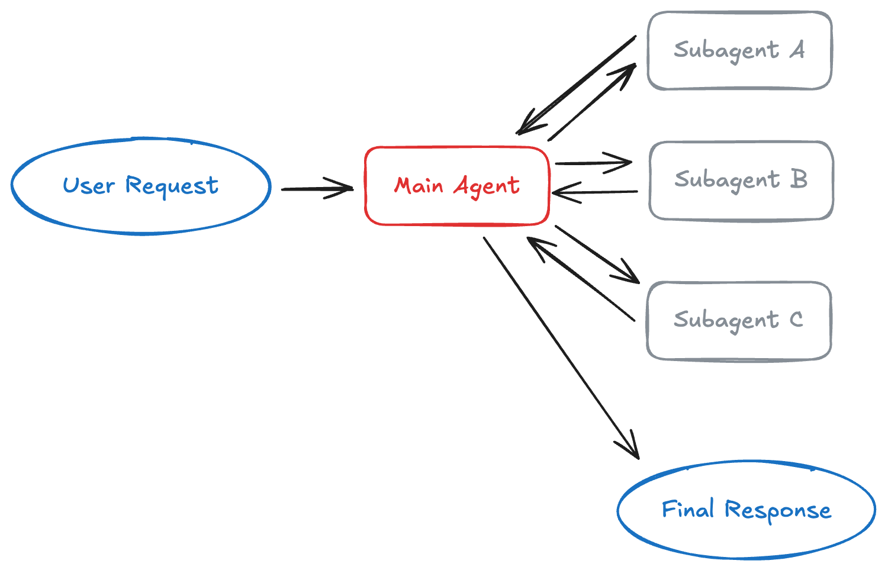
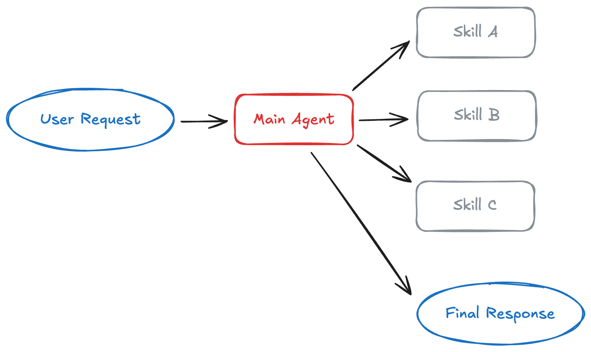
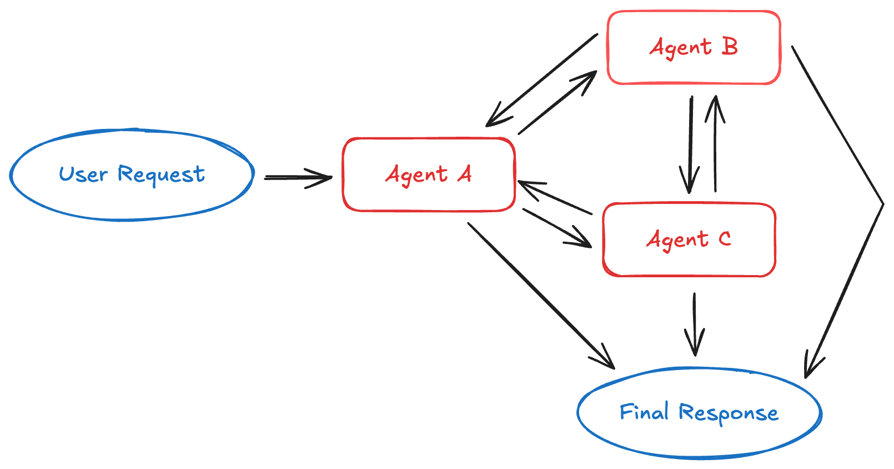
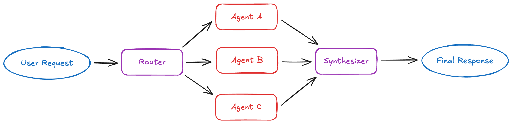
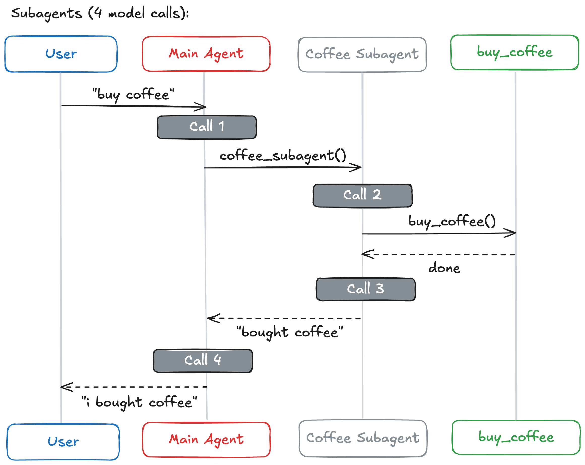
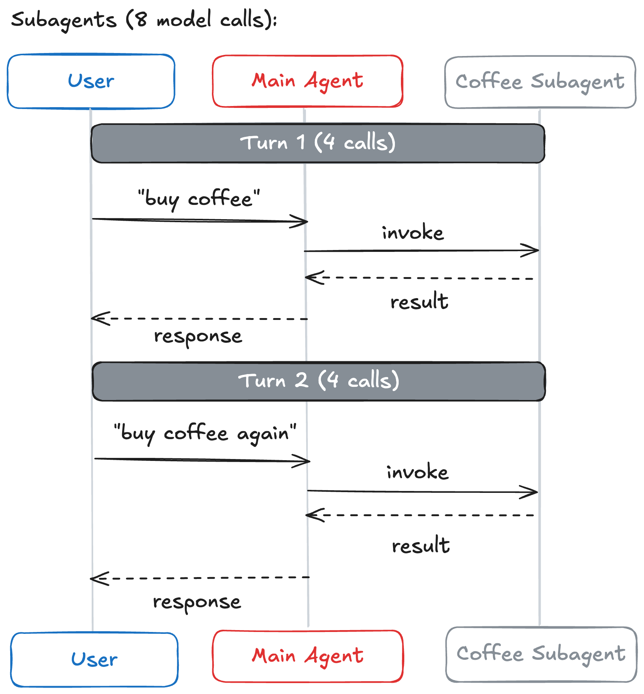
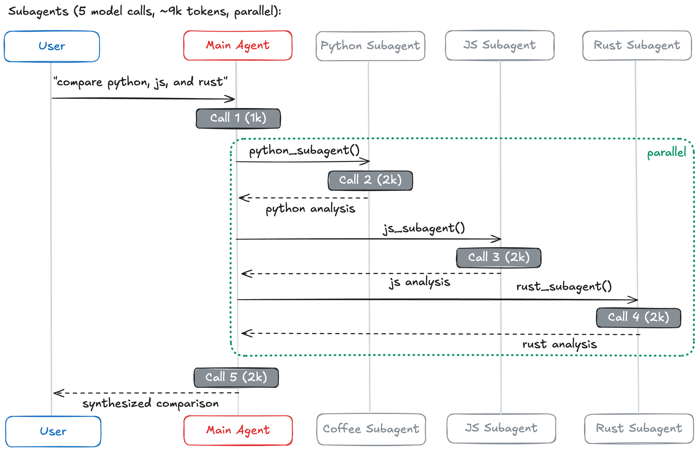

By Sydney Runkle

Many agentic tasks are best handled by a single agent with well-designed tools. You should start here—single agents are simpler to build, reason about, and debug. But as applications scale, teams face a common challenge wherein they have sprawling agent capabilities they want to combine into a single coherent interface. As the features they want to combine grow in number, two main constraints emerge:

**Context management**: Specialized knowledge for each capability doesn't fit comfortably in a single prompt. If context windows were infinite and latency was zero, you could include all relevant information upfront. In practice, you need strategies to selectively surface information as agents work.

**Distributed development**: Different teams develop and maintain each capability independently, with clear boundaries and ownership. A single monolithic agent prompt becomes difficult to manage across team boundaries.

These constraints become critical when you're managing extensive domain knowledge, coordinating across teams, or tackling genuinely complex tasks. In these cases, multi-agent architectures _can_ become the right choice.

Recent [research](https://www.anthropic.com/engineering/multi-agent-research-system?ref=blog.langchain.com) demonstrates how multi-agent systems perform better in these situations. In Anthropic’s multi-agent research system, a multi-agent architecture with Claude Opus 4 as the lead agent and Claude Sonnet 4 subagents outperformed single-agent Claude Opus 4 by 90.2% on internal research evaluations. The architecture’s ability to distribute work across agents with separate context windows enabled parallel reasoning that a single agent couldn’t achieve.

## Multi-Agent Architectures

Four architectural patterns form the foundation of most multi-agent applications: subagents, skills, handoffs, and routers. Each takes a different approach to task coordination, state management, and sequential unlocking. Below we outline a framework for selecting an architecture that best addresses your most critical constraints.

### Subagents: Centralized orchestration

In the subagents pattern, a supervisor agent coordinates specialized subagents by calling them as tools. The main agent maintains conversation context while subagents remain stateless, providing strong context isolation.

**How it works**: The main agent decides which subagents to invoke, what input to provide, and how to combine results. Subagents don’t remember past interactions. This architecture provides centralized control where all routing passes through the main agent, which can invoke multiple subagents in parallel.

**Best for**: Applications with multiple distinct domains where you need centralized workflow control and subagents don’t need to converse directly with users. Examples include personal assistants that coordinate calendar, email, and CRM operations, or research systems that delegate to specialized domain experts.

**Key tradeoff**: Adds one extra model call per interaction because results must flow back through the main agent. This overhead provides centralized control and context isolation, but costs latency and tokens.

For developers who want this pattern with minimal setup, [Deep Agents](https://docs.langchain.com/oss/python/deepagents/overview?ref=blog.langchain.com) provides an out-of-the-box implementation for adding subagents with just a few lines of code.

[Learn more: Subagents documentation](https://docs.langchain.com/oss/python/langchain/multi-agent/subagents?ref=blog.langchain.com) \| [Tutorial: Build a personal assistant with subagents](https://docs.langchain.com/oss/python/langchain/multi-agent/subagents-personal-assistant?ref=blog.langchain.com)

### Skills: Progressive disclosure

In the skills pattern, an agent loads specialized prompts and knowledge on-demand. Think of it as progressive disclosure for agent capabilities.

While the skills architecture technically uses a single agent, it shares characteristics with multi-agent systems by enabling that agent to dynamically adopt specialized personas. This approach provides similar benefits to multi-agent patterns—like distributed development and fine-grained context control—but through a lighter-weight, prompt-driven method rather than managing multiple agent instances. So, perhaps controversially, we consider skills to be a quasi-multi-agent architecture.

**How it works**: Skills are primarily prompt-driven specializations packaged as directories containing instructions, scripts, and resources. At startup, the agent knows only skill names and descriptions. When a skill becomes relevant, the agent loads its full context. Additional files within skills provide a third level of detail that the agent discovers only as needed.

**Best for**: Single agents with many possible specializations, situations where you don’t need to enforce constraints between capabilities, or team distribution where different teams maintain different skills. Common examples include coding agents or creative assistants.

**Key tradeoff**: Context accumulates in conversation history as skills are loaded, which can lead to token bloat on subsequent calls. However, the pattern provides simplicity and direct user interaction throughout.

[Learn more: Skills documentation](https://docs.langchain.com/oss/python/langchain/multi-agent/skills?ref=blog.langchain.com) \| [Tutorial: Build a SQL assistant with on-demand skills](https://docs.langchain.com/oss/python/langchain/multi-agent/skills-sql-assistant?ref=blog.langchain.com)

### Handoffs: State-driven transitions

In the handoffs pattern, the active agent changes dynamically based on conversation context. Each agent has the ability to transfer to others via tool calling.

**How it works**: When an agent calls a handoff tool, it updates state that determines the next agent to activate. This can mean switching to a different agent or changing the current agent’s system prompt and available tools. The state survives across conversation turns, enabling sequential workflows.

**Best for**: Customer support flows that collect information in stages, multi-stage conversational experiences, or any scenario requiring sequential constraints where capabilities unlock only after preconditions are met.

**Key tradeoff**: More stateful than other patterns, requiring careful state management. However, this enables fluid multi-turn conversations where context carries forward naturally between stages.

[Learn more: Handoffs documentation](https://docs.langchain.com/oss/python/langchain/multi-agent/handoffs?ref=blog.langchain.com) \| [Tutorial: Build customer support with handoffs](https://docs.langchain.com/oss/python/langchain/multi-agent/handoffs-customer-support?ref=blog.langchain.com)

### Router: Parallel dispatch and synthesis

In the router pattern, a routing step classifies input and directs it to specialized agents, executing queries in parallel and synthesizing results.

**How it works**: The router decomposes the query, invokes zero or more specialized agents in parallel, and synthesizes results into a coherent response. Routers are typically stateless, handling each request independently.

**Best for**: Applications with distinct verticals (separate knowledge domains), scenarios requiring queries across multiple sources in parallel, or situations where you need to synthesize results from multiple agents. Examples include enterprise knowledge bases and multi-vertical customer support assistants.

**Key tradeoff**: Stateless design means consistent performance per request, but repeated routing overhead if you need conversation history. Can be mitigated by wrapping the router as a tool within a stateful conversational agent.

[Learn more: Router documentation](https://docs.langchain.com/oss/python/langchain/multi-agent/router?ref=blog.langchain.com) \| [Tutorial: Build a multi-source knowledge base with routing](https://docs.langchain.com/oss/python/langchain/multi-agent/router-knowledge-base?ref=blog.langchain.com)

## Matching requirements to patterns

Before implementing a multi-agent system, consider whether your requirements align with one of these four patterns:

| Your requirements | Pattern |
| --- | --- |
| Multiple distinct domains (calendar, email, CRM), need parallel execution | **Subagents** |
| Single agent with many possible specializations, lightweight composition | **Skills** |
| Sequential workflow with state transitions, agent converses with user throughout | **Handoffs** |
| Distinct verticals, query multiple sources in parallel and synthesize results | **Router** |

The [table below](https://docs.langchain.com/oss/python/langchain/multi-agent?ref=blog.langchain.com#choosing-a-pattern) shows how each pattern supports common multi-agent requirements:

| Pattern | Distributed development | Parallelization | Multi-hop | Direct user interaction |
| --- | --- | --- | --- | --- |
| Subagents | ⭐⭐⭐⭐⭐ | ⭐⭐⭐⭐⭐ | ⭐⭐⭐⭐⭐ | ⭐ |
| Skills | ⭐⭐⭐⭐⭐ | ⭐⭐⭐ | ⭐⭐⭐⭐⭐ | ⭐⭐⭐⭐⭐ |
| Handoffs | — | — | ⭐⭐⭐⭐⭐ | ⭐⭐⭐⭐⭐ |
| Router | ⭐⭐⭐ | ⭐⭐⭐⭐⭐ | — | ⭐⭐⭐ |

- **Distributed development**: Can different teams maintain components independently?
- **Parallelization**: Can multiple agents execute concurrently?
- **Multi-hop**: Does the pattern support calling multiple subagents in series?
- **Direct user interaction**: Can subagents converse directly with the user?

## Performance characteristics

Architecture choice directly impacts latency, cost, and user experience. We analyzed three representative scenarios to understand how different patterns perform under real-world conditions.

Note, you can find the full performance breakdown (with mermaid diagrams for each architecture) in our new [multi-agent performance docs](https://docs.langchain.com/oss/python/langchain/multi-agent?ref=blog.langchain.com#performance-comparison).

### Scenario 1: One-shot request

A user makes a single request: “buy coffee.” A specialized agent can call a `buy_coffee` tool.

| Pattern | Model calls | Notes |
| --- | --- | --- |
| Subagents | 4 | Results flow back through main agent |
| Skills | 3 | Direct execution |
| Handoffs | 3 | Direct execution |
| Router | 3 | Direct execution |

**Key insight:** Handoffs, Skills, and Router are most efficient for single tasks (3 calls each). Subagents adds one extra call because results flow back through the main agent. This overhead provides centralized control, as seen below.

### Scenario 2: Repeat request

The user makes the same request twice in conversation:

- **Turn 1**: “buy coffee”
- **Turn 2**: “buy coffee again”

| Pattern | Turn 2 calls | Total calls | Efficiency gain |
| --- | --- | --- | --- |
| Subagents | 4 | 8 | — |
| Skills | 2 | 5 | 40% |
| Handoffs | 2 | 5 | 40% |
| Router | 3 | 6 | 25% |

**Key insight**: Stateful patterns (Handoffs, Skills) save 40-50% of calls on repeat requests by maintaining context. Subagents maintain consistent cost per request through stateless design, providing strong context isolation at the cost of repeated model calls.

### Scenario 3: Multi-domain query

A user asks: “Compare Python, JavaScript, and Rust for web development.” Each language agent contains approximately 2000 tokens of documentation. All patterns can make parallel tool calls.

| Pattern | Model calls | Total tokens | Notes |
| --- | --- | --- | --- |
| Subagents | 5 | ~9K | Each subagent works in isolation |
| Skills | 3 | ~15K | Context accumulation |
| Handoffs | 7+ | ~14K+ | Sequential execution required |
| Router | 5 | ~9K | Parallel execution |

**Key insight**: For multi-domain tasks, patterns with parallel execution (Subagents, Router) are most efficient. Skills has fewer calls but high token usage due to context accumulation. Handoffs must execute sequentially and can’t leverage parallel tool calling for consulting multiple domains simultaneously.

In this scenario, Subagents processes 67% fewer tokens overall compared to Skills due to context isolation. Each subagent works only with relevant context, avoiding the token bloat that accumulates when loading multiple skills into a single conversation.

### Performance summary

The optimal pattern depends on your workload characteristics:

| Pattern | Single requests | Repeat requests | Parallel execution | Large-context domains |
| --- | --- | --- | --- | --- |
| Subagents | — | — | ✅ | ✅ |
| Skills | ✅ | ✅ | — | — |
| Handoffs | ✅ | ✅ | — | — |
| Router | ✅ | — | ✅ | ✅ |

## Getting Started

Multi-agent systems coordinate specialized components to tackle complex workflows. When you do need multi-agent capabilities, match your requirements to the decision framework above. For teams wanting to start quickly, [Deep Agents](https://docs.langchain.com/oss/python/deepagents/overview?ref=blog.langchain.com) offers an out-of-the-box implementation combining subagents and skills for complex task planning.

In many cases though, simpler architectures often suffice. Start with a single agent and good prompt engineering. Add tools before adding agents. Graduate to multi-agent patterns only when you hit clear limits.