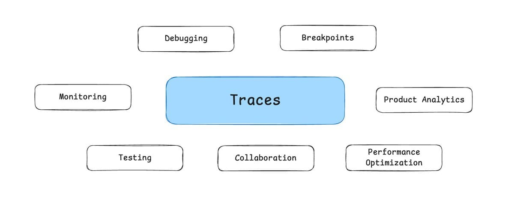
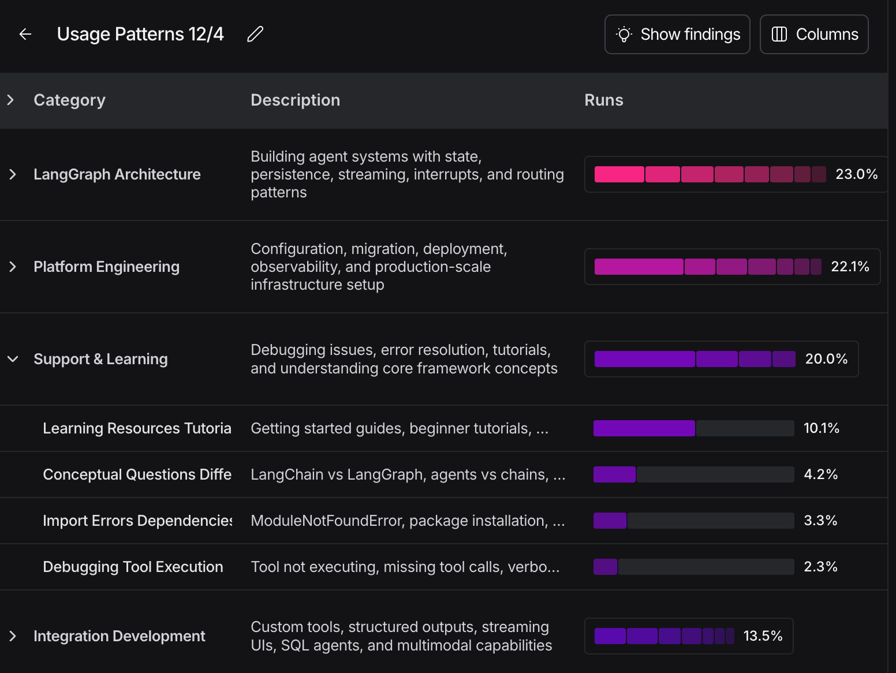
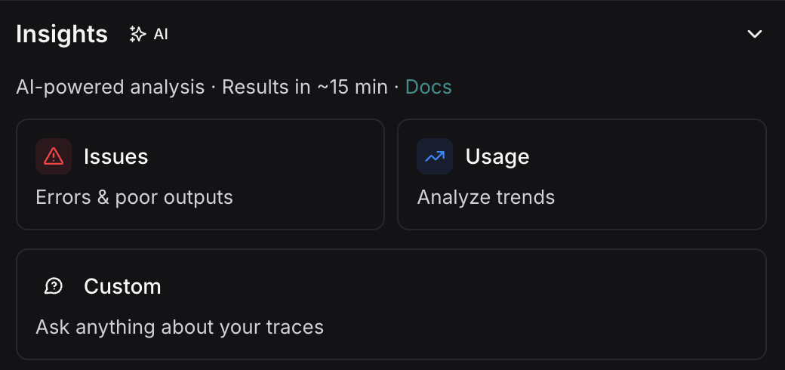
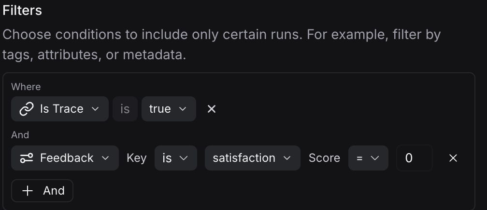
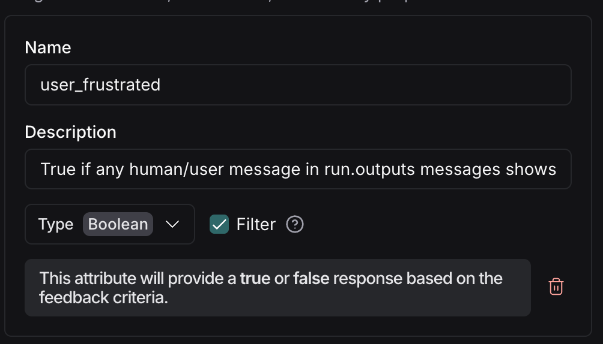
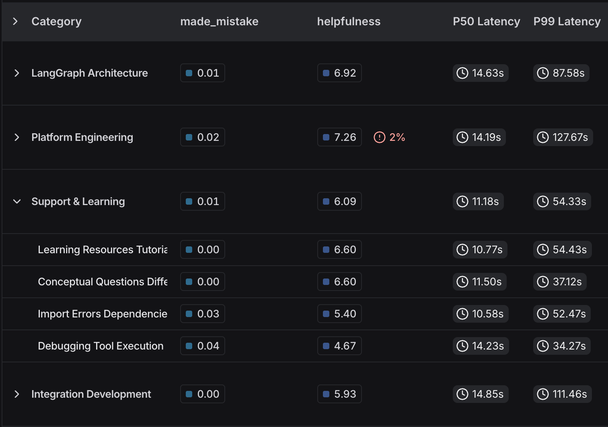
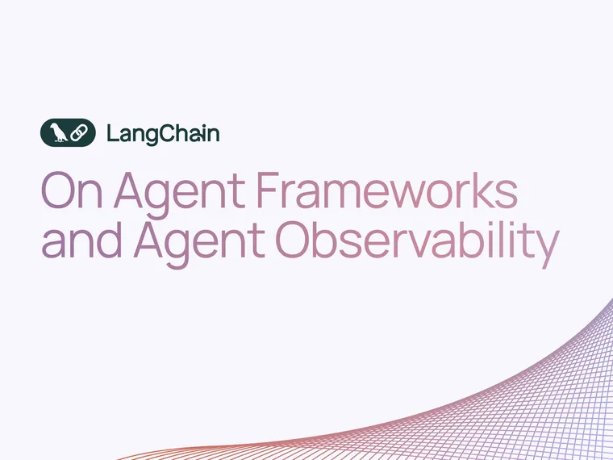

> Visibility is the easiest piece. The hard part is analyzing and understanding what you’re observing. I’ve spoken to teams recording 100k+ traces every single day. What are they doing with those traces? Literally nothing. Because it’s impossible to read and summarize 100,000 traces at any human scale.

[\- Dev Shah](https://x.com/0xDevShah/status/2010435036584333514?s=20&ref=blog.langchain.com)

Tracing is [critical for agent development](https://blog.langchain.com/in-software-the-code-documents-the-app-in-ai-the-traces-do/) \- it powers evaluation, debugging, and annotation. But when you have agents in production generating thousands of traces daily, manual review doesn't scale.

When building traditional software, we have product analytics to help with this problem. You [can track agent metrics too](https://docs.langchain.com/langsmith/dashboards?ref=blog.langchain.com)—latency, error rates, feedback. But these metrics only surface problems. To understand the patterns behind them, you need to analyze unstructured conversations—not predefined event flows. Traditional product analytics wasn't built for this. This is exactly why we built [LangSmith Insights Agent](https://docs.langchain.com/langsmith/insights?ref=blog.langchain.com).

## Why You Can't Predict Agent Behavior

Building agents is different than building software. There are three key differences from traditional software:

**Non-determinism.** When you run software multiple times, you get the same result. This doesn’t happen with agents. Each call to an LLM may produce different results. When you let an agent run for a while and make hundreds of calls in a row, it is highly likely that the same input may produce very different paths.

**Prompt sensitivity.** Software doesn't change dramatically with small input changes. It is robust to small changes in user input. LLMs have a characteristic called [“prompt sensitivity”](https://arxiv.org/abs/2410.12405?ref=blog.langchain.com). This means small changes in the prompt space can produce large changes in output.

**Unbounded input space. S** oftware structures user input through UIs. The input space is naturally bounded and scoped by what is in the UI. Agents accept natural language, which is unbounded. Users can enter anything

|  | Software | Agents |
| --- | --- | --- |
| Deterministic | Yes | No |
| Robust to small changes in user input | Yes | No |
| Bounded input space | Yes | No |

_💡 **Because agents are non-deterministic and accept unbounded input, you can't predict what they'll do or how users will use them until production.**_

## **You Need Production Analytics**

Software is deterministic, robust to small changes in user input, and bounded in input space. As a result, you can be pretty sure software is behaving as you expect before you launch to production, and have a suite of tests to assert that. You can discover user behavior by observing production events, but this is constrained by the actions they can take in the UI (this is traditional product analytics).

Agents are non-deterministic and sensitive to small changes in user input. As a result - you don't know what agents will actually do until production. Agents also usually have a natural language interface, giving them a completely unbounded input space. This means there is way more user intent you can capture and analyze.

**_💡 When building agents, you need to iterate on production data much more than when building traditional software._**

**You need to iterate on how agents fail.** With software, you catch correctness issues pre-production with tests. Maybe some edge cases slip through. With agents, it's the opposite - most failures emerge in production.

**You need to iterate on how users actually use agents.** With software, users can only use the product as you let them. With agents, natural language means they can use it in far more ways.

## **Traditional product analytics are necessary but not sufficient** for agent iteration

Traditional software generates tons of events (clicks, page views, sessions). Product analytics tools (Mixpanel, Amplitude, etc.) solve the "too much data" problem by:

- Aggregating discrete events into metrics
- Building funnels and cohorts
- A/B testing

You can (and should) do this with agents as well. We’ve found that most companies in production track end user feedback, latency and tool calls.

These metrics help you understand what is going on, but not why. In order to understand why these metrics are moving, you need to analyze the traces themselves.

Online evals help with known questions. You can run evaluators over traces to score for specific things - user frustration, topic tags, success criteria. But online evals require you to know what you're looking for upfront.

What about exploratory questions? 'How are users actually using my agent?' 'What failure patterns exist?' You can't write an evaluator for patterns you haven't discovered yet.

So what does agent analytics actually look like? You need a tool that:

- Analyzes unstructured conversations, not discrete events
- Discovers patterns you didn't know to look for
- Surfaces clusters at scale

This is [LangSmith Insights Agent](https://docs.langchain.com/langsmith/insights?ref=blog.langchain.com).

## **LangSmith Insights Agent**

[LangSmith Insights Agent](https://docs.langchain.com/langsmith/insights?ref=blog.langchain.com) uses clustering to automatically discover patterns in your traces. Instead of defining what to look for upfront, it analyzes thousands of conversations and surfaces the clusters that matter - usage patterns, error modes, or any dimension you specify. It handles the exploratory questions that would otherwise require manually reviewing hundreds of traces.

Insights Agent will look for patterns and produce a report. The report will be based around a clustered analysis of the runs. There will be multiple different hierarchies of clusters. There will be top level clusters, then a second level of more detailed groupings, and then individual runs beneath that. You can click through those levels to explore the data at whatever level you think best. This lets you zoom in on specific issues or zoom out for high-level patterns

You can configure Insights Agent to look for whatever patterns you want. The two most common patterns we see people looking for are:

- How are user’s using my agent?
- How might my agent be failing?

We have prebuilt prompts for these two use cases, but if you want to configure it to look for something else you can specify an arbitrary prompt. Because every agent is different - you might care about compliance, tone, accuracy, or domain-specific failures

Sometimes you may only want to run Insights Agent over a specific subset of runs. This lets you combine Insights Agent with online evals or traditional product analytics. For example, you may only want to investigate runs that had negative end user feedback (e.g a thumbs down). You can do this by specifying a filtered set of runs to run Insights Agent over. Combine quantitative signals (thumbs down) with qualitative analysis (what patterns exist in those thumbs down).

You can also filter by attributes that don't exist yet. Example: 'Why are users frustrated?' LangSmith Insights Agent can calculate 'user is frustrated' on the fly, then filter and cluster based on it.

When clusters are produced, it will then aggregate attributes associated with the traces in those groups so you can quickly spot outlier clusters. You can also specify attributes to calculate on the fly (that are then also included in the aggregated stats). Discover patterns you didn't know to track.

## Try LangSmith Insights Agent

Agents generate thousands of unstructured traces daily. Traditional metrics tell you that something changed, but not what or why. Manual review doesn't scale.

[LangSmith Insights Agent](https://docs.langchain.com/langsmith/insights?ref=blog.langchain.com) makes pattern discovery practical - surfacing usage patterns and failure modes automatically. It's what makes iterating on production agent data possible.

Try it today in LangSmith today.

### Tags

[Harrison's Hot Takes](https://blog.langchain.com/tag/in-the-loop/)

[**On Agent Frameworks and Agent Observability**](https://blog.langchain.com/on-agent-frameworks-and-agent-observability/)

[Harrison's Hot Takes](https://blog.langchain.com/tag/in-the-loop/) 4 min read

[**In software, the code documents the app. In AI, the traces do.**](https://blog.langchain.com/in-software-the-code-documents-the-app-in-ai-the-traces-do/)

[Harrison's Hot Takes](https://blog.langchain.com/tag/in-the-loop/) 5 min read

[**Agent Frameworks, Runtimes, and Harnesses- oh my!**](https://blog.langchain.com/agent-frameworks-runtimes-and-harnesses-oh-my/)

[Harrison's Hot Takes](https://blog.langchain.com/tag/in-the-loop/) 3 min read

[**Reflections on Three Years of Building LangChain**](https://blog.langchain.com/three-years-langchain/)

[Harrison's Hot Takes](https://blog.langchain.com/tag/in-the-loop/) 6 min read

[**Not Another Workflow Builder**](https://blog.langchain.com/not-another-workflow-builder/)

[Harrison's Hot Takes](https://blog.langchain.com/tag/in-the-loop/) 4 min read

[**Deep Agents**](https://blog.langchain.com/deep-agents/)

[Harrison's Hot Takes](https://blog.langchain.com/tag/in-the-loop/) 3 min read