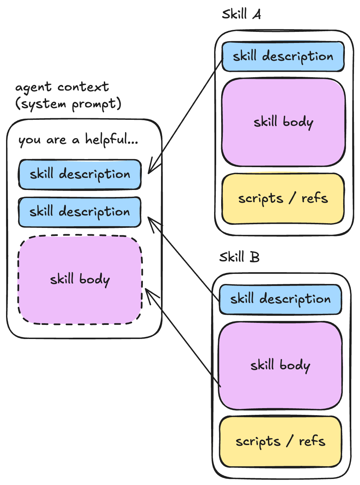
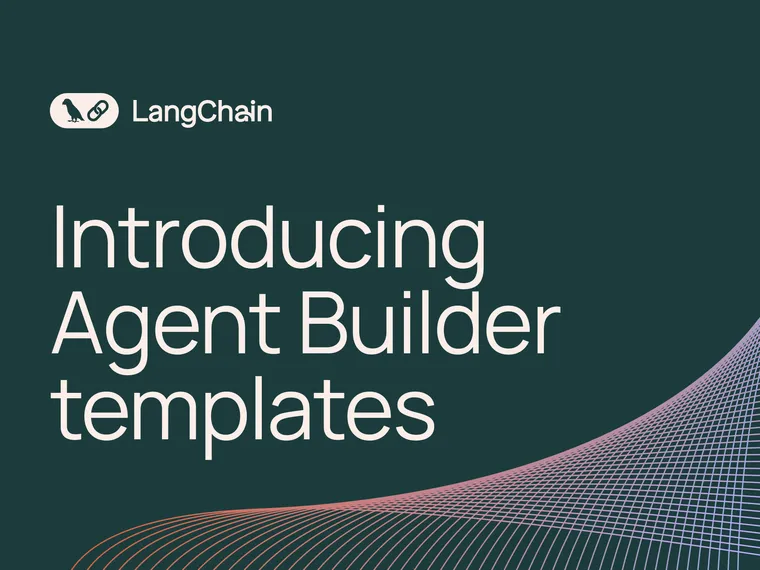
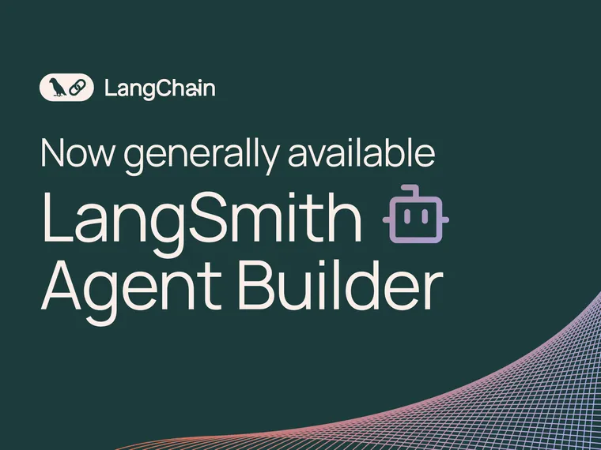
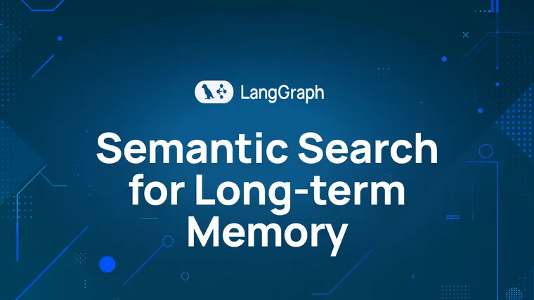
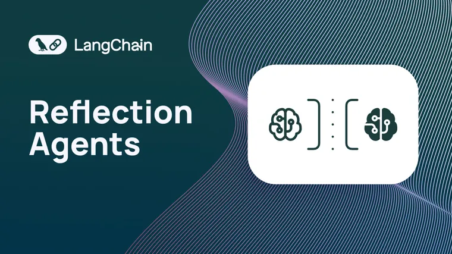
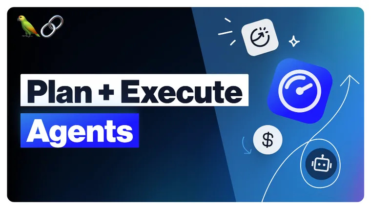

By Sydney Runkle and Vivek Trivedy

Breaking down complex tasks across specialized agents is one of the most effective approaches to building capable AI systems.

Deep Agents makes this easy with two first-class primitives:

- **subagents:** delegating to isolated agents
- **skills:** progressively disclosing capabilities

In this post, we'll show you how to build multi-agent systems with Deep Agents.

## Using Subagents: Specialized, Isolated Workers

Subagents tackle a fundamental problem in agent engineering: **context bloat**. This is when an agent’s context window becomes close to full as it works on a task.

Why is this important? There’s great work from [Chroma on context rot](https://research.trychroma.com/context-rot?ref=blog.langchain.com) showing that models struggle to complete tasks as their context window gets filled. Our friends at HumanLayer call this high context regime the “ [dumb zone](https://www.hlyr.dev/blog/context-efficient-backpressure?ref=blog.langchain.com)”. Subagents isolate context from the main agent to help avoid quickly entering the dumb zone.

When your agent makes dozens of web searches or file reads, the context window fills with intermediate results. Subagents isolate work by running with their own context window. So if the subagent is doing a lot of exploratory work before coming with its final answer, the main agent still only gets the final result, not the 20 tool calls that produced it.

Here’s a look at the basic subagents architecture:


### When to Use Subagents

- **Context Preservation:** A task requiring multiple steps can clutter the main agent's context (ex: codebase exploration).
- **Specialization:** Use domain specific instructions or tools. Subagents developed by distinct teams can specialize in different verticals.
- **Multi-Model:** Subagents can use different models than the main agent. For example, choosing a smaller model for lower latency.
- **Parallelization**: Subagents can run simultaneously and return their outputs to the main agent. This reduces latency.

### Creating Subagents

Define subagents as dictionaries and pass them to `create_deep_agent()`:

```python
from deepagents import create_deep_agent

research_subagent = {
    "name": "research-agent",
    "description": "Used to research more in depth questions",
    "system_prompt": "You are a great researcher",
    "tools": [internet_search],
    "model": "openai:gpt-4o",  # Optional: override main agent model
}

agent = create_deep_agent(
    model="claude-sonnet-4-5-20250929",
    subagents=[research_subagent]
)
```

See the [subagents](https://docs.langchain.com/oss/python/deepagents/subagents?ref=blog.langchain.com#configuration) documentation for configuration details.

### The General-Purpose Subagent

Deep Agents include a built-in `general-purpose` subagent that mirrors your main agent's capabilities. It has the same system prompt, tools, and model. This is perfect for **context isolation without specialized behavior.**

Example: Instead of your main agent making 10 web searches and filling its context, it can delegate to the general-purpose subagent with `task(name="general-purpose", task="Research quantum computing trends")`. The subagent performs all searches internally and returns only a summary.

### Best Practices for Subagents

**Write clear descriptions.** Your main agent uses descriptions to decide which subagent to call:

✅ Good: `"Analyzes financial data and generates investment insights with confidence scores"`

❌ Bad: `"Does finance stuff"`

**Keep system prompts detailed.** Include tool usage guidance and output format requirements:

```python
research_subagent = {
    "name": "research-agent",
    "description": "Conducts in-depth research using web search and synthesizes findings",
    "system_prompt": """You are a thorough researcher. Your job is to:

    1. Break down the research question into searchable queries
    2. Use internet_search to find relevant information
    3. Synthesize findings into a comprehensive but concise summary
    4. Cite sources when making claims

    Output format:
    - Summary (2-3 paragraphs)
    - Key findings (bullet points)
    - Sources (with URLs)

    Keep your response under 500 words to maintain clean context.""",
    "tools": [internet_search],
}
```

**Minimize tool sets.** Only give subagents the tools they need:

```python
# ✅ Good: Focused tool set
email_agent = {
    "name": "email-sender",
    # Only email-related
    "tools": [send_email, validate_email],
}

# ❌ Bad: Too many tools
email_agent = {
    "name": "email-sender",
    # Unfocused
    "tools": [send_email, web_search, database_query, file_upload],
}
```

## Using Skills: Progressive Disclosure of Capabilities

Skills provide a different pattern: progressive disclosure. Instead of giving your agent dozens of tools upfront, you define specialized capabilities in [SKILL.md](http://skill.md/?ref=blog.langchain.com) files. Your agent sees skill names and descriptions, then reads the full instructions only when needed.

Skill descriptions are pre-loaded into the context window. The skill body is only loaded when the agent decides the skill is needed based on the description and previous context.

Caption: skill descriptions are pre-loaded into the context window. The skill body is only loaded when the agent decides the skill is needed based on the description and previous context.

### Setting Up Skills

Skills use the [agentskills.io spec](https://agentskills.io/?ref=blog.langchain.com). Here's the structure:

```
.deepagents/skills/
├── deploy/SKILL.md
└── review-pr/SKILL.md
```

Each [SKILL.md](http://skill.md/?ref=blog.langchain.com) file has YAML frontmatter with metadata and a main body:

```markdown
---
name: deploy
description: Deploy to production
version: 1.0.0  # Optional
tags: [deployment, production]  # Optional
---

# Deploy to Production

When the user asks to deploy, follow these steps:

1. Run tests: `npm test`
2. Build the application: `npm run build`
3. Deploy to production: `npm run deploy:prod`
4. Verify deployment: Check the health endpoint

Always confirm with the user before deploying to production.
```

### Adding Skills to Your Agent

Use the `skills` argument to `create_deep_agent` to load skills from the filesystem:

```python
from deepagents import create_deep_agent
from deepagents.backends import FilesystemBackend

agent = create_deep_agent(
    model="claude-sonnet-4-5-20250929",
    backend=FilesystemBackend(root_dir="/"),
    skills=[".deepagents/skills"],
)
```

The agent now sees your skills. When it needs detailed instructions, it reads the full [SKILL.md](http://skill.md/?ref=blog.langchain.com) file.

You can also use other backends (such as a [StateBackend](https://docs.langchain.com/oss/python/deepagents/backends?ref=blog.langchain.com#statebackend-ephemeral) or [StoreBackend](https://docs.langchain.com/oss/python/deepagents/backends?ref=blog.langchain.com#storebackend-langgraph-store)), then invoke the agent with a `files` specification:

```python
from deepagents.middleware.filesystem import FileData

# default backend is a StateBackend
agent = create_deep_agent(
    model="anthropic:claude-sonnet-4-20250514",
    skills=["/skills/"],
)

skill_content = """
---
name: deploy
...
"""

# Invoke the agent with the skill and virtual files
result = agent.invoke({
    "messages": [HumanMessage(content="Research the latest Python releases")],
    "files": {
        "/skills/web-research/SKILL.md": FileData(
            content=skill_content.split("\n"),
            created_at="2024-01-01T00:00:00Z",
            modified_at="2024-01-01T00:00:00Z",
        ),
    },
})
```

## Choosing the Right Pattern

Here’s a quick set of questions to guide you:

| When you need to... | Use... | Both? |
| --- | --- | --- |
| Delegate complex, multi-step work | Subagents for context isolation |  |
| Reuse procedures or instructions | Skills for progressive disclosure |  |
| Provide specialized tools for specific tasks | Subagents with focused tool sets | ✅ |
| Share capabilities across multiple agents | Skills (they’re just files) | ✅ |
| Work with large tool sets | Skills to avoid token bloat |  |

💡

Note, this doesn’t have to be an **either-or** decision.

Many systems use both. Skills define procedures; subagents execute complex multi-step work. Your subagents can use skills to effectively manage their context windows!

## Next Steps

To learn more about multi-agent patterns in Deep Agents, check out our:

- [Subagents documentation](https://docs.langchain.com/oss/python/deepagents/subagents?ref=blog.langchain.com) \- Detailed API reference and examples
- [Skills documentation](https://docs.langchain.com/oss/python/deepagents/skills?ref=blog.langchain.com) \- Detailed API reference and examples
- [Multi-agent patterns guide](https://docs.langchain.com/oss/python/langchain/multi-agent/index?ref=blog.langchain.com#choosing-a-pattern) \- General guidance on choosing patterns

The key insight: multi-agent patterns don't have to be complicated. With the right abstractions (middleware for plumbing, tool calling for invocation), they become simple building blocks you can compose into capable, sophisticated systems.

Start with subagents for context management, add skills for progressive disclosure, and build from there.

### Tags

[deep agents](https://blog.langchain.com/tag/deep-agents/) [agents](https://blog.langchain.com/tag/agents/) [Engineering](https://blog.langchain.com/tag/engineering/)


[](https://blog.langchain.com/introducing-agent-builder-template-library/)

[**Deploy agents instantly with Agent Builder templates**](https://blog.langchain.com/introducing-agent-builder-template-library/)

[agent builder](https://blog.langchain.com/tag/agent-builder/) 3 min read

[](https://blog.langchain.com/langsmith-agent-builder-generally-available/)

[**Now GA: LangSmith Agent Builder**](https://blog.langchain.com/langsmith-agent-builder-generally-available/)

[agents](https://blog.langchain.com/tag/agents/) 2 min read

[**LangSmith Incident on May 1, 2025**](https://blog.langchain.com/langsmith-incident-on-may-1-2025/)

[Engineering](https://blog.langchain.com/tag/engineering/) 2 min read

[](https://blog.langchain.com/semantic-search-for-langgraph-memory/)

[**Semantic Search for LangGraph Memory**](https://blog.langchain.com/semantic-search-for-langgraph-memory/)

[langgraph](https://blog.langchain.com/tag/langgraph/) 3 min read

[](https://blog.langchain.com/reflection-agents/)

[**Reflection Agents**](https://blog.langchain.com/reflection-agents/)

[agents](https://blog.langchain.com/tag/agents/) 6 min read

[](https://blog.langchain.com/planning-agents/)

[**Plan-and-Execute Agents**](https://blog.langchain.com/planning-agents/)

[By LangChain](https://blog.langchain.com/tag/by-langchain/) 5 min read