**TL;DR**

- You don't know what your agents will do until you actually run them — which means agent observability is different and more important than software observability
- Agents often do complex, open-ended tasks, which means evaluating them is different than evaluating software
- Because traces document where agent behavior emerges, they power evaluation in a multitude of ways

When something goes wrong in traditional software, you know what to do: check the error logs, look at the stack trace, find the line of code that failed. But AI agents have changed what we're debugging. When an agent takes 200 steps over two minutes to complete a task and makes a mistake somewhere along the way, that’s a different type of error. There’s no stack trace - because there’s no code that failed. What failed was the agent’s reasoning.

## From debugging code to debugging reasoning

You still write code to define your agent, e.g. which tools exist, what data is available. You write prompts and tool descriptions to guide the agent's behavior, but you won't know how the LLM will interpret these instructions until you run it. The source of truth thus shifts from code to traces that show what the agent actually did.

[Agent engineering is an iterative process](https://blog.langchain.com/agent-engineering-a-new-discipline/), and tracing + evaluation are how you close the loop. In this post, we'll explore why agent observability and evaluation are fundamentally different from traditional software, what new primitives and practices you need, and how observability powers evaluation in ways that make them inseparable.

## Agent observability ≠ software observability

Pre-LLMs, software was largely deterministic — given the same input, you'd get the same output. Logic was codified. You could read the code and know exactly how the system behaved. When something went wrong, logs  pointed you to which service or function failed, then you'd go back to the code to understand why it happened and fix it.

**AI agents break the assumptions of determinism and code as a source of truth.** As we're moving from traditional software to LLM applications to agents, each step introduces more uncertainty. LLM apps make a single call to an LLM with context, introducing natural language's inherent "fuzziness" but remain constrained to one LLM call.

However, **agents call LLMs and tools in a loop until they determine a task is done**— and can reason across dozens or hundreds of steps, calling tools, maintaining state, and adapting behavior based on context. When building an agent, you attempt to recommend the application logic in code and prompts. But you don't know what this logic will do until actually running the LLM.

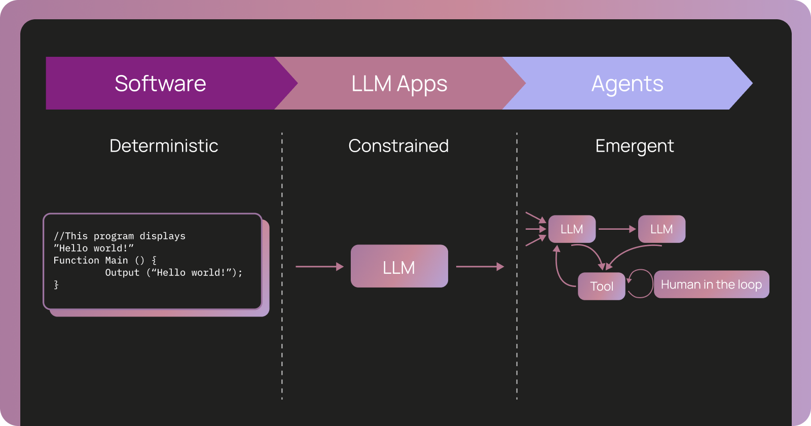Traditional software vs. LLM apps vs. Agents

When something goes wrong, you're not finding a single line of code that failed. Instead, you're asking:

- Why did the agent decide to call `edit_file` instead of `read_file` at step 23 of 200?
- What context and prompt instructions informed that decision?
- Where in this two-minute, 200-step trajectory did the agent go off track?

Traditional tracing tools can't answer these questions. A 200-step trace is too large for a human to parse, and traditional traces don't capture the reasoning context behind each decision; they only capture which services were called and how long each took.

## Agent evaluation ≠ software evaluation

Traditional software testing relies on deterministic assertions: write tests that check `output == expected_output`, verify they pass, then ship. Online evaluation (A/B tests, product analytics) measures business impact separately. Evaluating agents differ from evaluating software in a few key ways:

**1\. You're testing reasoning, not code paths**

Traditional software has tests at different levels of granularity (unit, integration, e2e), testing deterministic code paths you can read and modify. Agents also need testing at different levels, but you're no longer testing code paths — you're testing reasoning:

- **Single-step**: Did the agent make the right decision at this moment?
- **Full-turn**: Did the agent perform well in an end-to-end execution?
- **Multi-turn**: Did the agent maintain context across a conversation?

**2\. Production becomes your primary teacher**

In traditional software, you can catch most correctness issues with offline tests (unit tests, integration tests, staging). You still test in production through canary deployments and feature flags, but the goal is to catch edge cases and integration issues you missed.

With agents, production plays a different role. Because every natural language input is unique, you can't anticipate how users will phrase requests or what edge cases exist. Production traces reveal failure modes you couldn't have predicted and help you understand what "correct behavior" actually looks like for real user interactions.

This shifts how you think about evaluation: **production isn't just where you catch missed bugs. It's where you discover what to test for offline.** Production traces become test cases, and your evaluation suite grows continuously from real-world examples, not just engineered scenarios.

## The primitives of agent observability

Agent observability uses three core primitives to capture non-deterministic reasoning:

- **Runs**: A single execution step (one LLM call with its input/output)
- **Traces**: A complete agent execution showing all runs and their relationships
- **Threads**: Multi-turn conversations grouping multiple traces over time

These use the same concepts as traditional observability (e.g. traces, spans) but capture reasoning context rather than service calls and timing

### Runs: capturing what the LLM did at a single step

A [run](https://docs.langchain.com/langsmith/observability-concepts?ref=blog.langchain.com#runs) captures a single execution step. This is most useful for capturing how the LLM behaved at a particular point in time. This captures the complete prompt for an LLM call, including all instructions, tools used, and context.

These runs serve dual purposes:

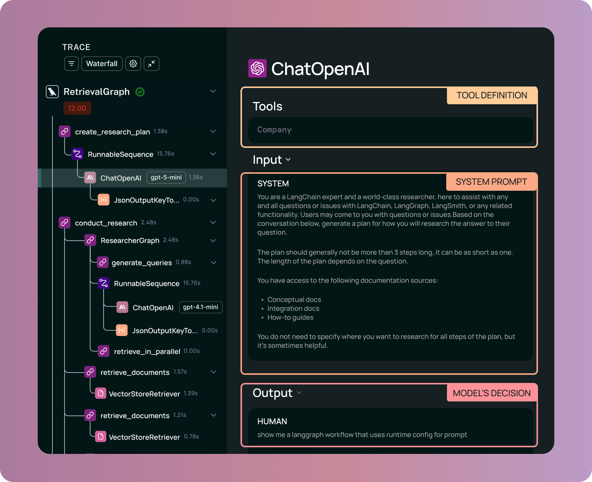Example of an agent run and its components

- **For debugging**: See exactly what the agent was thinking at any step. What was in the prompt? What tools were available? Why did it choose this action?
- **For evaluation**: Write assertions against this run. Did the agent call the right tool? With the right arguments?

### Traces: capturing trajectories

A trace captures a complete agent execution by linking together all the runs that occurred. A reasoning trace captures:

- All information about what goes into the model at each step, captured as runs that make up the trace
- **All tool calls** with their arguments and results
- **The nested structure** showing how steps relate to each other

Agent traces are massive. While a typical distributed trace might be a few hundred bytes, agent traces can be orders of magnitude larger. For complex, long-running agents, traces can reach hundreds of megabytes. This context is necessary for debugging and evaluating the agent's reasoning.

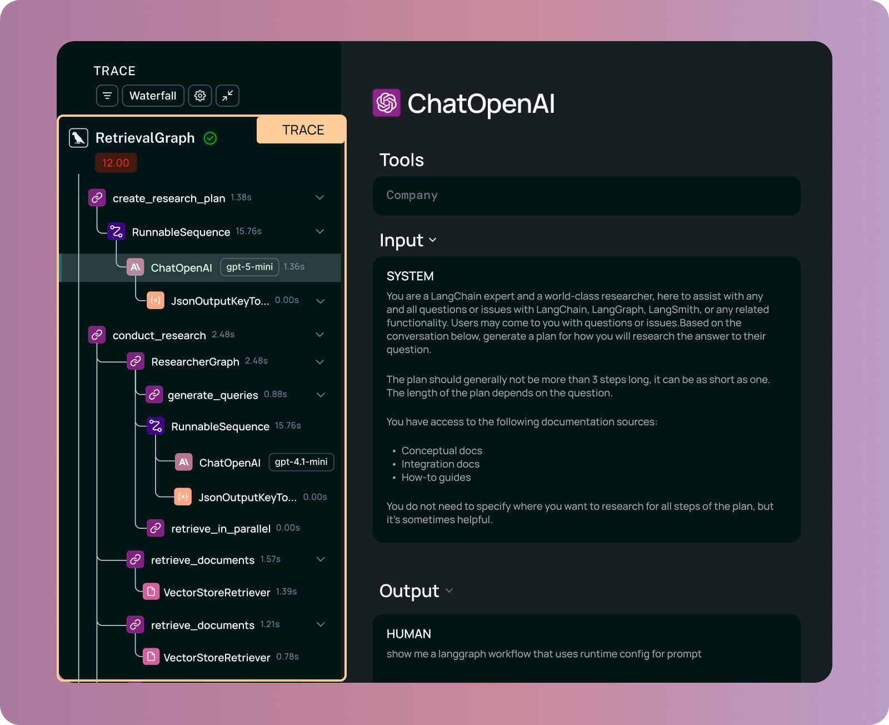Example trace and its components

### Threads: multi-turn conversation context

A single trace captures one agent execution, but agents often operate across **sessions** involving multiple interactions with a user or system. A [thread](https://docs.langchain.com/langsmith/threads?ref=blog.langchain.com) groups multiple agent executions (traces) into a single conversational session, preserving:

- **Multi-turn context**: All interactions between user and agent in chronological order
- **State evolution**: How the agent's memory, files, or other artifacts changed across turns
- **Time span:** Conversations can last minutes, hours, or days

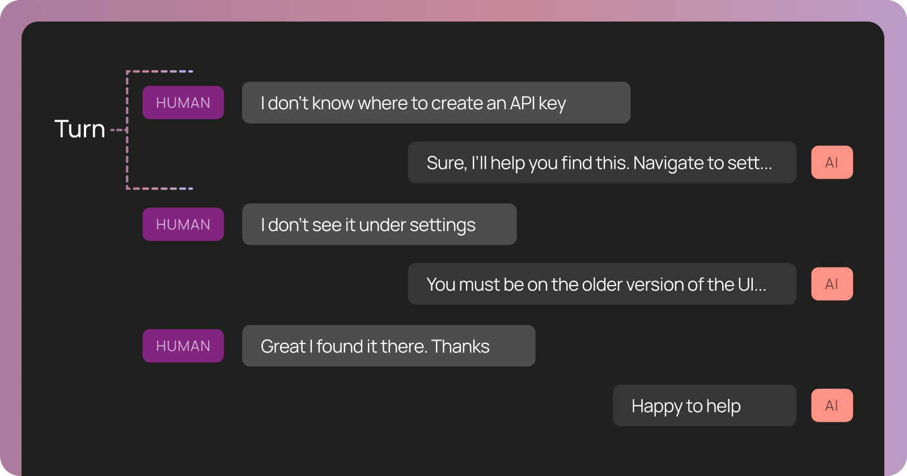Example of a thread capturing multiple turns of conversation

Consider debugging a coding agent that worked fine for 10 turns but suddenly started making mistakes in turn 11. The turn 11 trace in isolation might show the agent calling a reasonable tool. But when you examine the full thread, you discover that in turn 6 the agent updated its memory with an incorrect assumption, and by turn 11 that bad context had compounded into buggy behavior.

Threads are essential for understanding how agent behavior evolves over time and how context accumulates (or degrades) across interactions.

## How this influences agent evaluation

Agent behavior only emerges at runtime, and is only captured by observability (runs, traces, and threads). This means that to evaluate behavior you need to evaluate your observability data. This raises two key questions:

- At what granularity do you evaluate agents? At the run, trace, or thread level?
- When do you evaluate agents? If behavior only emerges when you run the agents, can you evaluate them offline in the same way you do software?

### Evaluations agents at different levels of granularity

**You can evaluate agents at different levels of granularity, which map 1:1 to the observability primitives.** What you're evaluating determines which primitive you need:

- **Single-step evaluation** validates individual runs → Did the agent make the right decision at a specific step?
- **Full-turn evaluation** validates complete traces → Did the agent execute the full task correctly?
- **Multi-turn evaluation** validates threads → Did the agent maintain context across a conversation?

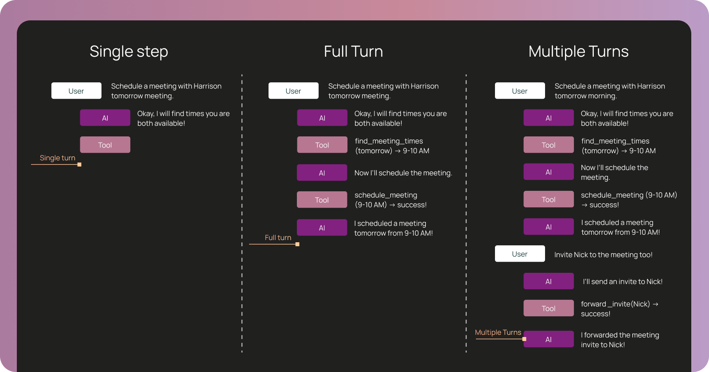Single step vs. full turn vs. multi-turn evaluation patterns

1. **Single-step evaluation: unit tests for decisions**

Sometimes, you need to validate a specific decision point without running the entire agent. You may want to see if the agent choose the right tool in a specific scenario, or whether it used the correct arguments.

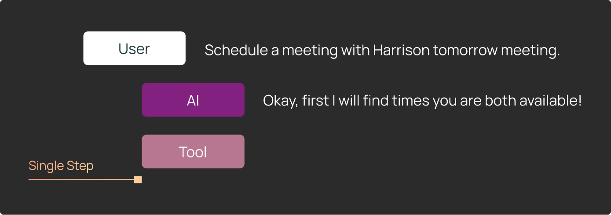

This is like a unit test for agent reasoning: set up a specific state (conversation history, available tools, current task), run the agent for one step, and assert that it made the right decision. Single-step evaluation validates runs, i.e. individual LLM calls.

**Example: Testing a calendar agent's tool selection**

A scheduling agent needs to find available meeting times before scheduling. You want to verify it checks availability first rather than immediately trying to create the meeting:

Your single-step test:

1. Setup state: Conversation history = user said "Schedule a meeting with Harrison tomorrow morning", available tools = \[`find_meeting_times`, `schedule_meeting`, `send_email`\]
2. Run one step: Agent generates next action
3. Assert: Agent chose `find_meeting_times` (not `schedule_meeting`)

**Why you need runs**: Single step tests often come from real production cases that error. In order to recreate these, you need the exact state of the agent before that step. Detailed run captures are the only way to get this!

Single-step evaluations are efficient and catch regressions at individual decision points. In practice, about half of agent test suites use these single-step tests to isolate and validate specific reasoning behaviors without the overhead of full agent execution.

**2\. Full-turn evaluation: end-to-end trajectory assessment**

Other times, you need to see a complete agent execution. Full-turn evaluation validates traces, i.e. complete agent executions with all their runs, and let you test multiple dimensions:

**Trajectory**: Did the agent call the necessary tools? For a coding agent fixing a bug, you might assert: "The agent should have called `read_file`, then `edit_file`, then `run_tests`." The exact sequence might vary, but certain tools must be called.

**Final response**: Was the output correct and helpful? For open-ended tasks like research or coding, the quality of the final answer often matters more than the specific path taken.

**State changes**: Did the agent create the right artifacts? For a coding agent, you'd inspect the files it wrote and verify they contain the correct code. For an agent with memory, you'd check that it stored the right information.

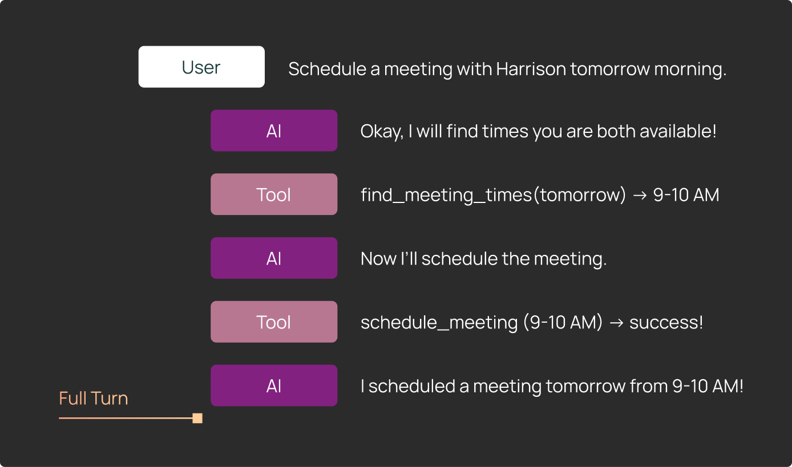

Testing that an agent remembers user preferences also requires validating three things:

1. Trajectory: Did the agent call `edit_file` on its memory file?
2. Final response: Did the agent confirm the update to the user?
3. State: Does the memory file actually contain the preference?

Each assertion requires different parts of the trace. You can't evaluate these dimensions without capturing the full trajectory and state changes.

**3\. Multi-turn evaluation: realistic conversation flows**

Some agent behaviors only emerge over multiple turns. The agent might maintain context correctly for 5 turns but fail on turn 6, or handle individual requests fine but struggle when requests build on each other.

Multi-turn evaluation validates threads, i.e. conversational sessions with multiple agent executions. You test whether the agent accumulates context correctly, maintains state across turns, and handles conversational flows that build on previous exchanges.

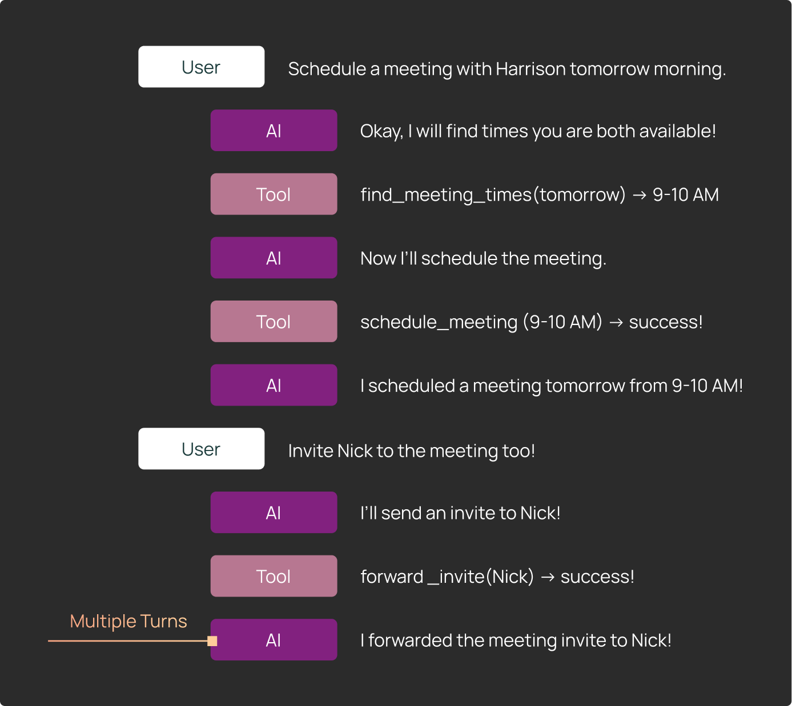

For example, testing context persistence:

- Turn 1: User shares a preference ("I prefer Python over JavaScript")
- Turn 2: User asks a question building on that ("Show me an example")
- Turn 3: Test that preference persists ("Write a script for this")

The agent should provide Python examples in turns 2 and 3, not JavaScript. This requires maintaining context across turns.

The challenge is keeping multi-turn tests on rails. If the agent deviates from the expected path in turn 1, your hardcoded turn 2 input might not make sense. Use conditional logic to check the agent's output after each turn, and fail early if it goes off track.

Multi-turn evaluation requires threads to group multiple agent executions (traces) into a single conversation. When a multi-turn test fails, you need the thread showing all turns to understand what went wrong and where.

### How to choose what granularity to evaluate your agent at

There is no single right way to choose which granularity to evaluate agents at. Some heuristics we’ve seen:

- **It’s often easiest to come up with inputs for trace-level evals (full-turn).** These are inputs to your agent, so it’s pretty easy (and necessary) to come up with expected inputs. That being said, it can be harder to come up with expected outputs and/or a way to validate those programmatically. This means there may be some period time of where you automate the running of the agent over these datapoints, but not the scoring.
- **It’s easiest to fully automate the scoring of run-level evals (single-step).** This is just a single model call, and often times can be evaluated by checking with tools were called. One word of caution: depending on how frequently you are changing the internals of your agent (which tools are available, the right sequence to call tools) these evaluations may get out of date quickly and require updating. For this reason, we generally see teams building these only after the general agent architecture is relatively stable.
- **Thread-level evals are hard to implement effectively (multi-turn)**. They involve coming up with a sequence of inputs, but often times that sequence only makes sense if the agent behaves a certain way between inputs. They are also hard to evaluate automatically. This is least common type of evaluation that we see.

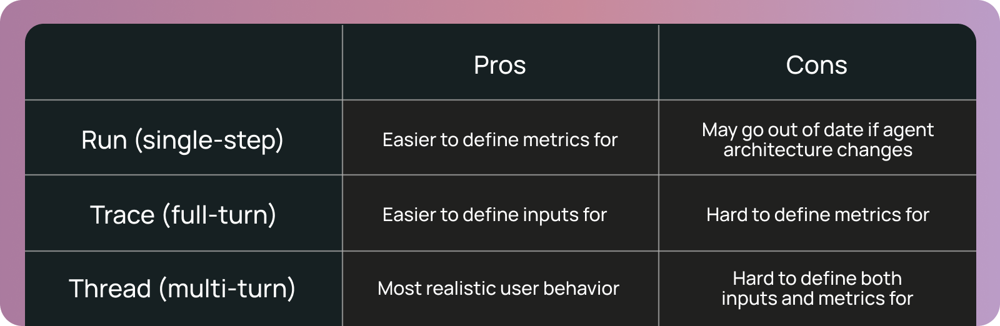

Most production agents use a combination: full-turn tests for core workflows, single-step tests for known failure modes discovered in production, and multi-turn tests for stateful interactions.

### When to evaluate an agent

Agent behavior doesn’t fully emerge until you run it in production, which means that **when** you evaluate agents also differs from traditional software.

- **Offline evaluation:** This is the equivalent of running unit tests before shipping. To run these tests, you’ll want to collect a dataset of inputs and, optionally, ground truth outputs to compare against. Depending on the cost to run and evaluate the agent over this dataset, you may run these evals on every commit, or just before you push to prod. If you are running offline evals frequently, you will want to set up some sort of caching so that you’re not calling the model unnecessarily. _Note: when most people talk about “evaluation”, offline evals are the primary type of evaluation they are likely referring to._
- **Online evaluation**: Since you don’t know how the agent will perform until you run it, you may want to run evaluations “online”, as the agent runs on production data. When doing this, these evaluators definitionally need to be “ [reference free](https://docs.langchain.com/langsmith/evaluation-concepts?ref=blog.langchain.com#reference-free-vs-reference-based-evaluators)”. Online evaluators typically run on ingestion of production data.
- **Ad-hoc evaluation**: Agents are very unbounded in their inputs and behavior, so you don’t always know ahead of time what you want to test for. If you have a lot of traces in production, you may want to test them **after** they have already been ingested. This exploratory data analysis can be crucial for understanding your agents. Systems like [Insights Agent](https://docs.langchain.com/langsmith/insights?ref=blog.langchain.com) in LangSmith can help you do this.

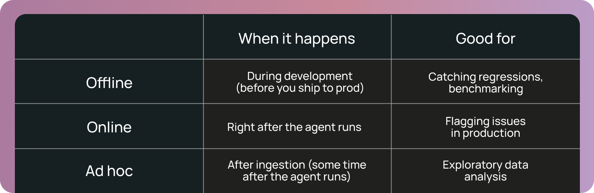

The key shift: **offline evaluation is necessary but not sufficient.** Evaluating your agents in production is important because you can't anticipate all the ways users will interact with your agent.

## How agent observability powers agent evaluation

The traces you generate for observability are the same traces that power your evaluations, forming a unified foundation.

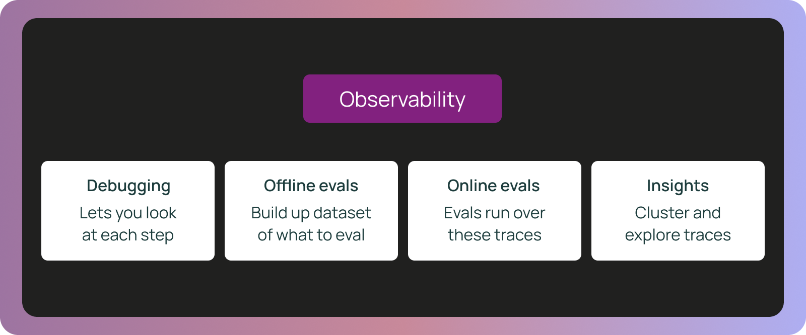

### Traces → manual debugging

When you are running an agent locally on ad hoc queries and manually inspecting the results - that is still a form of (manual) evaluation! Traces power this workflow as they allow you to step into every step of the process and figure out exactly what when wrong.

### Traces → offline evaluation datasets

Production traces become your evaluation dataset automatically. For example, when a user reports a bug, you can see in the trace: the exact conversation history and context, what the agent decided at each step, and where specifically it went wrong.

**An example workflow:**

1. User reports incorrect behavior
2. Find the production trace
3. Extract the state at the failure point
4. Create a test case from that exact state
5. Fix and validate

Thus, your test suite for offline evaluation can be formed from real data points.

### Traces → online evaluation

The same traces generated for debugging power continuous production validation. Online evaluations run on traces you're already capturing. You can run checks on every trace or sample strategically:

- **Trajectory checks**: Flag unusual tool call patterns
- **Efficiency monitoring**: Detect performance degradation trends
- **Quality scoring**: Run LLM-as-judge on production outputs
- **Failure alerts**: Surface errors before user reports

This surfaces issues in real-time, validating that development behavior holds in production.

### Traces → ad-hoc insights

When a trace contains 100,000+ lines of data or a thread spans dozens of turns, manual inspection becomes impossible. This is where AI-assisted analysis helps you query traces and threads to:

- Surface usage patterns across many agent executions
- Identify common failure modes and inefficiencies
- Explain specific decisions: "Why did the agent call this tool at this step?"
- Compare successful vs. failed executions to find patterns

For example, recently we were investigating why an agent was taking inefficient paths. Instead of manually reading 150-step traces, we used an AI assistant which identified that the agent was calling `read_file` multiple times on the same file instead of storing content in context. The fix was a simple prompt adjustment (whereas spotting this pattern manually would have taken hours).

## What this means for teams building agents

The teams shipping reliable agents have embraced the shift from debugging code to debugging reasoning. Traditional software separated tracing (for debugging) and testing (for validation). Now that we're debugging non-deterministic reasoning across long-running, stateful processes, these practices converge. You need reasoning traces to evaluate agent behavior, and you need systematic evaluation to make sense of traces.

The teams that adopt both practices together, from day one, will be the ones shipping agents that actually work.

### Get started with agent observability & evals

LangSmith helps teams observe, evaluate, and deploy agents. Sign up for free [here](https://smith.langchain.com/?ref=blog.langchain.com).